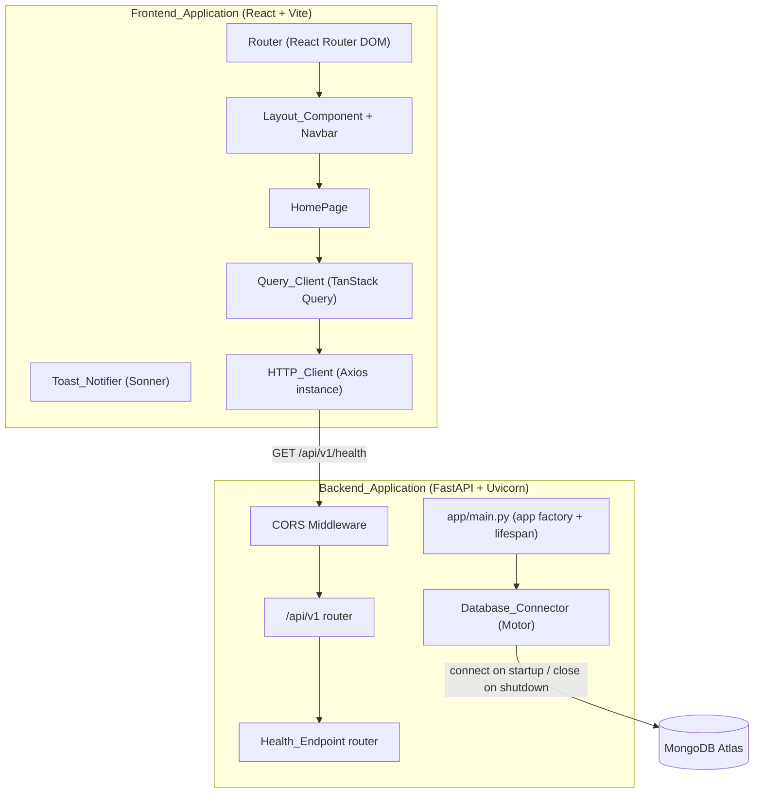
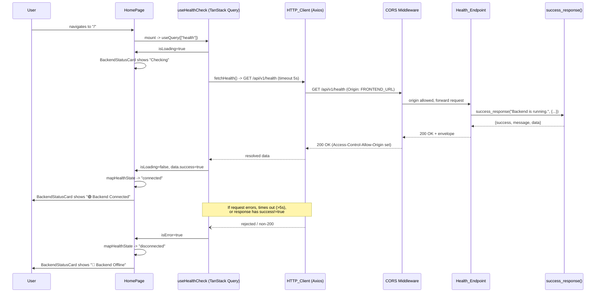

# Design Document

## Overview

Sprint 0 establishes the foundational scaffolding for the Feature Request & Public Roadmap Portal: an independently runnable React (Vite) frontend and FastAPI backend, a managed MongoDB Atlas connection lifecycle (no schemas or collections yet), environment-driven configuration, project documentation, and a single end-to-end integration check — the frontend polling the backend's health endpoint.

No business logic (auth, feature CRUD, voting, comments, moderation, roadmap Kanban) is designed here. The only "real" behaviors introduced in this sprint are:
- The response envelope shape (success/error) that all future endpoints will reuse.
- The CORS allow/deny decision.
- The database connection lifecycle (connect once at startup, close once at shutdown).
- The health-check polling and UI status mapping (Checking / Connected / Disconnected).

Everything else in this sprint is structural scaffolding (folders, routing, providers, README) that exists to be built on in later sprints.

## Architecture

The system is two independently deployable/runnable applications that communicate exclusively over HTTP. The backend never imports frontend code and vice versa; the only contract between them is the versioned REST API surface (in Sprint 0: `GET /api/v1/health`) and the JSON response envelope.



Key architectural decisions:
- **Independent runnability (Req 13)**: the frontend never blocks on the backend being up; the backend never blocks on the frontend. The only coupling point is the health check, which is designed to fail gracefully (Disconnected state) rather than throw.
- **Versioned API surface (Req 5.4)**: all routes live under `/api/v1`, so future sprints can introduce `/api/v2` without breaking Sprint 0 clients.
- **No schema footprint yet (Req 8.9)**: the Database_Connector only opens/pings/closes a client; it does not touch collections, so this sprint cannot accidentally introduce data-model debt that later sprints must migrate.

## Components and Interfaces

### Frontend

#### Directory layout (`frontend/src/`)

```
frontend/
├── src/
│   ├── components/       # Navbar, Layout, BackendStatusCard, etc.
│   ├── pages/            # HomePage, LoginPage, SignupPage, RoadmapPage, NotFoundPage
│   ├── services/         # axios instance, healthService.js
│   ├── hooks/            # useHealthCheck.js
│   ├── context/          # (reserved for future sprints; empty placeholder + .gitkeep)
│   ├── utils/             # (reserved for future sprints; empty placeholder + .gitkeep)
│   ├── assets/            # static assets (logo, images)
│   ├── App.jsx            # Router + Layout wiring
│   └── main.jsx           # ReactDOM root, QueryClientProvider, Toaster mount
├── index.html
├── vite.config.js
├── tailwind.config.js
├── postcss.config.js
└── package.json
```

`context/` and `utils/` are created empty (per Req 1.3's structural requirement) since Sprint 0 has no logic to place there yet; later sprints will populate them (e.g., `AuthContext`, formatting helpers).

#### Routing (Req 2)

`App.jsx` defines the route table with React Router DOM's `createBrowserRouter`/`<Routes>`:

| Path | Element | Notes |
|---|---|---|
| `/` | `HomePage` | wrapped by `Layout` |
| `/login` | `LoginPage` | placeholder heading only |
| `/signup` | `SignupPage` | placeholder heading only |
| `/roadmap` | `RoadmapPage` | placeholder heading only |
| `*` | `NotFoundPage` | catch-all, renders "Not Found" heading |

All routes render inside a shared `Layout` route (nested route with `<Outlet />`) so the Navbar is present on every page (Req 3.1).

#### Layout & Navbar (Req 3)

`Layout` renders `<Navbar />` followed by `<Outlet />`, and applies the shared page shell (light background, dark text, consistent spacing/typography via a Tailwind base layer class, e.g. `bg-slate-50 text-slate-900`).

`Navbar` holds one piece of local state, `isMobileMenuOpen: boolean`, defaulting to `false`. Below the `md` (768px) breakpoint, the link list is hidden unless `isMobileMenuOpen` is `true`; a toggle button flips the boolean. This is the entire "state machine" for the Navbar — a single boolean toggle — so it is designed as example-based behavior, not a property (see Testing Strategy).

Navigation links: Home (`/`), Login (`/login`), Signup (`/signup`), Roadmap (`/roadmap`) — exactly four, per Req 3.2.

#### HTTP client (Req 1.6)

`services/httpClient.js` exports a single configured Axios instance:

```js
import axios from "axios";

export const httpClient = axios.create({
  baseURL: import.meta.env.VITE_API_BASE_URL,
  timeout: 5000, // matches the 5s connectivity-check budget (Req 4.5, 12.4)
});
```

All future service modules (in later sprints: `authService`, `featureService`, etc.) import this single instance rather than constructing their own, satisfying "used by all backend API requests."

#### Server-state provider (Req 1.7) and toasts (Req 1.8)

`main.jsx` wraps the app once in `QueryClientProvider` (TanStack Query) and mounts a single `<Toaster />` (Sonner) at the root, alongside the router:

```jsx
<QueryClientProvider client={queryClient}>
  <App />
  <Toaster />
</QueryClientProvider>
```

#### Health check (Req 4, Req 12)

`services/healthService.js`:

```js
export async function fetchHealth() {
  const { data } = await httpClient.get("/api/v1/health");
  return data; // { success, message, data: { status, version } }
}
```

`hooks/useHealthCheck.js` wraps this in a TanStack Query `useQuery`:

```js
export function useHealthCheck() {
  return useQuery({
    queryKey: ["health"],
    queryFn: fetchHealth,
    retry: false,
    refetchInterval: 10000, // periodic re-check so status recovers within 10s (Req 13.4)
  });
}
```

The hook's raw `{ isLoading, isError, data }` is mapped to exactly one of three UI states by a small pure function, `mapHealthState`, in `services/healthService.js`:

```js
export function mapHealthState({ isLoading, isError, data }) {
  if (isLoading) return "checking";
  if (isError || !data?.success) return "disconnected";
  return "connected";
}
```

Extracting this as a pure function (rather than inlining conditionals in JSX) is what makes the Checking/Connected/Disconnected mapping unit-testable in isolation from React rendering and network timing.

`components/BackendStatusCard.jsx` renders based on `mapHealthState(...)`:
- `"checking"` → neutral/pending indicator
- `"connected"` → `"🟢 Backend Connected"`
- `"disconnected"` → `"🔴 Backend Offline"`

The 5-second failure budget (Req 4.5, 12.4) is enforced by the Axios `timeout: 5000` on the client instance, which causes the query to reject and `isError` to become `true`, which `mapHealthState` turns into `"disconnected"`.

#### HomePage composition (Req 4)

`HomePage` renders, top to bottom: project title, a description string kept under 200 characters, `<BackendStatusCard />` (driven by `useHealthCheck`), and a static "Feature feed coming soon" placeholder block — explicitly not rendering any feature-card component (Req 4.7).

### Backend

#### Directory layout (`backend/app/`)

```
backend/
├── app/
│   ├── api/
│   │   └── v1/
│   │       ├── __init__.py      # aggregates all v1 routers
│   │       └── health.py        # Health_Endpoint router
│   ├── core/
│   │   ├── config.py            # Settings (pydantic-settings)
│   │   └── cors.py              # CORS middleware configuration
│   ├── db/
│   │   └── mongodb.py           # Database_Connector (Motor client lifecycle)
│   ├── middleware/               # (reserved for future sprints; empty placeholder)
│   ├── models/                   # (reserved for future sprints; empty placeholder)
│   ├── services/                 # (reserved for future sprints; empty placeholder)
│   ├── utils/
│   │   └── responses.py         # success_response()/error_response() envelope helpers
│   └── main.py                   # app factory, lifespan, router mounting
├── .env.example
└── requirements.txt
```

`middleware/`, `models/`, `services/` are created empty in Sprint 0 (structural requirement only, Req 5.3); later sprints add `User`/`Feature`/`Comment` models, auth middleware, and business services here without restructuring.

#### App factory & lifespan (Req 5.2, Req 8)

`main.py` creates the single `FastAPI()` instance and wires an `asynccontextmanager` lifespan handler:

```python
from contextlib import asynccontextmanager
from fastapi import FastAPI
from app.core.config import settings
from app.core.cors import configure_cors
from app.db.mongodb import connect_to_mongo, close_mongo_connection
from app.api.v1 import api_router

@asynccontextmanager
async def lifespan(app: FastAPI):
    await connect_to_mongo()   # Req 8.3-8.6
    yield
    await close_mongo_connection()  # Req 8.7-8.8

app = FastAPI(lifespan=lifespan)
configure_cors(app)
app.include_router(api_router, prefix="/api/v1")
```

**Design decision — `lifespan` over `@app.on_event`:** FastAPI's `on_event("startup"/"shutdown")` decorators are deprecated in favor of the `lifespan` context manager, which also makes the connect/close relationship explicit in a single function (easier to reason about "connect once, always close on exit, even on startup failure before `yield`"). Req 8.6 requires the app to terminate startup without accepting requests if the connection attempt fails — raising inside `connect_to_mongo()` before `yield` achieves exactly that, since FastAPI/Uvicorn aborts startup when the lifespan startup phase raises.

#### Configuration (Req 9)

`core/config.py` defines a `pydantic-settings` `BaseSettings` subclass mapping 1:1 to the `.env.example` variables:

```python
class Settings(BaseSettings):
    mongodb_uri: str
    database_name: str
    jwt_secret: str
    jwt_refresh_secret: str
    access_token_expire_minutes: int = 15
    refresh_token_expire_days: int = 7
    frontend_url: str

    model_config = SettingsConfigDict(env_file=".env")

settings = Settings()
```

All fields except the two with explicit defaults are required with no default, so a missing/blank/invalid value raises `pydantic.ValidationError` at import time (module-level `settings = Settings()`), which happens before the app object is fully constructed — satisfying Req 9.5's "fail to start" requirement. The error is a pydantic `ValidationError` whose message names the offending field, satisfying "descriptive error message identifying the affected variable."

Sprint 0 does not yet use `jwt_secret`/`jwt_refresh_secret` operationally, but they are part of the settings schema now (per Req 9.1) so later sprints don't need to touch config wiring.

#### CORS (Req 7.3-7.5)

`core/cors.py`:

```python
def configure_cors(app: FastAPI) -> None:
    allowed_origins = [settings.frontend_url] if settings.frontend_url else []
    app.add_middleware(
        CORSMiddleware,
        allow_origins=allowed_origins,
        allow_methods=["GET", "POST", "PUT", "PATCH", "DELETE", "OPTIONS"],
        allow_headers=["*"],
        allow_credentials=True,
    )
```

If `frontend_url` is unset, `allowed_origins` is `[]`, so Starlette's `CORSMiddleware` allows no origin — satisfying Req 7.5's "default to disallowing" without special-casing.

#### API routing (Req 5.4-5.7)

`api/v1/__init__.py` aggregates sub-routers:

```python
api_router = APIRouter()
api_router.include_router(health.router, tags=["health"])
```

`api/v1/health.py`:

```python
router = APIRouter()

@router.get("/health")
async def health_check():
    return success_response(
        message="Backend is running.",
        data={"status": "healthy", "version": "1.0.0"},
    )
```

Because only `GET` is registered for `/health`, FastAPI's routing layer itself returns `405 Method Not Allowed` for any other verb on that path (Req 6.4) — no custom logic is needed to enforce this.

#### Response envelope (Req 7.1, 7.2)

`utils/responses.py` centralizes envelope construction so every current and future route returns the same shape:

```python
def success_response(message: str, data: Any = None) -> dict:
    return {"success": True, "message": message, "data": data}

def error_response(message: str, errors: list[str]) -> dict:
    return {"success": False, "message": message, "errors": errors}
```

**Error handling approach:** rather than requiring every route to catch exceptions manually, `main.py` registers FastAPI exception handlers that translate framework/validation errors into the error envelope, so the shape is guaranteed even for errors the route handler didn't anticipate:

```python
@app.exception_handler(RequestValidationError)
async def validation_handler(request, exc):
    return JSONResponse(status_code=422, content=error_response(
        message="Validation failed.",
        errors=[str(e["msg"]) for e in exc.errors()],
    ))

@app.exception_handler(StarletteHTTPException)
async def http_exception_handler(request, exc):
    return JSONResponse(status_code=exc.status_code, content=error_response(
        message=str(exc.detail),
        errors=[str(exc.detail)],
    ))

@app.exception_handler(Exception)
async def unhandled_exception_handler(request, exc):
    return JSONResponse(status_code=500, content=error_response(
        message="An unexpected error occurred.",
        errors=[str(exc)],
    ))
```

This gives Sprint 0 a complete, reusable error-handling foundation even though no business routes exist yet to trigger 401/403/404 cases — those handlers (auth/authorization/not-found) will be added by later sprints but will flow through the same `error_response()` helper and the same `HTTPException` handler.

#### Database connector (Req 8)

`db/mongodb.py`:

```python
client: AsyncIOMotorClient | None = None
db = None

async def connect_to_mongo() -> None:
    global client, db
    if not settings.mongodb_uri or not settings.database_name:
        logger.error("Missing MONGODB_URI or DATABASE_NAME; skipping connection.")
        raise RuntimeError("MONGODB_URI/DATABASE_NAME not configured")
    client = AsyncIOMotorClient(settings.mongodb_uri, serverSelectionTimeoutMS=10000)
    try:
        await client.admin.command("ping")  # confirms connectivity within 10s
    except Exception as exc:
        logger.error(f"MongoDB connection failed: {exc}")
        raise
    db = client[settings.database_name]
    logger.info("MongoDB connection established.")

async def close_mongo_connection() -> None:
    if client is not None:
        client.close()
        logger.info("MongoDB connection closed.")
```

**Design decision — module-level client singleton:** Motor's `AsyncIOMotorClient` is designed to be created once and shared (it manages its own connection pool); creating one per-request would be wasteful and would defeat pooling. A module-level singleton set during `lifespan` startup and read by (future) services is the standard Motor+FastAPI pattern. No collections or indexes are created here (Req 8.9) — `db` is exposed only as a database handle for future sprints to obtain collections from.

`serverSelectionTimeoutMS=10000` combined with the `ping` command gives the "verify connectivity within 10 seconds" behavior (Req 8.3): if the server can't be selected in time, the `ping` call raises before 10s elapse, which is caught and re-raised so the lifespan startup fails and Uvicorn aborts startup (Req 8.6).

## Data Models

Sprint 0 introduces no persisted data models, collections, or schemas (Req 8.9, explicitly a non-goal). The only "data model" in this sprint is the in-memory API response envelope shape, which is not a database model:

```python
# success envelope
{ "success": True, "message": str, "data": Any | None }

# error envelope
{ "success": False, "message": str, "errors": list[str] }
```

The `Settings` schema (see Components and Interfaces → Configuration) is the only other structured data introduced this sprint, and it models environment configuration, not domain data.

## Correctness Properties

*A property is a characteristic or behavior that should hold true across all valid executions of a system-essentially, a formal statement about what the system should do. Properties serve as the bridge between human-readable specifications and machine-verifiable correctness guarantees.*

Sprint 0 is almost entirely scaffolding, so most acceptance criteria are structural/wiring checks best covered by smoke or example tests (see Testing Strategy). Only three pieces of Sprint 0 behavior are pure functions with a large enough input space to benefit from property-based testing: the two response-envelope builders and the CORS origin allow/deny decision.

### Property 1: Success envelope shape is invariant

For any message string of length 1 to 500 characters and any JSON-serializable data payload (including `None`, nested objects, lists, and primitives), building a success response SHALL always produce an object whose `success` field is `true`, whose `message` field equals the input message, and whose `data` field equals the input data.

**Validates: Requirements 7.1**

### Property 2: Error envelope shape is invariant

For any message string of length 1 to 500 characters and any non-empty list of error strings, building an error response SHALL always produce an object whose `success` field is `false`, whose `message` field equals the input message, and whose `errors` field equals the input list and contains at least one entry.

**Validates: Requirements 7.2**

### Property 3: CORS allow/deny matches configured origin exactly

For any request `Origin` header value and any configured `FRONTEND_URL` value (including the unset/empty case), the backend SHALL grant cross-origin access if and only if the `Origin` value is equal to a non-empty configured `FRONTEND_URL`; for every other origin value, or when `FRONTEND_URL` is unset or empty, the backend SHALL NOT grant cross-origin access.

**Validates: Requirements 7.3, 7.4, 7.5**

## Error Handling

All error paths funnel through the `error_response()` envelope helper via three FastAPI exception handlers registered in `main.py`:

| Trigger | Handler | HTTP Status | Envelope |
|---|---|---|---|
| Request body/query fails Pydantic validation | `RequestValidationError` handler | 422 | `error_response("Validation failed.", [...field errors])` |
| Route raises `HTTPException` (e.g. 404, 405, future 401/403) | `StarletteHTTPException` handler | passthrough (e.g. 404, 405) | `error_response(str(detail), [str(detail)])` |
| Any other unhandled exception | catch-all `Exception` handler | 500 | `error_response("An unexpected error occurred.", [str(exc)])` |

The 405 response for non-GET requests to `/health` (Req 6.4) is produced by FastAPI/Starlette's own routing before reaching a custom handler, but is still normalized into the same envelope shape by the `StarletteHTTPException` handler, so clients never need to special-case it.

On the frontend, the health check's failure modes (timeout, network error, non-200, non-`success:true` body) are all normalized by `mapHealthState` into a single `"disconnected"` UI state — the UI never throws or shows a raw error, satisfying Req 13.3 ("render HomePage and display Backend Offline rather than failing to load").

## Testing Strategy

Sprint 0 is infrastructure-first: the majority of acceptance criteria describe wiring (routes exist, folders exist, providers are mounted, README contains sections) rather than input-varying logic. Testing effort is allocated accordingly — property-based tests are reserved for the three pure-function behaviors identified above; everything else uses example-based unit/integration/smoke tests.

**Property tests** (backend, using **Hypothesis** — the standard Python property-based testing library):
- Minimum 100 iterations per property (Hypothesis default `max_examples=100` or explicit `@settings(max_examples=100)`).
- Each test tagged with a comment referencing its design property, e.g.:
  ```python
  # Feature: sprint-0-foundation-setup, Property 1: Success envelope shape is invariant
  @given(message=text_1_to_500(), data=json_serializable())
  @settings(max_examples=100)
  def test_success_response_shape(message, data):
      result = success_response(message, data)
      assert result == {"success": True, "message": message, "data": data}
  ```
- Property 3 (CORS) is tested by driving Starlette's `TestClient` with generated `Origin` header values against an app configured with a fixed `FRONTEND_URL`, asserting the presence/absence of `access-control-allow-origin` in the response.

**Unit / example tests** (backend, **pytest** + **httpx.AsyncClient**/FastAPI `TestClient`):
- Health endpoint returns exact expected body and 200 status (Req 6.2) — smoke test.
- Non-GET methods on `/health` return 405 (Req 6.4) — parametrized over `{POST, PUT, PATCH, DELETE}`.
- Settings validation: for each required field, unsetting it raises a `ValidationError` and app construction fails (Req 9.5) — parametrized over the required field names.
- Database connector: with a mocked `AsyncIOMotorClient`, assert `connect_to_mongo` pings once and raises on failure without setting `db`; assert `close_mongo_connection` calls `client.close()` once.

**Unit tests** (frontend, **Vitest** + **React Testing Library**, matching the Vite toolchain already in use):
- `mapHealthState` table-driven test over `{isLoading, isError, data.success}` combinations, asserting the resulting state string (`"checking" | "connected" | "disconnected"`).
- Routing: each defined path renders the expected page heading; an undefined path renders the NotFound heading (Req 2.1-2.6).
- Navbar: renders exactly four links; toggling the mobile menu button flips visibility (Req 3.2-3.3, 3.6).
- HomePage: renders title, a description under 200 characters, and the "coming soon" placeholder without any feature-card component (Req 4.1-4.2, 4.6-4.7).
- `BackendStatusCard`: given a mocked `useHealthCheck` return value, renders the correct text for each of the three states (Req 12.2-12.4).

**Integration checks:**
- Backend startup with valid `.env` connects to a MongoDB instance (local/mocked in CI) and logs the startup confirmation; startup with an unreachable URI logs the failure and the process exits non-zero (Req 8.4-8.6).
- End-to-end (manual/documented in README, not automated in Sprint 0): start backend, start frontend, confirm HomePage shows "🟢 Backend Connected"; stop backend, confirm it transitions to "🔴 Backend Offline" within 5 seconds and back to connected within 10 seconds of restart (Req 13.3-13.4).

## Sequence Diagram — Health Check Integration



## Design Decisions and Rationale

| Decision | Rationale |
|---|---|
| FastAPI `lifespan` context manager instead of `@app.on_event` | `on_event` is deprecated upstream; `lifespan` keeps connect/close paired in one function and naturally aborts startup if `connect_to_mongo()` raises before `yield`, satisfying Req 8.6 without extra control flow. |
| TanStack Query for the health check (instead of a bare `useEffect` + `fetch`) | The project already adopts TanStack Query as its server-state layer (Req 1.7); reusing it for the health check gives built-in loading/error state, retry control, and a `refetchInterval` for free, which directly produces the Checking/Connected/Disconnected states and the "recovers within 10s" behavior (Req 13.4) without hand-rolled polling logic. |
| Motor client as a module-level singleton set up in `lifespan` | Motor's client manages an internal connection pool and is documented to be created once per application process; per-request instantiation would defeat pooling and make the "connect once at startup, close once at shutdown" lifecycle (Req 8) harder to reason about. |
| Centralized `success_response()`/`error_response()` helpers in `app/utils` rather than inline dict literals per route | Guarantees every current and future route produces the exact same envelope shape (Req 7.1, 7.2) from one place, and makes the shape itself unit/property-testable independent of any particular route. |
| Empty placeholder folders (`context/`, `utils/` on frontend; `middleware/`, `models/`, `services/` on backend) | Req 1.3 and Req 5.3 require the structure to exist now so later sprints add files into an already-agreed layout instead of restructuring mid-project. |
| Pure `mapHealthState()` function separated from `BackendStatusCard` rendering | Isolates the Checking/Connected/Disconnected decision from React rendering and real network timing, making the state-mapping logic directly unit-testable (table-driven) without mocking network calls or waiting on timers. |
| CORS origin list built as `[frontend_url] if frontend_url else []` | Makes "deny all when unset" (Req 7.5) fall out of Starlette's existing `CORSMiddleware` behavior for an empty origin list, rather than requiring bespoke conditional logic that would need its own tests. |
