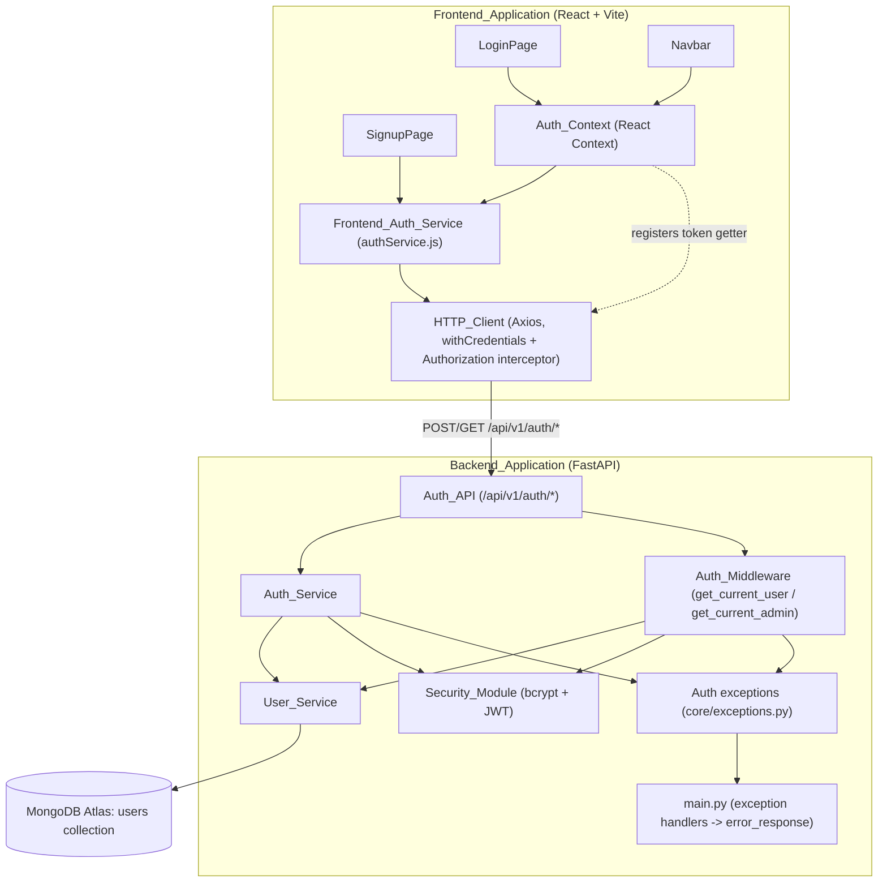

# Design Document

## Overview

Sprint 1A builds JWT-based authentication on top of the Sprint 0 scaffolding. It introduces the first persisted domain model (`users`), the first business-logic layer (`services/`), the first cross-cutting request dependency (`middleware/`), and the first non-health API surface (`/api/v1/auth/*`). It also turns `LoginPage`, `SignupPage`, and `Navbar` from placeholders into working, state-driven components backed by a new `AuthContext`.

The sprint is deliberately scoped to authentication mechanics only (signup, login, session refresh, logout, route protection) — no feature CRUD, voting, comments, moderation, or roadmap logic is touched. Every new backend module fits into the empty placeholder folders (`middleware/`, `models/`, `services/`) that Sprint 0 created for exactly this purpose, and every new frontend module fits into the empty `context/` folder and the existing `services/` folder.

Three architectural rules carry through the whole design, all directly from the requirements:

1. **Layering is strict.** Routes never touch Mongo or JWTs directly; they call `Auth_Service`, which calls `User_Service` (data) and `Security_Module` (crypto/JWT). `Auth_Middleware` calls `User_Service` and `Security_Module` the same way (Req 6.8, 27.2, 27.4).
2. **The Access_Token never touches disk or a cookie.** It lives only in the response body (login/refresh) and only in `AuthContext`'s in-memory state on the frontend (Req 19.6, 19.7).
3. **The Refresh_Token never touches JavaScript.** It is `httponly`, transmitted only via the `Refresh_Token_Cookie`, and rotated on every successful refresh/login (Req 19.3-19.5, 19.8).

## Architecture



Key decisions:

- **Two exception layers.** `Security_Module` raises low-level, JWT-specific exceptions (`TokenDecodeError`, `TokenExpiredError`) that say nothing about HTTP. `Auth_Service`/`Auth_Middleware` catch those and raise the API-facing exceptions defined in `app/core/exceptions.py` (`InvalidCredentialsException`, `UserAlreadyExistsException`, `InvalidTokenException`, `ExpiredTokenException`, `UnauthorizedException`). This keeps Requirement 5's decode-vs-expiration distinction inside the Security_Module while still satisfying Requirement 18's "reusable auth exceptions mapped to HTTP status" at the API boundary, without one exception type trying to serve both jobs.
- **`app/core/exceptions.py` is the new home for auth exceptions.** `app/core` already holds `config.py` and `cors.py` — app-wide infrastructure that `main.py` wires at startup. Exception *types* and their HTTP-status mapping are the same kind of thing: app-wide infrastructure that `main.py`'s exception handlers consume. `app/utils` stays reserved for stateless helpers (`responses.py` today); exceptions are not a stateless helper, so they don't belong there.
- **`main.py` gains one new exception handler, not five.** Every new exception in `core/exceptions.py` derives from a single `AuthException` base carrying a `status_code` and `errors` list; one `@app.exception_handler(AuthException)` handler (added to the existing three from Sprint 0) maps any of them to `error_response()`. This avoids five near-identical handler functions and matches Requirement 18.8's "whichever exception is raised, translate it the same way."
- **The Access_Token is attached to outgoing requests via an Axios interceptor that reads through a getter function, not a second storage location.** See "Frontend Auth Integration" below — this is the precise mechanism Requirement 21.9 requires.

## Components and Interfaces

### Backend

#### Directory layout additions (`backend/app/`)

```
backend/
├── app/
│   ├── api/v1/
│   │   ├── __init__.py      # now also includes auth.router
│   │   ├── health.py
│   │   └── auth.py          # NEW - Auth_API
│   ├── core/
│   │   ├── config.py        # extended: project_name, api_prefix
│   │   ├── cors.py
│   │   └── exceptions.py    # NEW - AuthException + 5 subclasses
│   ├── middleware/
│   │   ├── __init__.py      # NEW
│   │   └── auth.py          # NEW - get_current_user / get_current_admin
│   ├── models/
│   │   ├── __init__.py      # NEW
│   │   └── user.py          # NEW - UserCreate/UserLogin/UserResponse/TokenResponse
│   ├── services/
│   │   ├── __init__.py      # NEW
│   │   ├── user_service.py  # NEW - User_Service
│   │   └── auth_service.py  # NEW - Auth_Service
│   ├── db/mongodb.py         # unchanged (connection lifecycle only)
│   ├── utils/responses.py    # unchanged
│   └── main.py                # extended: mounts auth router, registers AuthException handler
```

#### Settings extension (Req 1)

`core/config.py` adds two required string fields:

```python
class Settings(BaseSettings):
    project_name: str
    api_prefix: str
    mongodb_uri: str
    database_name: str
    jwt_secret: str
    jwt_refresh_secret: str
    access_token_expire_minutes: int = 15
    refresh_token_expire_days: int = 7
    frontend_url: str

    model_config = SettingsConfigDict(env_file=".env")

settings = Settings()
```

Both are required with no default (like `mongodb_uri`), so a missing/blank `PROJECT_NAME` or `API_PREFIX` raises `pydantic.ValidationError` at import time via the same mechanism Sprint 0 established for `mongodb_uri` etc. (Req 1.4). No route currently mounts on `api_prefix` — Sprint 0's `/api/v1` prefix stays hardcoded in `main.py` for this sprint, since Requirement 1 only requires the *setting* to exist and be validated, not that every existing router be rewired to consume it. Introducing that wiring change is out of scope and risks disturbing the working health route.

pydantic's built-in `str_strip_whitespace` is not enabled by default, so `PROJECT_NAME=" "` would otherwise pass a naive "is set" check; both fields use a `field_validator` that strips and rejects empty results, satisfying "empty or whitespace-only" in Req 1.4:

```python
@field_validator("project_name", "api_prefix")
@classmethod
def _not_blank(cls, v: str, info) -> str:
    if not v or not v.strip():
        raise ValueError(f"{info.field_name} must not be empty or whitespace-only")
    return v
```

#### User model and schemas (`models/user.py`, Req 2, 3)

Persisted Mongo document shape (not a Pydantic model stored in Mongo directly — Motor works with plain dicts; this is the *shape* `User_Service` reads/writes):

```python
{
    "_id": ObjectId(...),           # Req 2.1 — uniquely identifies the document
    "name": str,
    "email": str,                    # stored lowercased for case-insensitive uniqueness (Req 2.2)
    "password_hash": str,
    "role": "user" | "admin",        # default "user" (Req 2.3, 2.6)
    "is_verified": bool,             # default False (Req 2.4)
    "refresh_token": str | None,     # default None (Req 2.5)
    "created_at": datetime,          # set once, never rewritten (Req 2.7, 2.8)
    "updated_at": datetime,          # rewritten on every persisted-field change (Req 2.7, 2.8)
}
```

**Design decision — normalize email to lowercase before every read/write, plus a unique index.** Requirement 2.2 requires case-insensitive uniqueness. Two mechanisms enforce it together: `User_Service` always lowercases the `email` argument before querying or inserting, *and* `users` has a unique index on `email` (created once, e.g. in a startup step or a one-time migration note in the README — Sprint 0 explicitly forbids index creation in the connection lifecycle itself (Req 8.9), so this index is created by `User_Service`'s own module-level setup the first time it's imported, or documented as a manual Atlas step; either way it is a defense-in-depth backstop, not the primary uniqueness check). The primary check remains the application-level `email_exists`/duplicate-key handling in Requirement 6.4/6.7, so behavior doesn't depend on index creation timing.

Pydantic schemas:

```python
class UserCreate(BaseModel):
    name: str = Field(min_length=1, max_length=100)
    email: EmailStr = Field(max_length=254)
    password: str = Field(min_length=8, max_length=128)

class UserLogin(BaseModel):
    email: EmailStr
    password: str

class UserResponse(BaseModel):
    id: str
    name: str
    email: str
    role: str
    is_verified: bool

class TokenResponse(BaseModel):
    access_token: str
    token_type: str = "bearer"
```

`UserResponse` and `TokenResponse` structurally cannot contain `password_hash` or `refresh_token` (Req 3.3, 3.4) — they simply have no such field, which is stronger than filtering them out at serialization time. `UserResponse.from_mongo(doc)` is a small classmethod that maps `doc["_id"]` → `id` (stringified) and drops every other document field, so the Auth_API can never accidentally leak a raw document (Req 3.5) — there is no method that returns the raw dict as a response model.

`EmailStr` (from `pydantic[email]`, already a transitive dependency pattern used by FastAPI) enforces "valid email address format"; combined with `max_length=254` this implements Req 3.1's email bound. `python-jose`/`passlib` are already pinned in `requirements.txt`; `pydantic[email]`'s `email-validator` package is a new pinned dependency this sprint adds to `requirements.txt`.

#### Security module (`core/security.py`, Req 4, 5)

```python
from passlib.context import CryptContext
from jose import jwt, JWTError
from datetime import datetime, timedelta, timezone
from app.core.config import settings

_pwd_context = CryptContext(schemes=["bcrypt"], deprecated="auto")

class TokenDecodeError(Exception):
    """Signature invalid or structure malformed. Distinct from expiration."""

class TokenExpiredError(Exception):
    """Signature/structure valid, but `exp` is in the past."""

def hash_password(password: str) -> str:
    """Raises ValueError if password is empty or exceeds 72 bytes UTF-8 (Req 4.6)."""
    _validate_password_bytes(password)
    return _pwd_context.hash(password)

def verify_password(password: str, password_hash: str) -> bool:
    """Returns False (never raises) for a malformed/non-bcrypt hash (Req 4.2)."""
    try:
        return _pwd_context.verify(password, password_hash)
    except (ValueError, UnknownHashError):
        return False

def create_access_token(user_id: str) -> str:
    return _create_token(user_id, token_type="access",
                          expires_delta=timedelta(minutes=settings.access_token_expire_minutes))

def create_refresh_token(user_id: str) -> str:
    return _create_token(user_id, token_type="refresh",
                          expires_delta=timedelta(days=settings.refresh_token_expire_days))

def _create_token(user_id: str, token_type: str, expires_delta: timedelta) -> str:
    now = datetime.now(timezone.utc)
    payload = {"sub": user_id, "type": token_type, "exp": now + expires_delta}
    return jwt.encode(payload, _secret_for(token_type), algorithm="HS256")

def decode_token(token: str, token_type: str) -> dict:
    """Verifies signature + structure first; if that fails, raises
    TokenDecodeError. Only once signature/structure are confirmed valid does
    it check `exp`, raising TokenExpiredError if it's in the past. This
    ordering is what makes the two failures distinguishable (Req 5.8, 5.9)."""
    secret = _secret_for(token_type)
    try:
        payload = jwt.decode(token, secret, algorithms=["HS256"],
                              options={"verify_exp": False})
    except JWTError as exc:
        raise TokenDecodeError(str(exc)) from exc
    if is_expired(payload["exp"]):
        raise TokenExpiredError("Token has expired")
    return payload

def is_expired(exp: float) -> bool:
    """Pure function: no signature check, no decoding — just a timestamp
    comparison (Req 5.4)."""
    return datetime.fromtimestamp(exp, tz=timezone.utc) < datetime.now(timezone.utc)

def _secret_for(token_type: str) -> str:
    return settings.jwt_secret if token_type == "access" else settings.jwt_refresh_secret
```

**Design decision — `decode_token` takes an explicit `token_type` and uses a different secret per type**, rather than one shared secret plus a post-hoc `payload["type"]` check. Using distinct secrets means an access token can never even *decode* successfully against the refresh secret, which is a stronger form of Requirement 5.6/5.7's "type discrimination" than checking the `type` claim alone would be (it also protects against a compromised access-token secret being replayed as a refresh token). The `type` claim is still embedded in the payload (Req 5.1, 5.2) and is redundantly checked by callers for defense in depth, but the primary discrimination mechanism is the secret choice.

**Design decision — verify signature/structure before checking `exp`**, by decoding with `verify_exp: False` and checking expiration manually via `is_expired`. `python-jose` normally raises a single `ExpiredSignatureError` (itself a `JWTError` subtype) when expiry-checking is left on, which would make "decode failure" and "expiration failure" the same exception family. Splitting the check manually is what makes Requirement 5.8/5.9's "distinct failure signal" achievable with one library call plus one pure comparison, and it lets `is_expired` (Req 5.4) be reused as the single source of truth for "is this timestamp in the past" in both `decode_token` and any future caller.

#### User service (`services/user_service.py`, Req 6)

```python
from app.db.mongodb import db

class DuplicateEmailError(Exception):
    """Raised when create_user's insert violates the email unique index."""

def _collection():
    return db["users"]

async def find_by_email(email: str) -> dict | None:
    return await _collection().find_one({"email": email.lower()})

async def find_by_id(user_id: str) -> dict | None:
    return await _collection().find_one({"_id": ObjectId(user_id)})

async def email_exists(email: str) -> bool:
    return await find_by_email(email) is not None

async def create_user(user_create: UserCreate) -> dict:
    now = datetime.now(timezone.utc)
    doc = {
        "name": user_create.name,
        "email": user_create.email.lower(),
        "password_hash": hash_password(user_create.password),
        "role": "user",
        "is_verified": False,
        "refresh_token": None,
        "created_at": now,
        "updated_at": now,
    }
    try:
        result = await _collection().insert_one(doc)
    except DuplicateKeyError as exc:
        raise DuplicateEmailError(user_create.email) from exc
    doc["_id"] = result.inserted_id
    return doc

async def set_refresh_token(user_id: str, token: str | None) -> bool:
    """Returns True iff a document matched the id (Req 6.5, 6.6)."""
    result = await _collection().update_one(
        {"_id": ObjectId(user_id)},
        {"$set": {"refresh_token": token, "updated_at": datetime.now(timezone.utc)}},
    )
    return result.matched_count == 1
```

`User_Service` is the only module that imports `db` from `app.db.mongodb` for the `users` collection (Req 6.8) — `Auth_Service` and `Auth_Middleware` never import `db` directly, and code review / a lint rule (not a runtime test) is the enforcement mechanism for that architectural constraint, same as Requirement 27's route-thinness constraints.

#### Auth exceptions (`core/exceptions.py`, Req 18)

```python
class AuthException(Exception):
    status_code: int
    def __init__(self, message: str, errors: list[str] | None = None):
        self.message = message
        self.errors = errors or [message]
        super().__init__(message)

class InvalidCredentialsException(AuthException):
    status_code = 401

class UserAlreadyExistsException(AuthException):
    status_code = 409

class InvalidTokenException(AuthException):
    status_code = 401

class ExpiredTokenException(AuthException):
    status_code = 401

class UnauthorizedException(AuthException):
    """status_code defaults to 401 (missing/invalid Authorization header,
    Req 15.3); Auth_Middleware overrides it to 403 for the non-admin-role
    case (Req 16.2)."""
    status_code = 401
    def __init__(self, message: str, status_code: int | None = None):
        super().__init__(message)
        if status_code is not None:
            self.status_code = status_code
```

`main.py` registers one handler for the whole family:

```python
@app.exception_handler(AuthException)
async def auth_exception_handler(request: Request, exc: AuthException) -> JSONResponse:
    return JSONResponse(status_code=exc.status_code,
                         content=error_response(message=exc.message, errors=exc.errors))
```

This satisfies Req 18.1-18.8 with one handler instead of five, and Req 18.9 because `Auth_Service`/`Auth_Middleware` only ever `raise SomeAuthException(...)` — they never build `error_response()` dicts themselves.

#### Auth service (`services/auth_service.py`, Req 7-10)

```python
async def signup(user_create: UserCreate) -> UserResponse:
    if await user_service.email_exists(user_create.email):
        raise UserAlreadyExistsException(f"An account with email {user_create.email} already exists.")
    try:
        doc = await user_service.create_user(user_create)
    except DuplicateEmailError:
        raise UserAlreadyExistsException(f"An account with email {user_create.email} already exists.")
    return UserResponse.from_mongo(doc)

async def login(user_login: UserLogin) -> tuple[TokenResponse, str]:
    """Returns (TokenResponse, refresh_token_value_for_cookie)."""
    doc = await user_service.find_by_email(user_login.email)
    if doc is None or not verify_password(user_login.password, doc["password_hash"]):
        raise InvalidCredentialsException("Invalid email or password.")
    access, refresh = _issue_tokens(str(doc["_id"]))
    if not await user_service.set_refresh_token(str(doc["_id"]), refresh):
        raise InvalidCredentialsException("Could not establish a session. Please try again.")
    return TokenResponse(access_token=access, token_type="bearer"), refresh

async def refresh_session(refresh_token: str | None) -> tuple[TokenResponse, str]:
    if refresh_token is None:
        raise InvalidTokenException("No refresh token provided.")
    try:
        payload = decode_token(refresh_token, token_type="refresh")
    except TokenExpiredError:
        raise ExpiredTokenException("Refresh token has expired.")
    except TokenDecodeError:
        raise InvalidTokenException("Invalid refresh token.")
    if payload.get("type") != "refresh":
        raise InvalidTokenException("Invalid refresh token.")
    doc = await user_service.find_by_id(payload["sub"])
    if doc is None or doc.get("refresh_token") != refresh_token:
        raise InvalidTokenException("Invalid refresh token.")
    access, new_refresh = _issue_tokens(str(doc["_id"]))
    if not await user_service.set_refresh_token(str(doc["_id"]), new_refresh):
        raise InvalidTokenException("Could not refresh session. Please log in again.")
    return TokenResponse(access_token=access, token_type="bearer"), new_refresh

async def logout(refresh_token: str | None) -> None:
    """Never raises (Req 10.3) — best-effort cleanup only."""
    if refresh_token is None:
        return
    try:
        payload = decode_token(refresh_token, token_type="refresh")
        doc = await user_service.find_by_id(payload["sub"])
        if doc is not None:
            await user_service.set_refresh_token(str(doc["_id"]), None)
    except (TokenDecodeError, TokenExpiredError):
        return

def _issue_tokens(user_id: str) -> tuple[str, str]:
    return create_access_token(user_id), create_refresh_token(user_id)
```

`signup` never calls `_issue_tokens` (Req 7.4). `login`/`refresh_session` always persist the new refresh token *before* returning it (Req 8.5, 9.7) — if persistence fails, an `AuthException` is raised and the caller (the route) never sees a `TokenResponse`, so it structurally cannot set the cookie (Req 8.8, 9.7-fail path). `refresh_session`'s "rotation" is exactly: create new tokens → persist new refresh token (overwriting the old value) → return it. Because `set_refresh_token` always fully replaces the stored value, the previous refresh token immediately stops matching `doc["refresh_token"]` on any subsequent call, which is what makes it rejected (Req 19.5) — see Property 10 below.

#### Auth middleware (`middleware/auth.py`, Req 15, 16)

```python
from fastapi import Header
from fastapi.security.utils import get_authorization_scheme_param

async def get_current_user(authorization: str | None = Header(None)) -> dict:
    scheme, token = get_authorization_scheme_param(authorization or "")
    if not authorization or scheme.lower() != "bearer" or not token:
        raise UnauthorizedException("Missing or invalid Authorization header.")
    try:
        payload = decode_token(token, token_type="access")
    except TokenExpiredError:
        raise ExpiredTokenException("Access token has expired.")
    except TokenDecodeError:
        raise InvalidTokenException("Invalid access token.")
    if payload.get("type") != "access":
        raise InvalidTokenException("Invalid access token.")
    user = await user_service.find_by_id(payload["sub"])
    if user is None:
        raise InvalidTokenException("Invalid access token.")
    return user

async def get_current_admin(user: dict = Depends(get_current_user)) -> dict:
    if user.get("role") != "admin":
        raise UnauthorizedException("Administrator access required.", status_code=403)
    return user
```

`get_current_admin` takes a `Depends(get_current_user)` FastAPI dependency rather than calling it as a plain function, so any `AuthException` raised inside `get_current_user` propagates through FastAPI's normal dependency-resolution exception path unchanged (Req 16.2) — there is no `try/except` around it to accidentally re-wrap it.

#### Auth API routes (`api/v1/auth.py`, Req 11-14, 17, 19.3)

Follows the `health.py` pattern: a bare `APIRouter()`, thin `async def` handlers, everything delegated.

```python
router = APIRouter(prefix="/auth")

def _cookie_kwargs() -> dict:
    return dict(httponly=True, secure=False, samesite="lax", path="/",
                max_age=settings.refresh_token_expire_days * 86400)

@router.post("/signup", status_code=201)
async def signup(body: UserCreate):
    user = await auth_service.signup(body)
    return success_response("Account created successfully.", user.model_dump())

@router.post("/login")
async def login(body: UserLogin, response: Response):
    tokens, refresh_token = await auth_service.login(body)
    response.set_cookie("refresh_token", refresh_token, **_cookie_kwargs())
    return success_response("Logged in successfully.", tokens.model_dump())

@router.post("/refresh")
async def refresh(request: Request, response: Response):
    refresh_token = request.cookies.get("refresh_token")
    tokens, new_refresh_token = await auth_service.refresh_session(refresh_token)
    response.set_cookie("refresh_token", new_refresh_token, **_cookie_kwargs())
    return success_response("Session refreshed.", tokens.model_dump())

@router.post("/logout")
async def logout(request: Request, response: Response):
    refresh_token = request.cookies.get("refresh_token")
    await auth_service.logout(refresh_token)
    response.delete_cookie("refresh_token", path="/")
    return success_response("Logged out successfully.")

@router.get("/me")
async def me(current_user: dict = Depends(get_current_user)):
    return success_response("Current user retrieved.", UserResponse.from_mongo(current_user).model_dump())
```

No route contains a `try/except` for an `AuthException` — every failure branch (409 on signup, 401 on login/refresh, etc.) is produced by letting `Auth_Service`/`get_current_user` raise, and the `AuthException` handler in `main.py` does the rest (Req 27.2). `/logout` never raises from `auth_service.logout` (Req 10.3-10.4) so `delete_cookie` and the 200 response always execute (Req 14.2).

`api/v1/__init__.py` gains one line:

```python
from app.api.v1 import auth, health

api_router = APIRouter()
api_router.include_router(health.router, tags=["health"])
api_router.include_router(auth.router, tags=["auth"])
```

Because `auth.router` already declares `prefix="/auth"` and `api_router` is mounted at `/api/v1` in `main.py` (unchanged), every route resolves to `/api/v1/auth/...` exactly as Requirements 11-14 and 17 specify. `main.py` adds the one new exception handler shown above; no other change is needed there.

### Frontend

#### Directory layout additions (`frontend/src/`)

```
frontend/
├── src/
│   ├── context/
│   │   └── AuthContext.jsx     # NEW
│   ├── services/
│   │   ├── httpClient.js       # extended: withCredentials + token-getter interceptor
│   │   └── authService.js      # NEW
│   ├── pages/
│   │   ├── LoginPage.jsx        # implemented
│   │   └── SignupPage.jsx       # implemented
│   ├── components/
│   │   └── Navbar.jsx           # extended: auth-aware
│   ├── App.jsx                   # extended: wraps Routes in AuthProvider
```

#### HTTP client extension (Req 19.7, 19.8, 20.6, 21.9)

```js
// services/httpClient.js
import axios from "axios";

export const httpClient = axios.create({
  baseURL: import.meta.env.VITE_API_BASE_URL,
  timeout: 5000,
  withCredentials: true, // send/receive the Refresh_Token_Cookie automatically (Req 19.8, 20.6)
});

let getAccessToken = () => null;

/** Lets AuthContext expose a synchronous read into its own in-memory token
 *  without httpClient storing a second copy of the token itself. */
export function registerAccessTokenGetter(getter) {
  getAccessToken = getter;
}

httpClient.interceptors.request.use((config) => {
  const token = getAccessToken();
  if (token) {
    config.headers.Authorization = `Bearer ${token}`;
  }
  return config;
});
```

**Design decision — this is precisely how the in-memory Access_Token gets attached to authenticated calls without a second storage location or `localStorage`.** `httpClient` never stores the token; it stores a *function* supplied by `AuthContext`. `AuthContext` keeps the actual token value in a `useRef` (a ref rather than plain state, because the interceptor needs a synchronous, always-current read — React state captured in a closure at registration time would go stale after the next `login`/`logout`). On mount, `AuthContext` calls `registerAccessTokenGetter(() => accessTokenRef.current)` once; from then on every `httpClient` call anywhere in the app — `/me` today, any future authenticated feature/vote/comment endpoint in later sprints — automatically carries the current `Authorization` header with zero per-call wiring. This is what satisfies Requirement 21's "attach the token to authenticated requests" while still satisfying Requirement 21.9's "`AuthContext` is the only module that *stores* the Access_Token" — `httpClient.js` stores a getter closure, not the token value.

#### Frontend Auth Service (`services/authService.js`, Req 20)

```js
import { httpClient } from "./httpClient";

export const authService = {
  async signup(name, email, password) {
    const { data } = await httpClient.post("/api/v1/auth/signup", { name, email, password });
    return data.data; // UserResponse
  },
  async login(email, password) {
    const { data } = await httpClient.post("/api/v1/auth/login", { email, password });
    return data.data.access_token;
  },
  async logout() {
    await httpClient.post("/api/v1/auth/logout");
  },
  async refresh() {
    const { data } = await httpClient.post("/api/v1/auth/refresh");
    return data.data.access_token;
  },
  async getCurrentUser() {
    const { data } = await httpClient.get("/api/v1/auth/me");
    return data.data; // UserResponse
  },
};
```

Every function is a thin wrapper with no `try/catch` — an error status from `httpClient` rejects the returned promise with the original Axios error untouched, satisfying Req 20.7 ("without suppressing or transforming the underlying HTTP_Client error"). `withCredentials` is set once on the shared `httpClient` instance (Req 20.6) rather than per-call, matching Sprint 0's "one shared Axios instance" convention.

#### Auth Context (`context/AuthContext.jsx`, Req 21)

```jsx
const AuthContext = createContext(null);

export function AuthProvider({ children }) {
  const [user, setUser] = useState(null);
  const [isAuthenticated, setIsAuthenticated] = useState(false);
  const [loading, setLoading] = useState(true);
  const accessTokenRef = useRef(null);

  useEffect(() => {
    registerAccessTokenGetter(() => accessTokenRef.current);
  }, []);

  useEffect(() => {
    (async () => {
      try {
        accessTokenRef.current = await authService.refresh();
        setUser(await authService.getCurrentUser());
        setIsAuthenticated(true);
      } catch {
        accessTokenRef.current = null;
        setUser(null);
        setIsAuthenticated(false);
      } finally {
        setLoading(false);
      }
    })();
  }, []);

  async function login(email, password) {
    const token = await authService.login(email, password); // rejects propagate to caller (Req 21.7)
    accessTokenRef.current = token;
    setUser(await authService.getCurrentUser());
    setIsAuthenticated(true);
  }

  async function logout() {
    try {
      await authService.logout();
    } finally {
      accessTokenRef.current = null;
      setUser(null);
      setIsAuthenticated(false);
    }
  }

  function signup(name, email, password) {
    return authService.signup(name, email, password); // never touches user/isAuthenticated (Req 21.1)
  }

  return (
    <AuthContext.Provider value={{ user, isAuthenticated, loading, login, logout, signup }}>
      {children}
    </AuthContext.Provider>
  );
}

export function useAuth() {
  return useContext(AuthContext);
}
```

`loading` is `true` from mount until the startup effect's `finally` runs, regardless of which branch (refresh success/failure, or a subsequent `getCurrentUser` failure) it takes (Req 21.4, 21.5). `login`'s state updates (`setUser`, `setIsAuthenticated`) only happen after `authService.login` has already resolved, so a rejected `login` call leaves `user`/`isAuthenticated` completely untouched — no explicit `catch` branch is needed to satisfy Req 21.7, the `await` failing is enough. `logout`'s `finally` guarantees the three resets happen whether or not the server call succeeds (Req 21.8).

#### LoginPage (`pages/LoginPage.jsx`, Req 22)

A pure validator function, colocated in the file but exported for testing, mirrors the pattern Sprint 0 used for `mapHealthState`:

```js
export function validateLoginForm({ email, password }) {
  const errors = {};
  if (!email.trim()) errors.email = "Email is required.";
  else if (!isValidEmailFormat(email)) errors.email = "Enter a valid email address.";
  if (!password) errors.password = "Password is required.";
  return errors; // {} means valid
}

export function isValidEmailFormat(email) {
  const at = email.indexOf("@");
  if (at <= 0) return false;
  const domain = email.slice(at + 1);
  return domain.includes(".");
}
```

The component holds `{ email, password, fieldErrors, isSubmitting }` local state. On submit: run `validateLoginForm`; if any error exists, `setFieldErrors` and return (never calls `login`, Req 22.2, 22.3). Otherwise set `isSubmitting(true)`, `disabled={isSubmitting}` on the submit button (Req 22.5), call `login(email, password)`:
- success → `toast.success(...)`, `navigate("/")` (Req 22.6)
- failure → `toast.error(...)`, stay on page (Req 22.7), `finally` resets `isSubmitting(false)` either way.

The component itself never imports `authService` or touches a token — it only calls `useAuth().login` (Req 22.8, 28.1, 28.3).

#### SignupPage (`pages/SignupPage.jsx`, Req 23)

Same shape, its own pure validator:

```js
export function validateSignupForm({ name, email, password, confirmPassword }) {
  const errors = {};
  if (!name.trim() || name.length > 100) errors.name = "Name must be 1-100 characters.";
  if (!isValidEmailFormat(email)) errors.email = "Enter a valid email address.";
  if (password.length < 8 || password.length > 128) errors.password = "Password must be 8-128 characters.";
  if (confirmPassword !== password) errors.confirmPassword = "Passwords do not match.";
  return errors;
}
```

On success: calls `authService.signup(...)` directly (not `useAuth().signup`'s pass-through wrapper is fine either way since it doesn't touch auth state — the design uses the context's `signup` for consistency with how the page reaches all auth actions through `AuthContext`), shows the toast text `"Account created successfully. Email verification pending."` exactly (Req 23.4), and navigates to `/login` without ever calling `login` (no auto-authentication). On failure: error toast, stays on page (Req 23.5).

#### Navbar (`components/Navbar.jsx`, Req 24)

```jsx
const { user, isAuthenticated, loading, logout } = useAuth();

// inside render, in place of the static NAV_LINKS list:
{loading ? null : isAuthenticated ? (
  <>
    <span>{user.name}</span>
    <button onClick={logout}>Logout</button>
  </>
) : (
  <>
    <NavLink to="/login">Login</NavLink>
    <NavLink to="/signup">Signup</NavLink>
  </>
)}
```

Home and Roadmap links remain unconditional (Sprint 0 behavior); only the Login/Signup-vs-user/Logout segment is conditional on the three `loading`/`isAuthenticated` states (Req 24.1-24.3). No dropdown/menu markup is added around the user's name (Req 24.5).

#### Wiring (`App.jsx`, Req 21)

```jsx
function App() {
  return (
    <BrowserRouter>
      <AuthProvider>
        <Routes>
          <Route element={<Layout />}>
            <Route index element={<HomePage />} />
            <Route path="login" element={<LoginPage />} />
            <Route path="signup" element={<SignupPage />} />
            <Route path="roadmap" element={<RoadmapPage />} />
            <Route path="*" element={<NotFoundPage />} />
          </Route>
        </Routes>
      </AuthProvider>
    </BrowserRouter>
  );
}
```

`AuthProvider` wraps `Routes` (not the other way around) so `Navbar`, `LoginPage`, and `SignupPage` — all rendered inside routes — can call `useAuth()`. `main.jsx` is unchanged; `QueryClientProvider`/`Toaster` continue to wrap `<App />` from Sprint 0.

## Data Models

### Persisted document: `users` collection

| Field | Type | Notes |
|---|---|---|
| `_id` | ObjectId | Req 2.1 |
| `name` | string | 1-100 chars at creation (validated by `UserCreate`, not re-validated on read) |
| `email` | string | stored lowercased; unique (Req 2.2) |
| `password_hash` | string | bcrypt hash, never serialized out (Req 3.3) |
| `role` | `"user"` \| `"admin"` | default `"user"` (Req 2.3, 2.6) |
| `is_verified` | boolean | default `false` (Req 2.4) |
| `refresh_token` | string \| null | default `null` (Req 2.5); overwritten wholesale on every login/refresh/logout |
| `created_at` | datetime | set once at creation (Req 2.7) |
| `updated_at` | datetime | rewritten on every persisted-field change (Req 2.8) |

### JWT claim shapes

| Claim | Access_Token | Refresh_Token |
|---|---|---|
| `sub` | user's `id` | user's `id` |
| `type` | `"access"` | `"refresh"` |
| `exp` | now + `access_token_expire_minutes` min | now + `refresh_token_expire_days` days |

Access and refresh tokens are signed with different secrets (`jwt_secret` vs `jwt_refresh_secret`), which is the primary type-discrimination mechanism (see Security Module design decision above).

### Pydantic schemas

`UserCreate { name: str[1,100], email: EmailStr[≤254], password: str[8,128] }`
`UserLogin { email: EmailStr, password: str }`
`UserResponse { id: str, name: str, email: str, role: str, is_verified: bool }`
`TokenResponse { access_token: str, token_type: str }`

### Frontend Auth_Context state

`{ user: UserResponse | null, isAuthenticated: boolean, loading: boolean, login, logout, signup }`, plus the non-exposed `accessTokenRef` (a `useRef`, not part of the context value, read only through the `httpClient` getter registration).

## Correctness Properties

*A property is a characteristic or behavior that should hold true across all valid executions of a system-essentially, a formal statement about what the system should do. Properties serve as the bridge between human-readable specifications and machine-verifiable correctness guarantees.*

### Property 1: Password hashing round-trips, and only for the original password

For any valid plaintext password (a UTF-8 string between 1 and 72 bytes), hashing it and then verifying that same plaintext against the resulting hash SHALL succeed; and for any two distinct valid plaintext passwords, verifying the second against the hash of the first SHALL fail. For any string that is empty or exceeds 72 bytes when UTF-8 encoded, `hash_password` SHALL raise rather than silently truncating; for any malformed or non-bcrypt hash string, `verify_password` SHALL return `False` rather than raising.

**Validates: Requirements 4.2, 4.3, 4.4, 4.6**

### Property 2: JWT encode/decode round-trips claims, with distinct expiration vs. decode failure signals

For any valid `sub` string and any unexpired lifetime, `decode_token(create_access_token(sub) or create_refresh_token(sub))` SHALL return a payload whose `sub`, `type`, and `exp` match what was encoded. For any validly-signed, well-formed token whose `exp` is in the past, `decode_token` SHALL raise `TokenExpiredError`. For any token string with an invalid signature or malformed structure, `decode_token` SHALL raise `TokenDecodeError`, and never `TokenExpiredError` for that same input.

**Validates: Requirements 5.1, 5.2, 5.3, 5.5, 5.8, 5.9**

### Property 3: Access and refresh tokens are never valid as each other

For any user id, decoding an access token created for that id with `token_type="refresh"` SHALL fail (raise `TokenDecodeError`, since it is signed with the other secret), and decoding a refresh token created for that id with `token_type="access"` SHALL fail. For all access tokens, decoding them with `token_type="access"` SHALL always yield `type == "access"`; symmetrically for refresh tokens.

**Validates: Requirements 5.6, 5.7**

### Property 4: `is_expired` is a pure function of the timestamp and the current time

For any timestamp `exp`, `is_expired(exp)` SHALL equal `exp < now()` at the moment of the call, regardless of whether `exp` came from a real token, and without performing any signature verification or raising a decoding error.

**Validates: Requirements 5.4**

### Property 5: Email uniqueness is case-insensitive

For any email string and any case-variant of that same email (e.g. differing only in the casing of letters), if a user was created with one variant, `email_exists` SHALL report `true` for every other variant, and attempting to create a second user with any variant SHALL be rejected as a duplicate.

**Validates: Requirements 2.2**

### Property 6: `role` is restricted to exactly two values

For any string that is not `"user"` or `"admin"`, constructing a persisted user document with that string as `role` SHALL be rejected; for `"user"` and `"admin"` specifically, it SHALL be accepted.

**Validates: Requirements 2.6**

### Property 7: `UserCreate` accepts and rejects based exactly on its stated bounds

For any `name`/`email`/`password` triple, `UserCreate` validation SHALL succeed if and only if `name` has length 1-100, `email` matches a valid email format with length ≤254, and `password` has length 8-128; for any triple violating at least one bound, validation SHALL fail.

**Validates: Requirements 3.1, 3.6**

### Property 8: `UserResponse` never exposes secrets and always reflects the source record

For any persisted user document (including one just created from arbitrary valid `UserCreate` input), `UserResponse.from_mongo` SHALL produce an object whose `id`, `name`, `email`, `role`, and `is_verified` match the source document, and which has no `password_hash` or `refresh_token` attribute under any circumstance.

**Validates: Requirements 3.3, 7.3**

### Property 9: Login failure is indistinguishable regardless of cause

For any email/password pair, if either no user exists with that email, or a user exists but the password does not verify against the stored hash, `Auth_Service.login` SHALL raise the same `InvalidCredentialsException` with the same message in both cases — a caller cannot distinguish "unknown email" from "wrong password" from the exception alone.

**Validates: Requirements 8.2, 8.3**

### Property 10: Refresh token rotation invalidates every previously issued token for that user

For any user and any sequence of successful login/refresh calls of length N, at every point in the sequence exactly one refresh token value is valid (the most recently issued one); calling `refresh_session` with any token from earlier in the sequence SHALL raise `InvalidTokenException`, and each newly issued refresh token SHALL differ from every token issued earlier in the sequence for that user.

**Validates: Requirements 9.6, 9.7, 19.4, 19.5**

### Property 11: Logout always instructs the client to clear the cookie

For any value presented as the refresh-token cookie on a logout request — a valid token for an existing user, a valid token for a since-deleted user, an expired token, a malformed string, or no cookie at all — the Logout_Endpoint response SHALL always include an instruction to clear the `refresh_token` cookie and SHALL always respond with success, regardless of which of those cases occurred.

**Validates: Requirements 10.2, 10.3, 10.4**

### Property 12: LoginPage's email-format gate is exactly "contains @ and a domain with a dot"

For any string, `isValidEmailFormat` SHALL return `true` if and only if the string contains an `"@"` character (with at least one character before it) and the substring after the first `"@"` contains at least one `"."` character. `validateLoginForm` SHALL report no `email` error if and only if this holds and the email is non-empty, and `LoginPage` SHALL call `login(...)` if and only if `validateLoginForm` reports no errors at all.

**Validates: Requirements 22.3, 22.4**

### Property 13: SignupPage calls `signup` if and only if every field independently satisfies its bound

For any `name`/`email`/`password`/`confirmPassword` quadruple, `validateSignupForm` SHALL report no errors if and only if `name` has length 1-100, `email` satisfies the Property 12 format rule, `password` has length 8-128, and `confirmPassword === password`; `SignupPage` SHALL call `signup(name, email, password)` if and only if `validateSignupForm` reports no errors.

**Validates: Requirements 23.2, 23.3**

## Error Handling

All backend authentication failures funnel through the single `AuthException` family and its one handler, alongside the three exception handlers Sprint 0 already registered:

| Trigger | Exception | HTTP Status |
|---|---|---|
| Email doesn't exist, or password doesn't verify | `InvalidCredentialsException` | 401 |
| Email already registered (pre-check or race via `DuplicateEmailError`) | `UserAlreadyExistsException` | 409 |
| Refresh/access token malformed, wrong signature, wrong `type`, unknown `sub`, or doesn't match persisted value | `InvalidTokenException` | 401 |
| Refresh/access token's `exp` is in the past | `ExpiredTokenException` | 401 |
| `Authorization` header missing/malformed | `UnauthorizedException` (default) | 401 |
| Authenticated user's `role` isn't `"admin"` | `UnauthorizedException(status_code=403)` | 403 |
| Request body fails `UserCreate`/`UserLogin` validation | (Sprint 0's `RequestValidationError` handler, unchanged) | 422 |
| Any other unexpected exception from signup/login/refresh | (Sprint 0's catch-all `Exception` handler, unchanged) | 500 |

Every branch above produces the same `error_response()` shape, so `Auth_Service`/`Auth_Middleware` code never constructs an envelope inline (Req 18.9) and routes never contain a `try/except` for these exceptions (Req 27.2).

On the frontend, `Frontend_Auth_Service` deliberately does not catch anything — every rejected Axios promise reaches `AuthContext` or the page component unchanged (Req 20.7). `LoginPage`/`SignupPage` catch at the point of the `await login(...)`/`await authService.signup(...)` call specifically to drive a `toast.error(...)` and reset `isSubmitting`; they never inspect or rethrow HTTP internals beyond reading a message for the toast.

## Testing Strategy

Sprint 1A has real input-varying logic (password hashing, JWT claims, schema bounds, token rotation, form validators) alongside a substantial amount of orchestration wiring (which service called which, which HTTP status a given branch returns). Both are covered, using property-based tests only where Property 1-13 above identify genuine "for all inputs" behavior, and example/unit/integration tests everywhere else — following the same allocation approach as Sprint 0.

### Backend property tests (pytest + Hypothesis, ≥100 examples each)

All added to `backend/tests/`, tagged per the format used in `test_responses.py`:

```python
# Feature: sprint-1a-authentication-foundation, Property 1: Password hashing round-trips...
@given(password=st.text(min_size=1).filter(lambda p: 1 <= len(p.encode("utf-8")) <= 72))
@settings(max_examples=100)
def test_hash_verify_round_trip(password):
    assert verify_password(password, hash_password(password))

@given(p1=passwords(), p2=passwords())
@settings(max_examples=100)
def test_distinct_passwords_never_cross_verify(p1, p2):
    assume(p1 != p2)
    assert not verify_password(p2, hash_password(p1))
```

- **Property 1** (`test_security.py`): generators for valid passwords (1-72 UTF-8 bytes, including multi-byte characters near the boundary), plus explicit `@example` cases for the empty string, 73+ byte strings, and a handful of known-malformed hash strings (`"not-a-hash"`, a truncated bcrypt hash, a hash produced by a different scheme) to exercise `verify_password`'s `False`-not-raise path.
- **Property 2 & 3** (`test_security.py`): a `claims()` strategy generating arbitrary `sub` strings and lifetimes; round-trip test encodes then decodes and asserts claim equality; a second test asserts `decode_token(create_access_token(x), "refresh")` always raises `TokenDecodeError`, and the symmetric case, satisfying type discrimination via the two-secret design.
- **Property 4** (`test_security.py`): generate arbitrary Unix timestamps (past, future, and near-`now` boundary values) and assert `is_expired(t) == (t < time.time())`.
- **Property 5** (`test_user_service.py`, mocked Motor collection): generate an email and a random case-permutation of it; assert `email_exists` sees the created user under any permutation.
- **Property 6 & 7** (`test_user_model.py`): Hypothesis text strategies for `name`/`email`/`password` combined with explicit boundary-violating and boundary-satisfying examples (length 0, 1, 100, 101 for `name`; 7, 8, 128, 129 for `password`; malformed vs. well-formed email shapes), asserting `UserCreate(...)` raises `ValidationError` if and only if a bound is violated. `role` restriction tested the same way against `st.text()` filtered to exclude `"user"`/`"admin"`.
- **Property 8** (`test_user_model.py`): generate arbitrary user documents (varying name/email/role/is_verified) and assert `UserResponse.from_mongo(doc)` never has a `password_hash`/`refresh_token` attribute and its remaining fields equal the source.
- **Property 9** (`test_auth_service.py`, mocked `User_Service`): parametrize/generate over `{email exists: bool, password correct: bool}` (excluding the "both true" case, which is the success path) and assert the same `InvalidCredentialsException` message in every failure combination.
- **Property 10** (`test_auth_service.py`, mocked `User_Service` backed by an in-memory fake that behaves like the real persistence contract): generate a random sequence length N of login-then-refresh calls; after each call, assert the previous refresh token is rejected and all prior tokens remain distinct from the current one.
- **Property 11** (`test_auth_service.py`): parametrize/generate over the five entry states (valid token/existing user, valid token/deleted user, expired token, malformed token, missing cookie) and assert `logout` never raises and the route always calls `delete_cookie`.

### Backend unit/example tests (pytest + `httpx.AsyncClient`/FastAPI `TestClient`, mocked services)

- `test_config.py` (extended): add `project_name`/`api_prefix` to `VALID_ENV`/`REQUIRED_FIELDS`, following the exact existing parametrized pattern — no new test style needed.
- `test_user_service.py`: `find_by_email`/`find_by_id` hit/miss against a mocked collection; `create_user` success and duplicate-key → `DuplicateEmailError`; `set_refresh_token` matched/unmatched-id branches.
- `test_auth_service.py`: `signup` happy path and the "duplicate slips past the pre-check" race branch (Req 7.5); `login`/`refresh_session` interaction ordering (tokens created before persistence, persistence before response) via mock call-order assertions.
- `test_auth_middleware.py`: one test per branch in Requirement 15 (missing header, non-bearer scheme, malformed token, expired token, wrong `type`, unknown `sub`, success) and Requirement 16 (propagated failure, non-admin → 403, admin → success).
- `test_auth_routes.py`: one test per HTTP-status branch in Requirements 11-14 and 17 against a `TestClient`, with `Auth_Service`/`get_current_user` mocked — asserting status code, envelope shape, and cookie presence/absence/attributes (`httponly`, `secure=false`, `samesite=lax`, `path=/`, `max_age`) per Req 19.1-19.3, 19.6.
- `test_main.py` (extended): assert the new `AuthException` handler is registered and maps a representative exception of each subclass to the right status/envelope, mirroring how Sprint 0 tested the existing three handlers.

### Frontend property tests (Vitest + fast-check)

The frontend introduces its first pure, input-varying logic worth property-testing (the two form validators). **fast-check** (the standard JavaScript/TypeScript property-based testing library, analogous to Hypothesis) is added as a new pinned dev dependency in `frontend/package.json` (exact version pinned at implementation time, consistent with the project's other exact-pinned dependencies).

```js
// Feature: sprint-1a-authentication-foundation, Property 12: LoginPage's email-format gate...
import fc from "fast-check";

test("isValidEmailFormat matches the stated @ + domain-dot rule", () => {
  fc.assert(
    fc.property(fc.string(), (email) => {
      const at = email.indexOf("@");
      const expected = at > 0 && email.slice(at + 1).includes(".");
      expect(isValidEmailFormat(email)).toBe(expected);
    }),
    { numRuns: 100 }
  );
});
```

- **Property 12** (`LoginPage.test.jsx`): as above, plus a second property asserting `validateLoginForm` and the submit handler's decision to call `login` agree with `isValidEmailFormat` and non-emptiness together.
- **Property 13** (`SignupPage.test.jsx`): a `fc.record` generator over `{name, email, password, confirmPassword}` (mixing valid/invalid strings for each field independently via `fc.oneof`) asserting `validateSignupForm`'s error-or-not decision matches the four independent bounds, and that `signup` is called if and only if there are no errors.

### Frontend unit/example tests (Vitest + React Testing Library, following the `Navbar.test.jsx`/`BackendStatusCard.test.jsx` patterns)

- `authService.test.js`: mock `httpClient`; assert each function calls the right method/URL/body and resolves/rejects with the right shape, including that a rejected `httpClient` call rejects `authService`'s promise unchanged.
- `AuthContext.test.jsx`: a small test harness component consuming `useAuth()`; table-driven over the four startup-outcome combinations (`refresh` success/fail × `getCurrentUser` success/fail); explicit tests for `login` success/failure and `logout` regardless of API outcome; a test asserting `registerAccessTokenGetter` is called and the getter it registers reflects the token set by `login`/cleared by `logout` (verifying the interceptor wiring end-to-end by making a mocked `httpClient` call after `login` and inspecting the `Authorization` header).
- `LoginPage.test.jsx`: empty-email/empty-password/both-empty validation messages (Req 22.2), disabled-submit-while-pending using a controllable promise (Req 22.5), success toast + navigation, failure toast + stays on page.
- `SignupPage.test.jsx`: one test per invalid-field case in Req 23.2, success toast text exact match + navigation to `/login` + no auth-state change, failure toast + stays on page.
- `Navbar.test.jsx` (extended): mock `useAuth()` (same `vi.mock` pattern as `BackendStatusCard.test.jsx` mocking `useHealthCheck`) for the three `loading`/`isAuthenticated` combinations; assert the Logout button calls `logout`; assert no dropdown role/element is rendered.

### Integration checks (manual/documented, consistent with Sprint 0's approach)

- End-to-end: signup a new user, log in, confirm `/me` reflects the account, refresh the page (confirm session survives via the refresh-token cookie), log out, confirm protected calls are rejected afterward.
- Confirm in a browser devtools Application/Storage panel that no `localStorage`/`sessionStorage` key ever holds a token across the whole flow (Req 19.7).
- Confirm the `refresh_token` cookie is `HttpOnly` (not readable via `document.cookie` in the browser console) throughout the flow (Req 19.8).

## Design Decisions and Rationale

| Decision | Rationale |
|---|---|
| Two exception layers (Security_Module-internal vs. `core/exceptions.py` API-facing) | Keeps Requirement 5's decode-vs-expiration distinction a pure JWT concern, independent of HTTP status codes, while still giving Requirement 18 one small, reusable, HTTP-aware exception family at the API boundary. |
| Access and refresh tokens signed with different secrets, not just a shared-secret `type` claim | Makes type discrimination (Req 5.6, 5.7) fail at the signature-verification step itself, which is strictly stronger than a claim comparison and needs no extra code path once `decode_token` takes an explicit expected type. |
| `is_expired` implemented as a standalone pure function, reused by `decode_token` | Requirement 5.4 asks for it as an independent function; reusing it inside `decode_token` (rather than duplicating the comparison) guarantees Property 4 and Property 2 can never disagree about what "expired" means. |
| One `AuthException` base class + one `main.py` handler instead of five parallel exception/handler pairs | Requirement 18.8 describes identical translation behavior for every auth exception; a shared base makes that guarantee structural rather than five independently-maintained pieces of near-duplicate code. |
| `httpClient` stores a token *getter function* registered by `AuthContext`, never the token itself | Satisfies Requirement 21's need to attach the in-memory Access_Token to outgoing requests (now and in future sprints) while keeping Requirement 21.9's "AuthContext is the only module that stores the token" true in substance, not just in name. |
| `accessTokenRef` is a `useRef`, not `useState`, inside `AuthContext` | The Axios interceptor reads the token synchronously and outside of React's render cycle; a `ref` gives it an always-current value without a stale-closure risk, while `user`/`isAuthenticated`/`loading` stay as `useState` because they drive rendering. |
| `refresh_token` field is fully overwritten (not appended to a list/history) on every login/refresh/logout | Makes "the immediately preceding token is rejected after rotation" (Req 19.5) fall directly out of the persistence model — there's no separate revocation list to keep in sync, and Property 10 has one authoritative value to check against. |
| Pure `validateLoginForm`/`validateSignupForm`/`isValidEmailFormat` functions, exported from the page files | Mirrors Sprint 0's `mapHealthState` pattern: isolates the property-testable decision logic from JSX rendering, so Properties 12 and 13 can be tested directly with fast-check without mounting a component. |
| `fast-check` added as the frontend's property-based testing library | It is the standard PBT library for the JS/TS ecosystem (the direct analog of Hypothesis, already used on the backend), and Requirement-driven form-validation logic is exactly the kind of pure, input-varying function PBT is suited for. |
