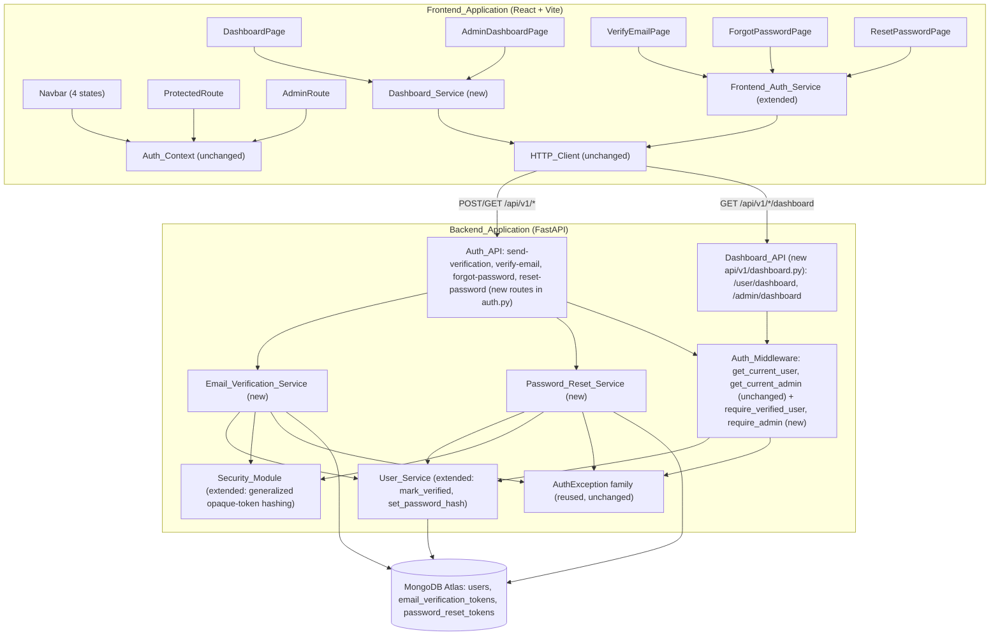

# Design Document

## Overview

Sprint 1B completes the authentication surface on top of Sprint 1A's JWT foundation. It adds two new opaque-token flows (email verification, password reset), two new stricter authorization dependencies (`require_verified_user`, `require_admin`), two minimal demonstration routes that exercise those dependencies, and the frontend components needed to consume all of it (`ProtectedRoute`, `AdminRoute`, three new pages, two minimal dashboard pages, and a four-state `Navbar`).

Nothing in Sprint 1A is redesigned. The Access_Token/Refresh_Token JWT mechanics, the Refresh_Token_Cookie attributes, `get_current_user`/`get_current_admin`, the response envelope, the `AuthException` family and its single handler, and the frontend's `httpClient` refresh-and-retry interceptor are all reused exactly as they exist today. This sprint's new backend modules fit into the same layering Sprint 1A established: new services (`email_verification_service.py`, `password_reset_service.py`) mirror `user_service.py`'s "sole owner of its collection" pattern; new middleware dependencies extend `middleware/auth.py` alongside the existing two; new routes extend `api/v1/auth.py` and add one new router (`api/v1/dashboard.py`) rather than overloading `auth.py` with unrelated RBAC-demo routes.

Four design decisions carry through the whole sprint, each resolving an ambiguity raised while scoping this work:

1. **Verify-email needs no `Authorization` header; send-verification does.** Requesting a token for *your own* account requires proof you're already logged in as that account (`get_current_user`). Consuming a token requires only knowledge of the token itself — that is the entire point of a mailed verification link, which may be opened in a browser session that never logged in (Req 3.1, 4.1).
2. **`require_admin` is additive, not a replacement for `get_current_admin`.** `get_current_admin` (Sprint 1A) checks `role == "admin"` only and nothing currently depends on stricter behavior. Rather than changing its contract retroactively, this sprint introduces `require_admin` as a new, stricter dependency (`is_verified` AND `role == "admin"`) used by the new `Admin_Dashboard_Endpoint`. `get_current_admin` is left untouched (Req 10.5).
3. **The envelope's `message` field stays generic; endpoint-specific text goes in `data`.** `success_response(message, data)` is the established convention. The dashboard endpoints' fixed literal strings ("Welcome to your dashboard.", "Welcome Admin.") are *payload*, not a description of the HTTP operation's outcome, so they go inside `data.message`; the envelope's own `message` field carries a generic description ("Dashboard retrieved.") exactly the way `UserResponse` payloads already work in `/auth/me` (Req 11.2, 12.2).
4. **`ProtectedRoute` gates on `isAuthenticated` alone; verification is enforced by the backend and handled by the page.** Splitting it this way keeps `ProtectedRoute` reusable for any future authenticated-but-not-necessarily-verified route, while `DashboardPage` itself renders a friendly "not verified yet" state when the backend's `require_verified_user` dependency rejects it with 403 — the frontend route guard and the backend authorization dependency each do the job they're suited for, and neither duplicates the other's check (Req 14.5, 16.2).

## Architecture



Key decisions:

- **Two new services, not one combined "tokens" service.** `Email_Verification_Service` and `Password_Reset_Service` each own exactly one collection (`email_verification_tokens`, `password_reset_tokens`), mirroring `User_Service`'s "sole owner of its collection" rule (Req 2.7, 5.7). They are structurally near-identical (create-token / consume-token), but merging them into one generic "opaque token service" would blur the collection-ownership boundary the rest of the codebase relies on for reasoning about who can write what — the small amount of duplication is the cheaper cost.
- **A new `api/v1/dashboard.py` router, not more routes crammed into `auth.py`.** The two dashboard routes are not authentication actions themselves — they are RBAC *demonstrations* that happen to depend on Auth_Middleware. Keeping them in their own router (mounted at `/api/v1` with routes for `/user/dashboard` and `/admin/dashboard`) keeps `auth.py` scoped to what its name says, matching Requirement 24.1's route-thinness intent applied to file organization.
- **The Security_Module's existing `_refresh_token_digest`/`hash_refresh_token`/`verify_refresh_token` pattern is generalized into named, reusable functions** (`hash_opaque_token`/`verify_opaque_token`) rather than each new service reimplementing its own SHA-256-then-bcrypt pipeline. This satisfies Requirement 24.4's "reuse the existing hashing approach" literally: one pipeline, three callers (Refresh_Token, Email_Verification_Token, Password_Reset_Token).
- **No new exception types.** `InvalidTokenException`, `ExpiredTokenException`, and `UnauthorizedException` (all from Sprint 1A) cover every new failure mode this sprint introduces — an unmatched opaque token, an expired opaque token, and an authorization failure with an overridable status code. Introducing `EmailVerificationException` or similar would duplicate a shape that already exists.

## Components and Interfaces

### Backend

#### Directory layout additions (`backend/app/`)

```
backend/
├── app/
│   ├── api/v1/
│   │   ├── __init__.py       # extended: include dashboard.router
│   │   ├── auth.py           # extended: 4 new route handlers
│   │   └── dashboard.py      # NEW - Dashboard_API
│   ├── core/
│   │   ├── config.py         # extended: email_verification_expire_hours,
│   │   │                     #   password_reset_expire_minutes, app_env
│   │   └── security.py       # extended: hash_opaque_token/verify_opaque_token
│   ├── middleware/
│   │   └── auth.py           # extended: require_verified_user, require_admin
│   ├── models/
│   │   ├── user.py           # extended: PasswordResetRequest schema
│   │   ├── email_verification.py  # NEW
│   │   └── password_reset.py      # NEW
│   ├── services/
│   │   ├── user_service.py           # extended: mark_verified, set_password_hash
│   │   ├── email_verification_service.py  # NEW
│   │   └── password_reset_service.py      # NEW
```

#### Settings extension (`core/config.py`, Req 1)

```python
class Settings(BaseSettings):
    # ...unchanged Sprint 0/1A fields...
    email_verification_expire_hours: int = 24
    password_reset_expire_minutes: int = 30
    app_env: str = "production"
```

`app_env` defaults to `"production"` (not `"development"`) precisely so an operator who forgets to set `APP_ENV` never accidentally exposes a raw token in a response (Req 1.3) — the safe default is the restrictive one, matching the project's "never leak a secret by omission" posture.

#### Security_Module generalization (`core/security.py`, Req 2.2, 5.2, 24.4)

The existing `_refresh_token_digest`/`hash_refresh_token`/`verify_refresh_token` trio is renamed to generic names and kept as thin aliases so no Sprint 1A caller needs to change:

```python
def _opaque_token_digest(token: str) -> str:
    """Reduces any opaque token string (far longer than bcrypt's 72-byte
    input limit) to a fixed-length 64-character hex SHA-256 digest."""
    return hashlib.sha256(token.encode("utf-8")).hexdigest()

def hash_opaque_token(token: str) -> str:
    """Hashes any opaque token (Refresh_Token, Email_Verification_Token,
    Password_Reset_Token) for storage, via SHA-256-digest-then-bcrypt."""
    return _pwd_context.hash(_opaque_token_digest(token))

def verify_opaque_token(token: str, token_hash: str) -> bool:
    """Verifies an opaque token against a stored hash. Returns False (never
    raises) for a malformed/non-bcrypt stored hash."""
    try:
        return _pwd_context.verify(_opaque_token_digest(token), token_hash)
    except (ValueError, UnknownHashError):
        return False

# Sprint 1A names kept as aliases - no caller changes required.
hash_refresh_token = hash_opaque_token
verify_refresh_token = verify_opaque_token
```

**Design decision — generalize by renaming rather than adding parallel functions.** `Email_Verification_Service` and `Password_Reset_Service` call `hash_opaque_token`/`verify_opaque_token` directly; `user_service.py`'s existing `set_refresh_token` keeps calling `hash_refresh_token`/`verify_refresh_token` (the aliases), so its source is untouched. This is what "generalize... rather than inventing a new hashing scheme" (per the sprint brief) means concretely: one pipeline, now with a name that describes what it actually does.

#### Email_Verification_Token model (`models/email_verification.py`, Req 2)

Persisted document shape (plain dict, mirroring `users`):

```python
{
    "_id": ObjectId(...),
    "user_id": str,          # string form of the associated user's _id
    "token_hash": str,       # hash_opaque_token(raw_token)
    "expires_at": datetime,  # created_at + email_verification_expire_hours
    "created_at": datetime,
}
```

No Pydantic schema is needed for this document — like `users`, it is read/written only by its owning service as a plain dict.

#### Email_Verification_Service (`services/email_verification_service.py`, Req 2)

```python
async def _collection():
    return db["email_verification_tokens"]

async def create_verification_token(user_id: str) -> str:
    """Generates a raw token via secrets.token_urlsafe, persists its hash,
    and returns the raw value exactly once (Req 2.1)."""
    raw_token = secrets.token_urlsafe(32)
    now = datetime.now(timezone.utc)
    await _collection().insert_one({
        "user_id": user_id,
        "token_hash": hash_opaque_token(raw_token),
        "expires_at": now + timedelta(hours=settings.email_verification_expire_hours),
        "created_at": now,
    })
    return raw_token

async def consume_verification_token(raw_token: str) -> None:
    """Locates the matching record by hash comparison, marks the user
    verified, and deletes the record so it cannot be reused (Req 2.3-2.6)."""
    record = await _find_matching_record(raw_token)
    if record is None:
        raise InvalidTokenException("Invalid verification token.")
    if is_expired_at(record["expires_at"]):
        raise ExpiredTokenException("Verification token has expired.")
    user = await user_service.find_by_id(record["user_id"])
    if user is None:
        raise InvalidTokenException("Invalid verification token.")
    await user_service.mark_verified(record["user_id"])
    await _collection().delete_one({"_id": record["_id"]})

async def _find_matching_record(raw_token: str) -> dict | None:
    """Scans unexpired-or-not records and returns the first whose
    token_hash verifies against raw_token, or None."""
    async for doc in _collection().find({}):
        if verify_opaque_token(raw_token, doc["token_hash"]):
            return doc
    return None
```

**Design decision — matching by scan-and-verify, not by a lookup key.** Because the raw token is never persisted, there is no indexed field to query by equality; the token can only be *verified* against a stored bcrypt hash, one candidate at a time. This mirrors exactly how `refresh_session` already matches a presented Refresh_Token against the one persisted hash on a already-identified user document — the difference here is that the user isn't known yet, only the token is, so the service must scan the small `email_verification_tokens`/`password_reset_tokens` collections (each has at most one live row per user in practice, since a new send-verification/forgot-password call does not delete the previous row, but expired rows are inert and consumed rows are deleted). This is acceptable because these collections are expected to stay small (one row per pending verification/reset, cleaned up on every successful consumption) and this is a demonstration/simulated flow, not a high-throughput production path.

**Design decision — an expired record is deliberately not deleted by the failure path.** Requirement 2.5 states the failure path must not delete the record as a side effect. This keeps the failure semantics simple (an expired token stays exactly as expired on a second attempt, rather than turning into "not found" after the first failed attempt) and leaves any cleanup of stale expired rows as an operational concern outside this sprint's scope (no TTL index or cleanup job is introduced).

#### Password_Reset_Token model and service (`models/password_reset.py`, `services/password_reset_service.py`, Req 5)

Structurally identical to Email_Verification_Token/Email_Verification_Service, with one additional step in the consume path:

```python
{
    "_id": ObjectId(...),
    "user_id": str,
    "token_hash": str,
    "expires_at": datetime,  # created_at + password_reset_expire_minutes
    "created_at": datetime,
}
```

```python
async def create_reset_token(user_id: str) -> str:
    """Same shape as create_verification_token, using
    password_reset_expire_minutes (Req 5.1)."""
    ...

async def consume_reset_token(raw_token: str, new_password: str) -> None:
    """Locates the matching record, hashes new_password via
    Security_Module.hash_password, replaces the user's password_hash via
    User_Service, clears the user's refresh_token_hash via User_Service
    (forcing logout of the single active session), deletes the token
    record, or raises InvalidTokenException/ExpiredTokenException
    (Req 5.3-5.6)."""
    record = await _find_matching_record(raw_token)
    if record is None:
        raise InvalidTokenException("Invalid password reset token.")
    if is_expired_at(record["expires_at"]):
        raise ExpiredTokenException("Password reset token has expired.")
    user = await user_service.find_by_id(record["user_id"])
    if user is None:
        raise InvalidTokenException("Invalid password reset token.")
    await user_service.set_password_hash(record["user_id"], hash_password(new_password))
    await user_service.set_refresh_token(record["user_id"], None)
    await _collection().delete_one({"_id": record["_id"]})
```

Clearing the Refresh_Token via the existing `set_refresh_token(user_id, None)` call (the same function `logout` already uses) is what satisfies "invalidate the stored refresh session" (Req 5.3, 7.3, 8.2) — no new User_Service function is needed for that half of the operation, only for replacing the password hash.

#### User_Service extension (`services/user_service.py`, Req 2.3, 5.3)

Two new functions, following the existing `set_refresh_token` pattern exactly:

```python
async def mark_verified(user_id: str) -> bool:
    """Sets is_verified=True on the user identified by id. Returns True iff
    a matching document was found and updated."""
    result = await _collection().update_one(
        {"_id": ObjectId(user_id)},
        {"$set": {"is_verified": True, "updated_at": datetime.now(timezone.utc)}},
    )
    return result.matched_count == 1

async def set_password_hash(user_id: str, password_hash: str) -> bool:
    """Replaces the password_hash field on the user identified by id.
    Returns True iff a matching document was found and updated."""
    result = await _collection().update_one(
        {"_id": ObjectId(user_id)},
        {"$set": {"password_hash": password_hash, "updated_at": datetime.now(timezone.utc)}},
    )
    return result.matched_count == 1
```

Neither `Email_Verification_Service` nor `Password_Reset_Service` writes to `users` directly — they call these two new `User_Service` functions, preserving Requirement 6.8's "sole access through User_Service" rule from Sprint 1A (restated here as Req 2.7/5.7 for the two new collections, and implicitly upheld for `users` itself).

#### Reset_Password request schema (`models/user.py`, Req 7.2)

```python
class PasswordResetRequest(BaseModel):
    """Reset_Password_Endpoint request body. Reuses UserCreate's password
    bounds (8-128 chars) rather than defining new ones (Req 7.2)."""
    token: str
    new_password: str = Field(min_length=8, max_length=128)
```

`VerifyEmailRequest`/`ForgotPasswordRequest` are similarly small schemas (`{token: str}` and `{email: EmailStr}` respectively) added alongside `PasswordResetRequest` in `models/user.py`, since they are all Auth_API request bodies and `models/user.py` is already the home for those.

#### Auth_Middleware extension (`middleware/auth.py`, Req 9, 10)

```python
async def require_verified_user(
    user: dict[str, Any] = Depends(get_current_user),
) -> dict[str, Any]:
    """Requires get_current_user to succeed AND is_verified True (Req 9)."""
    if not user.get("is_verified"):
        raise UnauthorizedException("Email verification required.", status_code=403)
    return user


async def require_admin(
    user: dict[str, Any] = Depends(get_current_user),
) -> dict[str, Any]:
    """Requires get_current_user to succeed AND is_verified True AND
    role == "admin" (Req 10). Additive alongside get_current_admin, which
    remains unchanged (Req 10.5)."""
    if not user.get("is_verified") or user.get("role") != "admin":
        raise UnauthorizedException("Administrator access required.", status_code=403)
    return user
```

Both depend on `get_current_user` via FastAPI's `Depends`, exactly like `get_current_admin` does, so any `AuthException` raised while resolving the user propagates unchanged (Req 9.2, 10.2) — no `try/except` wraps the call.

#### Auth_API extension (`api/v1/auth.py`, Req 3, 4, 6, 7)

```python
@router.post("/send-verification")
async def send_verification(current_user: dict = Depends(get_current_user)) -> dict:
    if current_user.get("is_verified"):
        return success_response("Account is already verified.")
    token = await email_verification_service.create_verification_token(str(current_user["_id"]))
    data = {"token": token} if settings.app_env == "development" else None
    return success_response("Verification email sent.", data)


@router.post("/verify-email")
async def verify_email(body: VerifyEmailRequest) -> dict:
    await email_verification_service.consume_verification_token(body.token)
    return success_response("Email verified successfully.")


@router.post("/forgot-password")
async def forgot_password(body: ForgotPasswordRequest) -> dict:
    user = await user_service.find_by_email(body.email)
    data = None
    if user is not None:
        token = await password_reset_service.create_reset_token(str(user["_id"]))
        if settings.app_env == "development":
            data = {"token": token}
    return success_response("If an account exists, a reset link has been generated.", data)


@router.post("/reset-password")
async def reset_password(body: PasswordResetRequest) -> dict:
    await password_reset_service.consume_reset_token(body.token, body.new_password)
    return success_response("Password reset successfully.")
```

No route here contains a `try/except` — every failure (401 invalid/expired token from `verify_email`/`reset_password`) is produced by letting the service layer raise, exactly like Sprint 1A's routes (Req 24.2). `send_verification` and `forgot_password` are the only two branches with an inline `if`, and both are envelope-shaping decisions (what to put in `data`), not business logic — the actual "does this user exist / is this user verified" decisions are read directly off already-resolved data (`current_user`, `user`), not re-derived.

**Design decision — `forgot_password`'s message is a single literal string used on both branches**, satisfying Requirement 6.4's "identical wording regardless of match" directly: there is only one `success_response(...)` call in the function, executed unconditionally, with `data` being the only thing that varies.

#### Dashboard_API (`api/v1/dashboard.py`, new file, Req 11, 12)

```python
router = APIRouter()

@router.get("/user/dashboard")
async def user_dashboard(user: dict = Depends(require_verified_user)) -> dict:
    return success_response("Dashboard retrieved.", {"message": "Welcome to your dashboard."})


@router.get("/admin/dashboard")
async def admin_dashboard(user: dict = Depends(require_admin)) -> dict:
    return success_response("Dashboard retrieved.", {"message": "Welcome Admin."})
```

Mounted in `api/v1/__init__.py` alongside `health.router` and `auth.router` (no prefix — `/user/dashboard` and `/admin/dashboard` are each other's full sub-paths under `/api/v1`, matching the literal paths in Requirements 11.1/12.1).

### Frontend

#### Directory layout additions (`frontend/src/`)

```
frontend/
├── src/
│   ├── components/
│   │   ├── ProtectedRoute.jsx    # NEW
│   │   └── AdminRoute.jsx        # NEW
│   ├── pages/
│   │   ├── DashboardPage.jsx         # NEW
│   │   ├── AdminDashboardPage.jsx    # NEW
│   │   ├── VerifyEmailPage.jsx       # NEW
│   │   ├── ForgotPasswordPage.jsx    # NEW
│   │   └── ResetPasswordPage.jsx     # NEW
│   ├── services/
│   │   ├── authService.js        # extended: verifyEmail, forgotPassword, resetPassword, sendVerification
│   │   └── dashboardService.js   # NEW
│   ├── components/Navbar.jsx     # extended: 4 states
│   ├── App.jsx                    # extended: 5 new routes
```

#### Frontend_Auth_Service extension (`services/authService.js`, Req 17, 18, 19)

```js
export const authService = {
  // ...existing Sprint 1A functions unchanged...
  async sendVerification() {
    const { data } = await httpClient.post("/api/v1/auth/send-verification");
    return data.data;
  },
  async verifyEmail(token) {
    const { data } = await httpClient.post("/api/v1/auth/verify-email", { token });
    return data;
  },
  async forgotPassword(email) {
    const { data } = await httpClient.post("/api/v1/auth/forgot-password", { email });
    return data;
  },
  async resetPassword(token, newPassword) {
    const { data } = await httpClient.post("/api/v1/auth/reset-password", {
      token,
      new_password: newPassword,
    });
    return data;
  },
};
```

Every new function is a thin wrapper with no `try/catch`, matching the existing five functions' contract (Req 25.1, mirroring Sprint 1A's Req 20.7) — a rejected `httpClient` call rejects the wrapper's promise unchanged.

#### Dashboard_Service (`services/dashboardService.js`, new file, Req 16.5)

```js
import { httpClient } from "./httpClient";

export const dashboardService = {
  async getUserDashboard() {
    const { data } = await httpClient.get("/api/v1/user/dashboard");
    return data.data; // { message: "Welcome to your dashboard." }
  },
  async getAdminDashboard() {
    const { data } = await httpClient.get("/api/v1/admin/dashboard");
    return data.data; // { message: "Welcome Admin." }
  },
};
```

A separate module from `authService.js`, so `authService.js` stays scoped to `/api/v1/auth/*` exactly as Sprint 1A's Requirement 20 establishes (Req 16.5, 25.2).

#### ProtectedRoute (`components/ProtectedRoute.jsx`, Req 14)

```jsx
import { Navigate } from "react-router-dom";
import { useAuth } from "../context/AuthContext";

function ProtectedRoute({ children }) {
  const { isAuthenticated, loading } = useAuth();

  if (loading) return <LoadingState />;
  if (!isAuthenticated) return <Navigate to="/login" replace />;
  return children;
}

export default ProtectedRoute;
```

Gates on `isAuthenticated` alone, per Design Decision 4 above (Req 14.5).

#### AdminRoute (`components/AdminRoute.jsx`, Req 15)

```jsx
function AdminRoute({ children }) {
  const { user, isAuthenticated, loading } = useAuth();

  if (loading) return <LoadingState />;
  const isAllowed = isAuthenticated && user?.is_verified && user?.role === "admin";
  if (!isAllowed) return <Navigate to="/" replace />;
  return children;
}

export default AdminRoute;
```

Redirects to `/` (HomePage), not `/login`, distinguishing it from `ProtectedRoute` (Req 15.5) — a logged-in non-admin isn't "not logged in", so sending them to a login form would be misleading.

#### DashboardPage / AdminDashboardPage (`pages/DashboardPage.jsx`, `pages/AdminDashboardPage.jsx`, Req 16)

```jsx
function DashboardPage() {
  const [state, setState] = useState({ status: "loading", message: null });

  useEffect(() => {
    dashboardService
      .getUserDashboard()
      .then(({ message }) => setState({ status: "ready", message }))
      .catch((error) => {
        if (error?.response?.status === 403) {
          setState({ status: "unverified", message: null });
        } else {
          setState({ status: "error", message: null });
        }
      });
  }, []);

  if (state.status === "loading") return <LoadingState />;
  if (state.status === "unverified") return <p>Please verify your email to access the dashboard.</p>;
  if (state.status === "error") return <p>Something went wrong loading your dashboard.</p>;
  return <p>{state.message}</p>;
}
```

`AdminDashboardPage` is the same shape without the 403-specific branch (an admin route is already gated by `AdminRoute`, so reaching the backend call at all implies the frontend already believes the user qualifies; a defensive generic error state still covers a stale/incorrect client-side `user` object).

#### VerifyEmailPage (`pages/VerifyEmailPage.jsx`, Req 17)

```jsx
function VerifyEmailPage() {
  const [status, setStatus] = useState("verifying");
  const [params] = useSearchParams();
  const navigate = useNavigate();
  const token = params.get("token");

  useEffect(() => {
    if (!token) {
      setStatus("failed");
      return;
    }
    authService
      .verifyEmail(token)
      .then(() => {
        setStatus("success");
        toast.success("Email verified successfully.");
        setTimeout(() => navigate("/login"), 2000);
      })
      .catch(() => {
        setStatus("failed");
        toast.error("This verification link is invalid or has expired.");
      });
  }, [token, navigate]);

  // render based on status: "verifying" | "success" | "failed"
}
```

The two-second delay before navigating (Req 17.3) is implemented with `setTimeout`, giving the user a moment to see the success state rendered on the page before being redirected.

#### ForgotPasswordPage (`pages/ForgotPasswordPage.jsx`, Req 18)

A single-field form following `LoginPage`'s validator-then-submit shape:

```js
export function validateForgotPasswordForm({ email }) {
  const errors = {};
  if (!email.trim() || !isValidEmailFormat(email)) {
    errors.email = "Enter a valid email address.";
  }
  return errors;
}
```

On success: `toast.success("If an account exists, a reset link has been generated.")` — this exact string, taken directly from Requirement 18.4, regardless of whether the backend's `data` field happened to contain a development-mode token. On failure (network/validation error, not the account-not-found case, since that's folded into the identical success response): `toast.error(...)`, stay on page.

#### ResetPasswordPage (`pages/ResetPasswordPage.jsx`, Req 19)

```js
export function validateResetPasswordForm({ newPassword, confirmPassword }) {
  const errors = {};
  if (newPassword.length < 8) errors.newPassword = "Password must be at least 8 characters.";
  if (confirmPassword !== newPassword) errors.confirmPassword = "Passwords do not match.";
  return errors;
}
```

Reads `token` from `useSearchParams()`. On submit success: `toast.success("Password updated.")`, `navigate("/login")`. On failure: `toast.error(...)` describing an invalid/expired token, stay on page (Req 19.4, 19.5, 21.3).

#### Navbar (`components/Navbar.jsx`, Req 20)

```jsx
const { user, isAuthenticated, loading, logout } = useAuth();

function renderAuthItems() {
  if (loading) return null;
  if (!isAuthenticated) {
    return <GuestLinks />; // Login, Signup
  }
  if (!user.is_verified) {
    return (
      <>
        <VerifyEmailControl />  {/* calls authService.sendVerification(), then toasts */}
        <NavLink to="/dashboard">Dashboard</NavLink>
      </>
    );
  }
  if (user.role === "admin") {
    return (
      <>
        <NavLink to="/dashboard">Dashboard</NavLink>
        <NavLink to="/admin">Admin Panel</NavLink>
        <LogoutButton onClick={logout} />
      </>
    );
  }
  return (
    <>
      <NavLink to="/dashboard">Dashboard</NavLink>
      <LogoutButton onClick={logout} />
    </>
  );
}
```

Four mutually exclusive branches implement the four states exactly (Req 20.1-20.4); no dropdown markup is introduced (Req 20.6), matching Sprint 1A's existing flat-element convention.

#### Route wiring (`App.jsx`, Req 14, 15, 16)

```jsx
<Route path="forgot-password" element={<ForgotPasswordPage />} />
<Route path="reset-password" element={<ResetPasswordPage />} />
<Route path="verify-email" element={<VerifyEmailPage />} />
<Route
  path="dashboard"
  element={<ProtectedRoute><DashboardPage /></ProtectedRoute>}
/>
<Route
  path="admin"
  element={<AdminRoute><AdminDashboardPage /></AdminRoute>}
/>
```

Added alongside the existing `/`, `/login`, `/signup`, `/roadmap` routes, all still rendered inside the shared `Layout`. `AuthProvider` continues to wrap `Routes`, unchanged from Sprint 1A.

## Data Models

### New persisted documents

#### `email_verification_tokens` collection

| Field | Type | Notes |
|---|---|---|
| `_id` | ObjectId | uniquely identifies the record |
| `user_id` | string | string form of the associated user's `_id` |
| `token_hash` | string | `hash_opaque_token(raw_token)`; the raw token is never persisted (Req 2.2) |
| `expires_at` | datetime | `created_at` + `email_verification_expire_hours` (Req 2.1) |
| `created_at` | datetime | set once at creation |

#### `password_reset_tokens` collection

| Field | Type | Notes |
|---|---|---|
| `_id` | ObjectId | uniquely identifies the record |
| `user_id` | string | string form of the associated user's `_id` |
| `token_hash` | string | `hash_opaque_token(raw_token)`; the raw token is never persisted (Req 5.2) |
| `expires_at` | datetime | `created_at` + `password_reset_expire_minutes` (Req 5.1) |
| `created_at` | datetime | set once at creation |

Both collections match the shape already declared in `PROJECT_SPEC.md` section 9 / `KIRO_CONTEXT.md` for `password_reset_tokens` (`user_id`, `token`, `expires_at`), refined here to store `token_hash` rather than the raw `token`, consistent with never persisting a raw secret token anywhere in this codebase (matching the existing `refresh_token_hash` precedent on `users`).

### Extended `users` collection

No new fields. `is_verified` (already present, defaulting to `false` since Sprint 1A) is set to `true` by `mark_verified`; `password_hash` is replaced by `set_password_hash`; `refresh_token_hash` is cleared by the existing `set_refresh_token(user_id, None)` call, reused unchanged from Sprint 1A.

### New Pydantic schemas (`models/user.py`, `models/email_verification.py`, `models/password_reset.py`)

`VerifyEmailRequest { token: str }`
`ForgotPasswordRequest { email: EmailStr }`
`PasswordResetRequest { token: str, new_password: str[8,128] }`

None of these schemas are persisted directly — they validate Auth_API request bodies only, exactly like `UserCreate`/`UserLogin` do.

### Settings additions

`email_verification_expire_hours: int = 24`, `password_reset_expire_minutes: int = 30`, `app_env: str = "production"`.

### Frontend Auth_Context state

Unchanged from Sprint 1A: `{ user: UserResponse | null, isAuthenticated, loading, login, logout, signup }`. `user.is_verified` and `user.role` already flow through from the Me_Endpoint's `UserResponse` (Req 13.2) — no Auth_Context change is required for `ProtectedRoute`/`AdminRoute`/`Navbar` to read them.

## Correctness Properties

*A property is a characteristic or behavior that should hold true across all valid executions of a system-essentially, a formal statement about what the system should do. Properties serve as the bridge between human-readable specifications and machine-verifiable correctness guarantees.*

The prework analysis above identified genuine "for all inputs" behavior in the opaque-token hashing pipeline, the two token-consumption flows, the two anti-enumeration/environment-gating rules, the schema bounds, the two new middleware dependencies, and six pieces of pure frontend decision logic (two route guards, three page-level validators, and the Navbar's state selector). During reflection, the per-service consumption checks for `Email_Verification_Service` and `Password_Reset_Service` were consolidated into one shared property (Property 2) since both services implement the identical single-use/expiry-distinction contract, with a second property (Property 3) capturing only the two side effects unique to password reset. The `require_verified_user`/`require_admin` checks were likewise consolidated into one property (Property 7) rather than two, since `require_admin`'s condition is a strict superset of `require_verified_user`'s. Configuration loading, documentation, architectural/route-thinness constraints, and fixed-literal-text toast/response checks are covered by unit and example tests instead, per the prework's "no" and "example" classifications.

### Property 1: Opaque token hashing round-trips, and only for the original token

For any string generated as a raw opaque token, hashing it with `hash_opaque_token` and then verifying that same raw value against the resulting hash with `verify_opaque_token` SHALL succeed; and for any two distinct token strings, verifying the second against the hash of the first SHALL fail. For any malformed or non-bcrypt hash string, `verify_opaque_token` SHALL return `False` rather than raising.

**Validates: Requirements 2.1, 2.2, 5.1, 5.2**

### Property 2: Opaque token consumption is single-use, and distinguishes expired from invalid without deleting the expired record

For any freshly created Email_Verification_Token or Password_Reset_Token, consuming it once with its correct raw value SHALL succeed, and consuming the same raw value a second time SHALL fail as an Invalid Token failure (the record having been deleted by the first successful consumption). For any token record whose `expires_at` is in the past, consuming it SHALL fail as an Expired Token failure rather than an Invalid Token failure, and a second consumption attempt with the same raw value SHALL still fail as an Expired Token failure (the record is not deleted by the failed attempt). For any raw value that never matches a persisted record's hash, consumption SHALL fail as an Invalid Token failure.

**Validates: Requirements 2.3, 2.4, 2.5, 2.6, 5.4, 5.5, 5.6**

### Property 3: Successful password reset replaces the password hash and invalidates the refresh session

For any user with an existing Refresh_Token hash and any valid unexpired Password_Reset_Token, successfully consuming that token with a new valid password SHALL cause the user's `password_hash` to verify against the new password (and no longer verify against the old password, unless the two happen to be equal), and SHALL cause the user's `refresh_token_hash` to become `None`.

**Validates: Requirements 5.3**

### Property 4: A raw opaque token appears in a response if and only if the environment is development and a token was actually created this call

For any App_Environment value and any combination of {Send_Verification_Endpoint invoked by an already-verified vs. not-yet-verified user; Forgot_Password_Endpoint invoked with an email that does or does not match an existing user}, the response body SHALL contain a raw token value in the `data` field if and only if App_Environment is exactly `"development"` AND a new Email_Verification_Token or Password_Reset_Token was actually created during that call. In every other combination (production environment, or no token created because the user was already verified / no matching account existed), the response body SHALL NOT contain a raw token value anywhere.

**Validates: Requirements 3.4, 3.5, 6.5, 6.6, 6.7**

### Property 5: Forgot-password responses are worded identically regardless of account existence

For any email string, whether or not it matches an existing user, the Forgot_Password_Endpoint's response `message` field SHALL be the exact same string in both cases, and the HTTP status SHALL be 200 in both cases.

**Validates: Requirements 6.4**

### Property 6: `PasswordResetRequest` accepts and rejects based exactly on its stated password bound

For any string used as `new_password`, `PasswordResetRequest` validation SHALL succeed if and only if the string's length is between 8 and 128 characters inclusive; for any string violating that bound, validation SHALL fail.

**Validates: Requirements 7.2**

### Property 7: `require_verified_user` and `require_admin` reject based exactly on their stated conditions, propagating upstream failures unchanged

For any resolved user document (varying `is_verified` and `role` independently), `require_verified_user` SHALL raise a 403 `UnauthorizedException` if and only if `is_verified` is not `true`, and SHALL otherwise return the user unchanged. For any resolved user document, `require_admin` SHALL raise a 403 `UnauthorizedException` if and only if `is_verified` is not `true` OR `role` is not `"admin"`, and SHALL otherwise return the user unchanged. For any failure raised while `get_current_user` resolves the underlying user (missing header, expired token, decode failure, unknown `sub`), both `require_verified_user` and `require_admin` SHALL propagate that exact failure without evaluating `is_verified` or `role`.

**Validates: Requirements 9.1, 9.2, 9.3, 9.4, 10.1, 10.2, 10.3, 10.4**

### Property 8: `ProtectedRoute` renders exactly one of three states as a pure function of `loading` and `isAuthenticated`

For any combination of `loading` and `isAuthenticated` (and any value of `is_verified`/`role`, which SHALL have no effect on the outcome), `ProtectedRoute` SHALL render the loading state if and only if `loading` is `true`; SHALL render its children if and only if `loading` is `false` AND `isAuthenticated` is `true`; and SHALL redirect to `/login` if and only if `loading` is `false` AND `isAuthenticated` is `false`. Exactly one of these three outcomes SHALL occur for every combination.

**Validates: Requirements 14.1, 14.2, 14.3, 14.4, 14.5**

### Property 9: `AdminRoute` renders exactly one of three states as a pure function of `loading`, `isAuthenticated`, `is_verified`, and `role`

For any combination of `loading`, `isAuthenticated`, `is_verified`, and `role`, `AdminRoute` SHALL render the loading state if and only if `loading` is `true`; SHALL render its children if and only if `loading` is `false` AND `isAuthenticated` is `true` AND `is_verified` is `true` AND `role` is exactly `"admin"`; and SHALL redirect to `/` if and only if `loading` is `false` AND at least one of the three conditions does not hold. Exactly one of these three outcomes SHALL occur for every combination.

**Validates: Requirements 15.1, 15.2, 15.3, 15.4, 15.5**

### Property 10: `VerifyEmailPage` calls the Verify_Email_Endpoint if and only if a non-empty `token` query parameter is present

For any URL query string, `VerifyEmailPage` SHALL call the Frontend_Auth_Service's `verifyEmail` function if and only if the parsed `token` parameter is present and non-empty; for any query string lacking a non-empty `token` parameter, `VerifyEmailPage` SHALL display the failure state without calling `verifyEmail`.

**Validates: Requirements 17.1, 17.5**

### Property 11: `ForgotPasswordPage` calls the Forgot_Password_Endpoint if and only if the submitted email is non-empty and validly formatted

For any string submitted as the email field, `ForgotPasswordPage`'s validator SHALL report no error if and only if the string is non-empty and satisfies the existing `isValidEmailFormat` rule established in Sprint 1A; `ForgotPasswordPage` SHALL call the Frontend_Auth_Service's `forgotPassword` function if and only if the validator reports no error.

**Validates: Requirements 18.2, 18.3**

### Property 12: `ResetPasswordPage` calls the Reset_Password_Endpoint if and only if the new password is at least 8 characters and the confirmation matches

For any `newPassword`/`confirmPassword` pair, `ResetPasswordPage`'s validator SHALL report no error if and only if `newPassword.length >= 8` AND `confirmPassword === newPassword`; `ResetPasswordPage` SHALL call the Frontend_Auth_Service's `resetPassword` function if and only if the validator reports no error.

**Validates: Requirements 19.2, 19.3**

### Property 13: The Navbar's state-selection function picks exactly one of four states as a pure function of authentication, verification, and role

For any combination of `loading`, `isAuthenticated`, `is_verified`, and `role`, a pure `selectNavbarState({ loading, isAuthenticated, is_verified, role })` function SHALL return exactly one of `"loading"`, `"guest"`, `"unverified"`, `"verified-user"`, or `"admin"`, determined as: `"loading"` if and only if `loading` is `true`; otherwise `"guest"` if and only if `isAuthenticated` is `false`; otherwise `"unverified"` if and only if `is_verified` is `false`; otherwise `"admin"` if and only if `role === "admin"`; otherwise `"verified-user"`. The Navbar component SHALL render the controls documented for each state in Requirement 20 based exclusively on this function's return value.

**Validates: Requirements 20.1, 20.2, 20.3, 20.4, 20.5, 20.6**

## Error Handling

Every new backend failure mode reuses the `AuthException` family and its single handler from Sprint 1A — no new exception type is introduced (Req 24.4).

| Trigger | Exception | HTTP Status |
|---|---|---|
| `verify-email`/`reset-password` token doesn't match any persisted record | `InvalidTokenException` | 401 |
| `verify-email`/`reset-password` token matches a record whose `expires_at` is in the past | `ExpiredTokenException` | 401 |
| `verify-email`/`reset-password` token's associated user no longer exists | `InvalidTokenException` | 401 |
| `send-verification` called without a valid Access_Token | `UnauthorizedException`/`InvalidTokenException`/`ExpiredTokenException` (unchanged Sprint 1A `get_current_user` behavior) | 401 |
| `require_verified_user` rejects an unverified user | `UnauthorizedException(status_code=403)` | 403 |
| `require_admin` rejects a non-verified or non-admin user | `UnauthorizedException(status_code=403)` | 403 |
| `reset-password` request body's `new_password` fails its 8-128 bound | (Sprint 0's `RequestValidationError` handler, unchanged) | 422 |
| `forgot-password` invoked with an email that doesn't match any user | *(not a failure)* — 200 with the identical success message (Property 5) | 200 |

Every branch above produces the same `error_response()` shape via the one existing `AuthException` handler in `main.py`; no new handler is registered, and no new route contains a `try/except` for these exceptions (Req 24.2).

On the frontend, `authService`'s four new functions and `dashboardService`'s two functions deliberately catch nothing, matching the existing five Sprint 1A functions' contract — every rejected Axios promise reaches the calling page component unchanged (Req 25.1). `VerifyEmailPage`, `ForgotPasswordPage`, and `ResetPasswordPage` each catch at the point of their own submit/mount handler specifically to drive a `toast.error(...)` and set a local failure state; none of them inspect HTTP internals beyond distinguishing a 403 (in `DashboardPage` only, for the "not yet verified" inline state) from any other failure.

## Testing Strategy

Sprint 1B has real input-varying logic (opaque token hashing and consumption, environment-gated token exposure, anti-enumeration wording, schema bounds, the two new middleware dependencies, and six pieces of pure frontend decision logic) alongside a substantial amount of orchestration wiring (which service called which, which HTTP status a given branch returns, which toast fires). Both are covered, using property-based tests only where Properties 1-13 above identify genuine "for all inputs" behavior, and example/unit/integration tests everywhere else — following the same allocation approach as Sprint 1A.

### Backend property tests (pytest + Hypothesis, ≥100 examples each)

Added to `backend/tests/`, tagged per the format established in Sprint 1A:

```python
# Feature: sprint-1b-authentication-completion, Property 1: Opaque token hashing round-trips...
@given(token=st.text(min_size=1, max_size=200))
@settings(max_examples=100)
def test_opaque_token_hash_verify_round_trip(token):
    assert verify_opaque_token(token, hash_opaque_token(token))
```

- **Property 1** (`test_security.py`): generators for arbitrary token-like strings (mirroring `secrets.token_urlsafe`'s alphabet and typical length), plus a distinct-pair test and explicit `@example` cases for malformed hash strings, mirroring Sprint 1A's Property 1 treatment of `hash_password`/`verify_password`.
- **Property 2** (`test_email_verification_service.py`, `test_password_reset_service.py`, mocked Motor collection behaving like the real single-record-per-token contract): generate a fresh token via the real `create_*_token` function; assert the first `consume_*_token` call succeeds and a second call with the same raw value raises `InvalidTokenException`. Separately, generate a record with a synthetically past `expires_at`; assert consumption raises `ExpiredTokenException` on both a first and a second attempt with the same value, and that the record is not deleted between attempts (assert `delete_one` was never called for that record).
- **Property 3** (`test_password_reset_service.py`, mocked `User_Service`): generate an arbitrary valid new password and an arbitrary existing `refresh_token_hash`; after `consume_reset_token` succeeds, assert `set_password_hash` was called with a hash that verifies against the new password, and `set_refresh_token` was called with `None`.
- **Property 4** (`test_auth_routes.py`, mocked services): generate over `{app_env: "development"|"production"|other, already_verified: bool}` for send-verification and `{app_env, email_matches: bool}` for forgot-password; assert the `data` field contains a `token` key if and only if `app_env == "development"` and a token was created, using `@example` to pin the two literal environment strings plus a fuzzed "neither" string treated as production-equivalent per Requirement 1.3's default.
- **Property 5** (`test_auth_routes.py`, mocked `User_Service`): generate arbitrary email strings and a boolean for whether `find_by_email` resolves to a user or `None`; assert the response `message` string is byte-for-byte identical across both branches.
- **Property 6** (`test_user_model.py`): Hypothesis text strategy for `new_password`, combined with explicit boundary examples (length 7, 8, 128, 129), asserting `PasswordResetRequest(...)` raises `ValidationError` if and only if the bound is violated — reusing the exact generator shape Sprint 1A already built for `UserCreate.password`.
- **Property 7** (`test_auth_middleware.py`): generate arbitrary `(is_verified, role)` pairs for a resolved user dict; assert `require_verified_user`'s and `require_admin`'s raise-or-return decisions match the stated boolean conditions exactly; separately, parametrize over each `get_current_user` failure mode already tested in Sprint 1A's `test_auth_middleware.py` and assert both new dependencies re-raise it unchanged (via a mocked `get_current_user` dependency override).

### Backend unit/example tests (pytest + `httpx.AsyncClient`/FastAPI `TestClient`, mocked services)

- `test_config.py` (extended): add `EMAIL_VERIFICATION_EXPIRE_HOURS`/`PASSWORD_RESET_EXPIRE_MINUTES`/`APP_ENV` default-and-override cases, following the exact existing parametrized pattern.
- `test_security.py` (extended): example test asserting `hash_refresh_token`/`verify_refresh_token` remain callable (alias regression guard).
- `test_user_service.py` (extended): unit tests for `mark_verified` and `set_password_hash`, matched/unmatched-id branches, mirroring `set_refresh_token`'s existing test shape.
- `test_email_verification_service.py`, `test_password_reset_service.py`: example test asserting the persisted document never contains a raw token field (Req 2.2, 5.2); example test asserting a deleted/nonexistent user's token record is rejected as Invalid (Req 2.6, 5.6).
- `test_auth_routes.py` (extended): one example test per HTTP-status branch for all six new/extended routes (`send-verification` 200 verified/not-verified, `verify-email` 200/401, `forgot-password` 200 (both branches, status only), `reset-password` 200/401/422), with the service layer mocked, following Sprint 1A's `test_auth_routes.py` pattern exactly. An example test confirming `verify-email` and `forgot-password`/`reset-password` route handlers execute successfully with no `Authorization` header supplied (Req 4.1, 6.1, 7.1).
- `test_dashboard_routes.py` (new): one example test per branch for `GET /api/v1/user/dashboard` (200 with exact message, 401, 403) and `GET /api/v1/admin/dashboard` (200 with exact message, 401, 403), with `require_verified_user`/`require_admin` mocked/overridden — the 401/403 branches assert the HTTP status only, since the underlying boolean logic is already covered by Property 7.
- `test_main.py`: no changes needed — the existing `AuthException` handler already covers every new exception instance without modification.

### Frontend property tests (Vitest + fast-check)

Following Sprint 1A's precedent of extracting pure decision functions for property testing:

```js
// Feature: sprint-1b-authentication-completion, Property 8: ProtectedRoute renders exactly one of three states...
import fc from "fast-check";

test("ProtectedRoute outcome is a pure function of loading and isAuthenticated", () => {
  fc.assert(
    fc.property(fc.boolean(), fc.boolean(), fc.boolean(), fc.string(), (loading, isAuthenticated, isVerified, role) => {
      const outcome = selectProtectedRouteOutcome({ loading, isAuthenticated });
      const expected = loading ? "loading" : isAuthenticated ? "children" : "redirect-login";
      expect(outcome).toBe(expected);
    }),
    { numRuns: 100 }
  );
});
```

- **Property 8** (`ProtectedRoute.test.jsx`): a small exported `selectProtectedRouteOutcome({ loading, isAuthenticated })` pure function (mirroring the component's own branching) is property-tested directly; a separate rendering test confirms the component honors that function's output.
- **Property 9** (`AdminRoute.test.jsx`): same shape, `selectAdminRouteOutcome({ loading, isAuthenticated, is_verified, role })`, generating `role` from `fc.oneof(fc.constant("admin"), fc.constant("user"), fc.string())` to exercise both the documented values and arbitrary noise.
- **Property 10** (`VerifyEmailPage.test.jsx`): `fc.string()` generator for the raw query-string token value (including the empty string and strings containing only whitespace, both treated as "empty" per Requirement 17.5's "empty or missing" wording), asserting the call-or-not decision matches "non-empty after trim."
- **Property 11** (`ForgotPasswordPage.test.jsx`): reuses the existing `isValidEmailFormat` generator strategy from Sprint 1A's `LoginPage.test.jsx`/`SignupPage.test.jsx`.
- **Property 12** (`ResetPasswordPage.test.jsx`): `fc.record` generator over `{ newPassword, confirmPassword }`, mixing valid/invalid lengths and matching/mismatched values via `fc.oneof`, mirroring Sprint 1A's Property 13 structure for `SignupPage`.
- **Property 13** (`Navbar.test.jsx`): the exported `selectNavbarState({ loading, isAuthenticated, is_verified, role })` function is property-tested directly, generating `role` the same way as Property 9; a separate rendering test confirms each of the five return values (`"loading"`, `"guest"`, `"unverified"`, `"verified-user"`, `"admin"`) maps to the documented rendered controls.

### Frontend unit/example tests (Vitest + React Testing Library)

- `authService.test.js` (extended): one test per new function (`sendVerification`, `verifyEmail`, `forgotPassword`, `resetPassword`) asserting method/URL/body and pass-through rejection, mirroring the existing five functions' tests.
- `dashboardService.test.js` (new): one test per function asserting method/URL and resolved shape.
- `DashboardPage.test.jsx`, `AdminDashboardPage.test.jsx` (new): success-message rendering; `DashboardPage`'s 403 → "please verify" inline state; a generic-error state for any other rejection.
- `VerifyEmailPage.test.jsx` (extended beyond Property 10): success state → toast + delayed navigation (using a fake timer to assert the two-second delay); failure state → toast, no navigation.
- `ForgotPasswordPage.test.jsx` (extended beyond Property 11): success → exact toast text match, regardless of whether the mocked response happened to include a `token` field in `data`; non-account-related failure (e.g. network error) → error toast, stays on page.
- `ResetPasswordPage.test.jsx` (extended beyond Property 12): success → toast + navigation to `/login`; failure → error toast, stays on page.
- `Navbar.test.jsx` (extended beyond Property 13): one rendering test per of the five `selectNavbarState` outcomes, asserting the documented controls (Verify Email control, Dashboard link, Admin Panel link, Logout control) appear or don't appear as specified in Requirement 20; a test asserting the Verify Email control calls `authService.sendVerification`; a structural test asserting no dropdown-role element renders in any state.
- `ProtectedRoute.test.jsx`, `AdminRoute.test.jsx` (extended beyond Properties 8/9): a rendering test per branch confirming `<Navigate>` targets `/login` and `/` respectively.

### Integration checks (manual/documented, consistent with Sprint 1A's approach)

- End-to-end: sign up, request verification (development mode, capture the returned token), open `/verify-email?token=...`, confirm `is_verified` becomes `true` and the Navbar transitions from the unverified state to the verified-user state after a refetch of `/auth/me`.
- End-to-end: request a password reset (development mode, capture the returned token), open `/reset-password?token=...`, set a new password, confirm the old password no longer authenticates and the new one does, and confirm a previously-active session's next authenticated call triggers the existing refresh-and-retry flow to fail (since the refresh token was invalidated) and redirects to `/login` via the existing `registerAuthFailureHandler` wiring.
- End-to-end: log in as a seeded admin user, confirm `/admin` renders the Admin Panel and `/dashboard` both work; log in as a verified non-admin user, confirm `/admin` redirects to `/`.
- Confirm in a browser devtools Application/Storage panel that no `localStorage`/`sessionStorage` key ever holds a verification or reset token across either flow (Req 25.4).

## Design Decisions and Rationale

| Decision | Rationale |
|---|---|
| `verify-email` and `reset-password` require no `Authorization` header; `send-verification` does | The token itself is the credential for the two public-link endpoints; requiring a session would break the core email-link use case. `send-verification` is scoped to "verify my own logged-in account," which does need a session to identify whose account is being verified. |
| `require_admin` is additive alongside `get_current_admin`, not a replacement | Nothing in the codebase currently depends on `get_current_admin` gaining a verification check, and changing its contract retroactively risks an undocumented behavior change for future callers. A new, explicitly stricter dependency avoids that risk entirely. |
| Dashboard endpoints' fixed strings go in `data.message`, not the envelope's top-level `message` | Matches the existing convention (established by `/auth/me` returning a `UserResponse` payload in `data` while the envelope's `message` stays a generic description of the operation) — endpoint-specific content is payload, not an outcome description. |
| `ProtectedRoute` checks `isAuthenticated` only; verification is enforced by the backend and rendered by the page | Keeps `ProtectedRoute` reusable for any future authenticated-but-unverified-okay route, and avoids duplicating the verification check in two places that could drift out of sync; the backend's `require_verified_user` is the actual authority, and the 403 it produces is exactly what `DashboardPage` needs to show a friendly state. |
| `hash_opaque_token`/`verify_opaque_token` generalize Sprint 1A's refresh-token-specific functions via aliasing, not new parallel functions | Satisfies "reuse the existing hashing approach" literally — one hashing pipeline serves the Refresh_Token, Email_Verification_Token, and Password_Reset_Token, and Sprint 1A's `user_service.py` needs no source change since its calls resolve through the kept aliases. |
| Two separate services (`Email_Verification_Service`, `Password_Reset_Service`) rather than one generic token service | Preserves the established "one service owns one collection" rule from Sprint 1A's `User_Service`, even though the two services are structurally near-identical; the collection-ownership boundary is worth more than the small amount of saved duplication. |
| Opaque tokens are matched by scanning and verifying against each stored hash, not by an indexed lookup key | The raw token is never persisted, so there is no field to query by equality — verification against a bcrypt hash is inherently a one-at-a-time comparison. Acceptable because each collection holds at most a small number of live rows per user in this simulated, non-high-throughput flow. |
| An expired token record is not deleted by the failed consumption attempt | Keeps failure semantics stable across repeated attempts with the same expired token (always "expired," never flipping to "not found" after the first attempt) and defers any cleanup-of-stale-rows job to a later sprint, since none is required by the acceptance criteria. |
| `app_env` defaults to `"production"`, not `"development"` | An operator who forgets to set `APP_ENV` gets the restrictive behavior (no token in responses) rather than the permissive one — the safe default is the one that cannot leak a secret. |
| Password reset's forgot-password response uses one unconditional `success_response(...)` call with only `data` varying | Makes Requirement 6.4's "identical wording regardless of match" a structural guarantee (there is only one message string in the function) rather than something that could drift if the two branches were written as separate return statements. |
| A new `api/v1/dashboard.py` router instead of adding the two dashboard routes to `auth.py` | The dashboard routes are RBAC demonstrations, not authentication actions; keeping `auth.py` scoped to `/auth/*` concerns avoids blurring what each router file is responsible for. |
