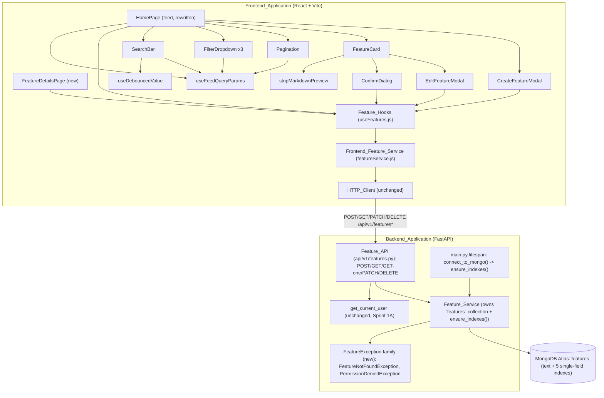

# Design Document

## Overview

Sprint 2A introduces the project's first real domain resource on top of Sprint 0/1A/1B's scaffolding and authentication surface: feature requests. It adds a persisted `features` collection and its Pydantic schemas (`Feature_Model`), a `Feature_Service` that owns all persistence and authorization logic for that collection, a small `FeatureException` family with a single handler, a versioned `Feature_API` exposing create/feed/get/update/delete routes, and a full frontend stack consuming it: `Frontend_Feature_Service`, `Feature_Hooks` (React Query), a rewritten `HomePage` feed, a new `FeatureDetailsPage`, create/edit modals, a delete `ConfirmDialog`, and reusable `SearchBar`/`FilterDropdown`/`Pagination` components driven entirely by the URL via `useFeedQueryParams`.

Nothing in Sprint 0/1A/1B is redesigned. `get_current_user`, the `{success, message, data}`/`{success, message, errors}` envelope, the `AuthException` family and its handler, `db/mongodb.py`'s connection-lifecycle-only responsibility, `HTTP_Client`'s refresh-and-retry interceptor, and `Auth_Context` are all reused exactly as they exist today. This sprint's new backend modules fit the same layering Sprint 1A/1B established: `Feature_Service` mirrors `User_Service`'s "sole owner of its collection" rule; `Feature_API` mirrors `Auth_API`'s thin-route rule; `FeatureException` mirrors `AuthException`'s single-handler-per-family pattern, as a new, unrelated family rather than a subclass of it.

The requirements document already resolved every design ambiguity this sprint raises; the decisions below restate them concisely rather than re-litigating them:

1. **`description_markdown`'s 10,000-character cap is a deliberate, documented bound, not one sourced from PROJECT_SPEC.md** (Req 1.9).
2. **`title` uniqueness is deliberately not enforced** — unlike email uniqueness, PROJECT_SPEC.md states no such requirement for feature requests (Req 1.10).
3. **`FeatureUpdate` structurally omits `status`** rather than accepting and discarding it, mirroring `UserResponse`'s deliberate omission of `password_hash`; this is the sole enforcement mechanism preventing non-admins from changing `status` (Req 2.2, 5.6).
4. **`FeatureResponse` structurally omits `votes`**, because no client-observable behavior this sprint depends on the array's contents (Req 2.3).
5. **`FeatureFeedResponse` is intentionally identical in shape to `FeatureResponse`**, including the full `description_markdown` — the feed's description preview is computed client-side (Req 2.4, 24.3).
6. **The `title`/`description_markdown` text index is one combined compound index**, per MongoDB's one-text-index-per-collection constraint (Req 3.1).
7. **Index creation lives in `Feature_Service.ensure_indexes()`, invoked from `main.py`'s lifespan after `connect_to_mongo()` succeeds** — not in `db/mongodb.py`, preserving Sprint 0's connection-lifecycle-only rule for that module (Req 3.3, 3.4).
8. **`Create_Feature_Endpoint` requires only `get_current_user`, not `require_verified_user`** — PROJECT_SPEC.md's RBAC table states no verification precondition for posting a feature (Req 5.1).
9. **The Feed_Endpoint and Get_Feature_Endpoint require no authentication** — a public roadmap implies a publicly browsable feed (Req 6.3, 6.4).
10. **`category`/`status` are repeated query parameters** (`?category=a&category=b`), matching FastAPI's native `list[Enum]` support and the Frontend_Feature_Service's serialization convention (Req 7.3, 12.4).
11. **`limit` above 100 is rejected with 422, never silently clamped** (Req 7.2), and **`sort`/`category`/`status` values outside their enums are rejected with 422**, never silently substituted (Req 8.3, 9.4) — both enforced structurally via Pydantic/FastAPI Enum-typed parameters, so no `InvalidCategoryException`/`InvalidStatusException` types are introduced (Req 11.6).
12. **`sort=trending` is `most_upvoted` with a `created_at` tiebreaker** — a documented Sprint 2A placeholder, not a real trending algorithm (Req 8.2).
13. **An explicit `sort` always wins over `search`** — `sort=relevance` must be requested explicitly to get text-score ordering; no implicit switch (Req 8.4-8.6).
14. **`FeatureException` is a new, small base class, not a subclass of `AuthException`** — reusing the identical single-handler-per-family pattern for an unrelated domain (Req 11.3).
15. **`FeatureDetailsPage` renders `description_markdown` as raw, whitespace-preserving plain text, never through `react-markdown`** — full markdown rendering is Sprint 2B's job (Req 16.3).
16. **`react-markdown@10.1.0` and `stripMarkdownPreview` are used exclusively for the feed card's client-side-truncated preview**, computed from the full `description_markdown` already present in `FeatureFeedResponse` (Req 24.1-24.5).
17. **Modals use the zero-dependency `validateFeatureForm` + local `useState` pattern**, not `react-hook-form`, matching every existing form in the Frontend_Application (Req 17.2).
18. **`Feature_Hooks` invalidates broadly** (`["features"]`-prefix, plus `["feature", featureId]` on update) rather than surgically — consistent with this sprint's explicit no-optimistic-UI Non-Goal (Req 13.4, 13.5).
19. **`Pagination` trusts the backend's `has_next`/`has_previous` directly**, never recomputing them client-side (Req 22.2).
20. **`FeatureCard`'s "View Details" control gets a real destination (`FeatureDetailsPage`)** this sprint, rather than a dead-end control, because a details page is a small, in-scope addition that no Non-Goal forbids (Req 15.4).

## Architecture



Key decisions:

- **One new service, `Feature_Service`, owns the entire `features` collection**, including index creation. No route handler, middleware, or other service issues a MongoDB query against `features` directly (Req 4.7, 27.2).
- **`Feature_API` handlers stay thin**: request parsing, `Depends(get_current_user)` wiring where required, one `Feature_Service` call, and response formatting. Authorization (author/admin checks) and not-found resolution live in `Feature_Service`, not in the route (Req 6.13).
- **A single new exception family, `FeatureException`, with one handler in `main.py`**, registered alongside (not replacing) the existing four handlers — `RequestValidationError`, `StarletteHTTPException`, `AuthException`, and the catch-all `Exception` handler (Req 11.4).
- **Feed parameter parsing (page/limit/category/status/sort/search) is expressed entirely as FastAPI `Query()`-typed parameters** on the Feed_Endpoint signature, so Pydantic/FastAPI performs all bounds/enum validation before `Feature_Service.get_feed()` is ever called with them.

## Components and Interfaces

### Backend

#### Directory layout additions (`backend/app/`)

```
backend/
├── app/
│   ├── api/v1/
│   │   ├── __init__.py       # extended: include features.router
│   │   └── features.py       # NEW - Feature_API
│   ├── core/
│   │   └── exceptions.py     # extended: FeatureException family
│   ├── models/
│   │   └── feature.py        # NEW - Feature_Model
│   ├── services/
│   │   └── feature_service.py  # NEW - Feature_Service
│   └── main.py                # extended: FeatureException handler + ensure_indexes() call
```

#### Feature_Model (`models/feature.py`, Req 1, 2)

Persisted document shape (plain dict, mirroring `users`):

```python
{
    "_id": ObjectId(...),           # uniquely identifies the document (Req 1.1)
    "title": str,                    # 5-120 chars (Req 1.8)
    "description_markdown": str,     # 20-10,000 chars (Req 1.8, 1.9)
    "category": "ui_ux" | "integrations" | "performance" | "general",
    "status": "under_review" | "planned" | "in_progress" | "completed",  # defaults to
                                      # "under_review" on creation (Req 1.2, 1.3)
    "author_id": str,                # string form of the creating user's _id
    "author_name": str,               # snapshotted at creation time
    "vote_count": int,                # defaults to 0 (Req 1.5)
    "comment_count": int,             # defaults to 0 (Req 1.5)
    "votes": list,                    # defaults to [] (Req 1.5); no voting logic this sprint
    "created_at": datetime,           # set once at creation, never rewritten (Req 1.6, 1.7)
    "updated_at": datetime,           # set at creation, rewritten on every subsequent
                                       # persisted-field change (Req 1.6, 1.7)
}
```

Pydantic schemas:

```python
FeatureCategory = Literal["ui_ux", "integrations", "performance", "general"]
FeatureStatus = Literal["under_review", "planned", "in_progress", "completed"]
FeatureSort = Literal["newest", "oldest", "most_upvoted", "most_discussed", "trending", "relevance"]


class FeatureCreate(BaseModel):
    """Create_Feature_Endpoint request body (Req 2.1). No status/author_id/
    author_name field - those are server-assigned."""
    title: str = Field(min_length=5, max_length=120)
    description_markdown: str = Field(min_length=20, max_length=10_000)
    category: FeatureCategory


class FeatureUpdate(BaseModel):
    """Update_Feature_Endpoint request body (Req 2.2). Every field optional
    for partial updates. Structurally has no `status` field under any name -
    this is the sole mechanism preventing a non-admin from changing status
    through this endpoint (Req 5.6)."""
    title: str | None = Field(default=None, min_length=5, max_length=120)
    description_markdown: str | None = Field(default=None, min_length=20, max_length=10_000)
    category: FeatureCategory | None = None


class FeatureResponse(BaseModel):
    """Serialized feature data (Req 2.3). No `votes` field - a deliberate
    omission, not an always-empty placeholder."""
    id: str
    title: str
    description_markdown: str
    category: FeatureCategory
    status: FeatureStatus
    author_id: str
    author_name: str
    vote_count: int
    comment_count: int
    created_at: datetime
    updated_at: datetime

    @classmethod
    def from_mongo(cls, doc: dict[str, Any]) -> "FeatureResponse":
        """Maps a persisted feature document to a FeatureResponse, reading
        only the fields this schema declares (never `votes`)."""
        return cls(id=str(doc["_id"]), **{k: doc[k] for k in (
            "title", "description_markdown", "category", "status",
            "author_id", "author_name", "vote_count", "comment_count",
            "created_at", "updated_at",
        )})


class FeatureFeedResponse(FeatureResponse):
    """Identical in shape to FeatureResponse (Req 2.4) - the feed's preview
    is computed client-side from the full description_markdown already
    present here (Req 24.3)."""


class PaginationMeta(BaseModel):
    page: int
    limit: int
    total_items: int
    total_pages: int
    has_next: bool
    has_previous: bool


class PaginatedFeatureResponse(BaseModel):
    items: list[FeatureFeedResponse]
    pagination: PaginationMeta
```

Every Feature_API response containing feature data is serialized via `FeatureResponse`, `FeatureFeedResponse`, or `PaginatedFeatureResponse`; the persisted document schema is never serialized directly (Req 2.7).

#### Feature_Service (`services/feature_service.py`, Req 3, 4, 5)

```python
def _collection():
    return db["features"]


async def ensure_indexes() -> None:
    """Creates the compound text index (title + description_markdown) and
    the five single-field indexes (category, status, created_at desc,
    vote_count desc, comment_count desc). Relies on create_index's
    idempotency - safe to call on every startup (Req 3.1, 3.2, 3.5)."""
    collection = _collection()
    await collection.create_index(
        [("title", "text"), ("description_markdown", "text")], name="feature_text_search"
    )
    await collection.create_index("category")
    await collection.create_index("status")
    await collection.create_index([("created_at", -1)])
    await collection.create_index([("vote_count", -1)])
    await collection.create_index([("comment_count", -1)])


async def create_feature(data: FeatureCreate, author_id: str, author_name: str) -> dict[str, Any]:
    """Creates a feature document from validated FeatureCreate data plus the
    requesting user's id/name, defaulting status/vote_count/comment_count/
    votes/created_at/updated_at (Req 1.2, 1.5, 1.6, 4.1)."""
    now = datetime.now(timezone.utc)
    doc = {
        "title": data.title,
        "description_markdown": data.description_markdown,
        "category": data.category,
        "status": "under_review",
        "author_id": author_id,
        "author_name": author_name,
        "vote_count": 0,
        "comment_count": 0,
        "votes": [],
        "created_at": now,
        "updated_at": now,
    }
    result = await _collection().insert_one(doc)
    doc["_id"] = result.inserted_id
    return doc


async def find_by_id(feature_id: str) -> dict[str, Any] | None:
    """Finds a feature document by id, or None (including an invalid
    ObjectId string) (Req 4.2)."""
    try:
        object_id = ObjectId(feature_id)
    except (InvalidId, TypeError):
        return None
    return await _collection().find_one({"_id": object_id})


async def update_feature(
    feature_id: str, data: FeatureUpdate, current_user: dict[str, Any]
) -> dict[str, Any]:
    """Applies only the fields present in `data` (Req 4.3), enforcing
    author-only authorization (Req 5.2, 5.3). Raises FeatureNotFoundException
    if no matching document exists (checked before authorization, Req 5.7),
    or PermissionDeniedException if the requester is not the author."""
    feature = await find_by_id(feature_id)
    if feature is None:
        raise FeatureNotFoundException("Feature request not found.")
    if feature["author_id"] != str(current_user["_id"]):
        raise PermissionDeniedException("Only the author may edit this feature request.")
    updates = data.model_dump(exclude_unset=True)
    updates["updated_at"] = datetime.now(timezone.utc)
    await _collection().update_one({"_id": feature["_id"]}, {"$set": updates})
    return await find_by_id(feature_id)


async def delete_feature(feature_id: str, current_user: dict[str, Any]) -> None:
    """Deletes a feature document iff the requester is its author OR an
    admin (Req 5.4, 5.5); raises FeatureNotFoundException (checked first,
    Req 5.7) or PermissionDeniedException."""
    feature = await find_by_id(feature_id)
    if feature is None:
        raise FeatureNotFoundException("Feature request not found.")
    is_author = feature["author_id"] == str(current_user["_id"])
    is_admin = current_user.get("role") == "admin"
    if not (is_author or is_admin):
        raise PermissionDeniedException("Only the author or an admin may delete this feature request.")
    await _collection().delete_one({"_id": feature["_id"]})


async def get_feed(
    page: int, limit: int, category: list[str], status: list[str], sort: str, search: str | None
) -> tuple[list[dict[str, Any]], int]:
    """Returns (page of matching documents, total matching count), given
    parsed feed parameters (Req 4.5)."""
    query = _build_query(category, status, search)
    sort_spec = _build_sort(sort, search)
    total = await _collection().count_documents(query)
    cursor = _collection().find(query).sort(sort_spec).skip((page - 1) * limit).limit(limit)
    items = [doc async for doc in cursor]
    return items, total


def _build_query(category: list[str], status: list[str], search: str | None) -> dict:
    """Translates filters into a MongoDB query: OR-within a filter type, AND
    across types (Req 9.1, 9.2, 9.3, 9.5); adds a $text clause iff `search`
    is non-empty (Req 10.1, 10.4)."""
    query: dict[str, Any] = {}
    if category:
        query["category"] = {"$in": category}
    if status:
        query["status"] = {"$in": status}
    if search:
        query["$text"] = {"$search": search}
    return query


def _build_sort(sort: str, search: str | None) -> list[tuple[str, int]]:
    """Translates `sort` (and whether `search` is present) into a MongoDB
    sort specification (Req 8.1, 8.2, 8.4, 8.5, 8.6)."""
    if sort == "relevance":
        if search:
            return [("score", {"$meta": "textScore"})]
        return [("created_at", -1)]  # no search term to score against
    return {
        "newest": [("created_at", -1)],
        "oldest": [("created_at", 1)],
        "most_upvoted": [("vote_count", -1)],
        "most_discussed": [("comment_count", -1)],
        "trending": [("vote_count", -1), ("created_at", -1)],
    }[sort]
```

**Design decision — `update_feature`/`delete_feature` take the requesting user's full document, not a bare id.** Authorization needs both the requester's id (for the author check) and role (for the delete admin check); passing the whole resolved user (already available from `get_current_user`) avoids a second lookup and keeps the authorization decision entirely inside `Feature_Service` (Req 5, per Requirement 4.3/4.4's explicit instruction).

**Design decision — `_build_query`/`_build_sort` are private helpers, not part of the public contract.** Requirement 4.6 leaves this decomposition to the implementer; splitting query/sort construction out of `get_feed` keeps each piece independently testable (the Correctness Properties below test them directly) without a live MongoDB connection.

#### FeatureException family (`core/exceptions.py`, Req 11)

```python
class FeatureException(Exception):
    """Base class for every reusable feature-domain exception. Same shape as
    AuthException (status_code/message/errors), but intentionally not a
    subclass of it - AuthException is authentication-specific."""

    status_code: int

    def __init__(self, message: str, errors: list[str] | None = None) -> None:
        self.message = message
        self.errors = errors or [message]
        super().__init__(message)


class FeatureNotFoundException(FeatureException):
    """Raised when Feature_Service cannot locate a feature by id. Maps to
    HTTP 404 (Req 11.1)."""
    status_code = 404


class PermissionDeniedException(FeatureException):
    """Raised when the requesting user is not authorized to modify or
    delete a specific feature request. Maps to HTTP 403 (Req 11.2)."""
    status_code = 403
```

No `InvalidCategoryException`/`InvalidStatusException` types are introduced (Req 11.6) — that failure mode is already fully covered by the `RequestValidationError` handler via Pydantic/FastAPI Enum-typed parameters.

#### Feature_API (`api/v1/features.py`, Req 6, 7, 8, 9, 10)

```python
router = APIRouter(prefix="/features")


@router.post("", status_code=201)
async def create_feature_route(
    body: FeatureCreate, current_user: dict = Depends(get_current_user)
) -> dict:
    doc = await feature_service.create_feature(body, str(current_user["_id"]), current_user["name"])
    return success_response("Feature request created.", FeatureResponse.from_mongo(doc))


@router.get("")
async def feed_route(
    page: int = Query(1, ge=1),
    limit: int = Query(20, ge=1, le=100),
    category: list[FeatureCategory] = Query([]),
    status: list[FeatureStatus] = Query([]),
    sort: FeatureSort = Query("newest"),
    search: str | None = Query(None),
) -> dict:
    items, total = await feature_service.get_feed(page, limit, category, status, sort, search)
    total_pages = ceil(total / limit) if total else 0
    pagination = PaginationMeta(
        page=page, limit=limit, total_items=total, total_pages=total_pages,
        has_next=page < total_pages, has_previous=page > 1,
    )
    body = PaginatedFeatureResponse(
        items=[FeatureFeedResponse.from_mongo(doc) for doc in items], pagination=pagination
    )
    return success_response("Feed retrieved.", body)


@router.get("/{feature_id}")
async def get_feature_route(feature_id: str) -> dict:
    feature = await feature_service.find_by_id(feature_id)
    if feature is None:
        raise FeatureNotFoundException("Feature request not found.")
    return success_response("Feature retrieved.", FeatureResponse.from_mongo(feature))


@router.patch("/{feature_id}")
async def update_feature_route(
    feature_id: str, body: FeatureUpdate, current_user: dict = Depends(get_current_user)
) -> dict:
    doc = await feature_service.update_feature(feature_id, body, current_user)
    return success_response("Feature request updated.", FeatureResponse.from_mongo(doc))


@router.delete("/{feature_id}")
async def delete_feature_route(
    feature_id: str, current_user: dict = Depends(get_current_user)
) -> dict:
    await feature_service.delete_feature(feature_id, current_user)
    return success_response("Feature request deleted.")
```

No route contains a `try`/`except`; `FeatureNotFoundException`/`PermissionDeniedException` propagate unchanged to `main.py`'s handler (Req 6.13, 11.5). The `get_feature_route`'s not-found check is inline (rather than delegated to `Feature_Service`) because `find_by_id`'s contract is "return `None` on no match" (used internally by `update_feature`/`delete_feature` for their own not-found checks); the route is the one caller that needs to translate that `None` into a 404 itself.

Mounted in `api/v1/__init__.py` alongside `health.router`, `auth.router`, and `dashboard.router`, so every route resolves under `/api/v1/features...` (Req 6.1).

#### main.py extension (Req 3.3, 11.4)

```python
@asynccontextmanager
async def lifespan(app: FastAPI):
    await connect_to_mongo()
    await feature_service.ensure_indexes()
    yield
    await close_mongo_connection()


@app.exception_handler(FeatureException)
async def feature_exception_handler(request: Request, exc: FeatureException) -> JSONResponse:
    """Translate any FeatureException subclass into the error envelope."""
    return JSONResponse(
        status_code=exc.status_code,
        content=error_response(message=exc.message, errors=exc.errors),
    )
```

No existing handler is modified; this is one additive registration plus one additive lifespan call (Req 27.4).

### Frontend

#### Directory layout additions (`frontend/src/`)

```
frontend/
├── src/
│   ├── components/
│   │   ├── FeatureCard.jsx         # NEW
│   │   ├── CreateFeatureModal.jsx  # NEW
│   │   ├── EditFeatureModal.jsx    # NEW
│   │   ├── ConfirmDialog.jsx       # NEW
│   │   ├── SearchBar.jsx           # NEW
│   │   ├── FilterDropdown.jsx      # NEW
│   │   └── Pagination.jsx          # NEW
│   ├── hooks/
│   │   ├── useFeatures.js          # NEW - Feature_Hooks
│   │   ├── useFeedQueryParams.js   # NEW
│   │   └── useDebouncedValue.js    # NEW
│   ├── utils/
│   │   └── stripMarkdownPreview.js # NEW
│   ├── services/
│   │   └── featureService.js       # NEW - Frontend_Feature_Service
│   ├── pages/
│   │   ├── HomePage.jsx             # rewritten
│   │   └── FeatureDetailsPage.jsx   # NEW
│   └── App.jsx                      # extended: /features/:featureId route
```

#### Frontend_Feature_Service (`services/featureService.js`, Req 12)

```js
import { httpClient } from "./httpClient";

function buildFeedParams({ page, limit, category, status, sort, search } = {}) {
  const params = new URLSearchParams();
  if (page != null) params.set("page", page);
  if (limit != null) params.set("limit", limit);
  (category ?? []).forEach((value) => params.append("category", value));
  (status ?? []).forEach((value) => params.append("status", value));
  if (sort) params.set("sort", sort);
  if (search) params.set("search", search);
  return params;
}

export const featureService = {
  async getFeatures(params) {
    const { data } = await httpClient.get(`/api/v1/features?${buildFeedParams(params)}`);
    return data.data; // PaginatedFeatureResponse
  },
  async getFeature(featureId) {
    const { data } = await httpClient.get(`/api/v1/features/${featureId}`);
    return data.data; // FeatureResponse
  },
  async createFeature(payload) {
    const { data } = await httpClient.post("/api/v1/features", payload);
    return data.data;
  },
  async updateFeature(featureId, payload) {
    const { data } = await httpClient.patch(`/api/v1/features/${featureId}`, payload);
    return data.data;
  },
  async deleteFeature(featureId) {
    const { data } = await httpClient.delete(`/api/v1/features/${featureId}`);
    return data.data;
  },
};

export { buildFeedParams };
```

`buildFeedParams` is the explicit serializer required by Requirement 12.4 — repeated keys via `URLSearchParams.append`, never a comma-joined value, and it is exported so it can be tested directly as a pure function. Every function is a thin wrapper with no `try`/`catch` (Req 12.5), matching `Frontend_Auth_Service`'s established contract.

#### Feature_Hooks (`hooks/useFeatures.js`, Req 13)

```js
import { useQuery, useMutation, useQueryClient } from "@tanstack/react-query";
import { featureService } from "../services/featureService";

export function useFeatureFeed(params) {
  return useQuery({ queryKey: ["features", params], queryFn: () => featureService.getFeatures(params) });
}

export function useFeature(featureId) {
  return useQuery({
    queryKey: ["feature", featureId],
    queryFn: () => featureService.getFeature(featureId),
    enabled: Boolean(featureId),
  });
}

export function useCreateFeature() {
  const queryClient = useQueryClient();
  return useMutation({
    mutationFn: featureService.createFeature,
    onSuccess: () => queryClient.invalidateQueries({ queryKey: ["features"] }),
  });
}

export function useUpdateFeature() {
  const queryClient = useQueryClient();
  return useMutation({
    mutationFn: ({ featureId, payload }) => featureService.updateFeature(featureId, payload),
    onSuccess: (_, { featureId }) => {
      queryClient.invalidateQueries({ queryKey: ["features"] });
      queryClient.invalidateQueries({ queryKey: ["feature", featureId] });
    },
  });
}

export function useDeleteFeature() {
  const queryClient = useQueryClient();
  return useMutation({
    mutationFn: featureService.deleteFeature,
    onSuccess: () => queryClient.invalidateQueries({ queryKey: ["features"] }),
  });
}
```

No hook writes an optimistic cache update (Req 13.6); every mutation's `onSuccess` only invalidates.

#### useFeedQueryParams (`hooks/useFeedQueryParams.js`, Req 23)

```js
import { useSearchParams } from "react-router-dom";

export function useFeedQueryParams() {
  const [searchParams, setSearchParams] = useSearchParams();

  const search = searchParams.get("search") ?? "";
  const category = searchParams.getAll("category");
  const status = searchParams.getAll("status");
  const sort = searchParams.get("sort") ?? "newest";
  const page = Number(searchParams.get("page") ?? "1");

  function updateParams(updates) {
    const next = new URLSearchParams(searchParams);
    for (const [key, value] of Object.entries(updates)) {
      next.delete(key);
      if (Array.isArray(value)) value.forEach((v) => next.append(key, v));
      else if (value != null && value !== "") next.set(key, value);
    }
    setSearchParams(next);
  }

  return {
    search, category, status, sort, page,
    setSearch: (value) => updateParams({ search: value, page: "1" }),
    setCategory: (values) => updateParams({ category: values, page: "1" }),
    setStatus: (values) => updateParams({ status: values, page: "1" }),
    setSort: (value) => updateParams({ sort: value, page: "1" }),
    setPage: (value) => updateParams({ page: String(value) }),
  };
}
```

**Design decision — every setter except `setPage` resets `page` to `1`.** Changing what's being searched/filtered/sorted while remaining on a stale page number (e.g. page 5 of a now much shorter result set) is surprising; resetting to page 1 on any filter change is the conventional feed UX and does not conflict with any requirement.

#### useDebouncedValue (`hooks/useDebouncedValue.js`, Req 20.2)

```js
import { useEffect, useState } from "react";

export function useDebouncedValue(value, delayMs) {
  const [debounced, setDebounced] = useState(value);
  useEffect(() => {
    const timer = setTimeout(() => setDebounced(value), delayMs);
    return () => clearTimeout(timer);
  }, [value, delayMs]);
  return debounced;
}
```

Hand-rolled `useState`+`useEffect`+`setTimeout`, no new dependency (Req 20.2).

#### stripMarkdownPreview (`utils/stripMarkdownPreview.js`, Req 24.2)

```js
const MARKDOWN_PATTERNS = [
  [/!\[[^\]]*\]\([^)]*\)/g, ""],   // images
  [/\[([^\]]*)\]\([^)]*\)/g, "$1"], // links -> link text only
  [/[#*_`~>]/g, ""],                // heading/emphasis/code/quote markers
  [/\s+/g, " "],                     // collapse remaining whitespace
];

export function stripMarkdownPreview(markdown, maxLength) {
  const plain = MARKDOWN_PATTERNS.reduce(
    (text, [pattern, replacement]) => text.replace(pattern, replacement),
    markdown ?? ""
  ).trim();
  return plain.slice(0, maxLength);
}
```

A pure function: strip common markdown syntax, then truncate — never the other order, avoiding unclosed-token rendering artifacts (Req 24.3).

#### FeatureCard (`components/FeatureCard.jsx`, Req 15)

```jsx
function FeatureCard({ feature, currentUser, onEdit, onDelete }) {
  const preview = stripMarkdownPreview(feature.description_markdown, 160);
  const canEdit = currentUser?.id === feature.author_id;
  const canDelete = canEdit || currentUser?.role === "admin";

  return (
    <div className="rounded-lg border border-slate-200 bg-white p-4">
      <h3 className="font-semibold text-slate-900">{feature.title}</h3>
      <p className="text-sm text-slate-600">{preview}</p>
      <div className="flex gap-2 text-xs">
        <span className="badge">{feature.category}</span>
        <span className="badge">{feature.status}</span>
      </div>
      <div className="text-xs text-slate-500">
        {feature.author_name} · {new Date(feature.created_at).toLocaleDateString()} ·{" "}
        {feature.vote_count} votes · {feature.comment_count} comments
      </div>
      <Link to={`/features/${feature.id}`}>View Details</Link>
      {canEdit && <button onClick={() => onEdit(feature)}>Edit</button>}
      {canDelete && <button onClick={() => onDelete(feature)}>Delete</button>}
    </div>
  );
}
```

No vote button, no comment-thread affordance (Req 15.2); `created_at` via `toLocaleDateString()` (Req 15.3); "View Details" links to `FeatureDetailsPage` (Req 15.4).

#### FeatureDetailsPage (`pages/FeatureDetailsPage.jsx`, Req 16)

```jsx
function FeatureDetailsPage() {
  const { featureId } = useParams();
  const { data: feature, isLoading, isError, error } = useFeature(featureId);

  if (isLoading) return <LoadingState />;
  if (isError && error?.response?.status === 404) return <p>Feature request not found.</p>;
  if (isError) return <p>Something went wrong loading this feature request.</p>;

  return (
    <article>
      <h1>{feature.title}</h1>
      <div>{feature.category} · {feature.status} · {feature.author_name} ·{" "}
        {new Date(feature.created_at).toLocaleDateString()} ·{" "}
        {feature.vote_count} votes · {feature.comment_count} comments</div>
      <pre className="whitespace-pre-wrap">{feature.description_markdown}</pre>
    </article>
  );
}
```

`description_markdown` renders inside a whitespace-preserving `<pre>`, never through `react-markdown` (Req 16.3); no voting/comment/status controls (Req 16.4); a 404 renders a not-found message (Req 16.5).

#### CreateFeatureModal / EditFeatureModal (Req 17, 18)

Both share one colocated validator (matching the `validateSignupForm` pattern):

```js
export function validateFeatureForm({ title, description_markdown, category }) {
  const errors = {};
  if (title.trim().length < 5 || title.length > 120) errors.title = "Title must be 5-120 characters.";
  if (description_markdown.trim().length < 20 || description_markdown.length > 10_000) {
    errors.description_markdown = "Description must be 20-10,000 characters.";
  }
  if (!category) errors.category = "Select a category.";
  return errors;
}
```

`CreateFeatureModal` calls `useCreateFeature().mutate(values)` on a validation-clean submit; `EditFeatureModal` prefills from the target feature and calls `useUpdateFeature().mutate({ featureId, payload })`. Both show a Sonner success/error Toast and, on failure, remain open with entered values intact (Req 17.5, 17.6, 18.5, 18.6); neither imports `react-markdown` (Req 24.5).

#### ConfirmDialog (`components/ConfirmDialog.jsx`, Req 19)

```jsx
function ConfirmDialog({ open, title, message, onConfirm, onCancel }) {
  if (!open) return null;
  return (
    <div role="dialog" aria-modal="true">
      <h2>{title}</h2>
      <p>{message}</p>
      <button onClick={onCancel}>Cancel</button>
      <button onClick={onConfirm}>Delete</button>
    </div>
  );
}
```

Generic and reusable (title/message/onConfirm are props, not hardcoded); the calling `FeatureCard`/`HomePage` code computes the author-or-admin visibility gate before rendering the trigger control, and only the trigger control's `onConfirm` calls `useDeleteFeature().mutate(...)` (Req 19.1-19.3).

#### SearchBar (`components/SearchBar.jsx`, Req 20)

```jsx
function SearchBar({ value, onSearchChange }) {
  const [draft, setDraft] = useState(value);
  const debounced = useDebouncedValue(draft, 300);

  useEffect(() => {
    onSearchChange(debounced);
  }, [debounced]);

  return <input value={draft} onChange={(e) => setDraft(e.target.value)} placeholder="Search feature requests" />;
}
```

`onSearchChange` is wired by `HomePage` to `useFeedQueryParams().setSearch` (Req 20.3).

#### FilterDropdown (`components/FilterDropdown.jsx`, Req 21)

```jsx
function FilterDropdown({ label, options, value, onChange }) {
  return (
    <select aria-label={label} value={value} onChange={(e) => onChange(e.target.value)}>
      {options.map((option) => (
        <option key={option.value} value={option.value}>{option.label}</option>
      ))}
    </select>
  );
}
```

One generic component; `HomePage` renders three instances (category, status, sort), each wired to the correspondingly-named `useFeedQueryParams` setter (Req 21.1, 21.2).

#### Pagination (`components/Pagination.jsx`, Req 22)

```jsx
function Pagination({ pagination, onPageChange }) {
  const { page, total_pages, has_previous, has_next } = pagination;
  return (
    <div>
      <button disabled={!has_previous} onClick={() => onPageChange(page - 1)}>Previous</button>
      <span>Page {page} of {total_pages}</span>
      <button disabled={!has_next} onClick={() => onPageChange(page + 1)}>Next</button>
    </div>
  );
}
```

Disabled state trusts the backend's `has_previous`/`has_next` directly, never recomputed client-side (Req 22.2).

#### HomePage rewrite (`pages/HomePage.jsx`, Req 14)

Reads `search`/`category`/`status`/`sort`/`page` from `useFeedQueryParams()`, passes them to `useFeatureFeed(params)`, and renders: `SearchBar`, three `FilterDropdown`s, a "New Feature Request" control (visible when `useAuth().isAuthenticated`) opening `CreateFeatureModal`, a loading-skeleton / empty-state / error-state / list-of-`FeatureCard` body depending on the query's status, and `Pagination` wired to `setPage`. No component-local default state for feed parameters — everything is derived from `useFeedQueryParams()` (Req 14.2).

#### App.jsx route addition (Req 28.5)

```jsx
<Route path="features/:featureId" element={<FeatureDetailsPage />} />
```

Added inside the existing `Layout` alongside the untouched Sprint 0/1A/1B routes.

## Data Models

| Model | Shape | Owner |
|---|---|---|
| Persisted `features` document | `_id, title, description_markdown, category, status, author_id, author_name, vote_count, comment_count, votes, created_at, updated_at` | `Feature_Service` (sole read/write access) |
| `FeatureCreate` | `title, description_markdown, category` | Request body (`POST /api/v1/features`) |
| `FeatureUpdate` | `title?, description_markdown?, category?` (no `status`) | Request body (`PATCH /api/v1/features/{id}`) |
| `FeatureResponse` | Persisted fields minus `votes`, `id` instead of `_id` | Response body (single-feature routes) |
| `FeatureFeedResponse` | Identical shape to `FeatureResponse` | Response body (feed items) |
| `PaginationMeta` | `page, limit, total_items, total_pages, has_next, has_previous` | Nested in `PaginatedFeatureResponse` |
| `PaginatedFeatureResponse` | `items: FeatureFeedResponse[], pagination: PaginationMeta` | Response body (`GET /api/v1/features`) |

Frontend-side shapes (`FeatureCard`'s `feature` prop, `useFeedQueryParams`'s return value, `PaginatedFeatureResponse`'s JS mirror) are structurally identical to their backend counterparts — no separate frontend schema/validation layer is introduced beyond `validateFeatureForm`.

## Correctness Properties

*A property is a characteristic or behavior that should hold true across all valid executions of a system-essentially, a formal statement about what the system should do. Properties serve as the bridge between human-readable specifications and machine-verifiable correctness guarantees.*

### Property 1: Feature field bounds are accepted and rejected exactly on their stated limits

For any strings assigned to `title` and `description_markdown`, `FeatureCreate`/`FeatureUpdate` construction SHALL succeed if and only if `5 <= len(title) <= 120` and `20 <= len(description_markdown) <= 10000`, respectively (and vacuously true when a `FeatureUpdate` field is omitted).

**Validates: Requirements 1.8, 1.9, 2.8**

### Property 2: Creating a feature applies documented defaults and echoes the input

For any valid `FeatureCreate` payload and any author id/name, `create_feature` SHALL return a document whose `title`/`description_markdown`/`category` equal the input, whose `status` is `"under_review"`, whose `vote_count`/`comment_count` are `0`, whose `votes` is `[]`, and whose `created_at` equals `updated_at`.

**Validates: Requirements 1.2, 1.5, 1.6, 4.1**

### Property 3: Updating a feature changes only the supplied fields and always bumps `updated_at` without touching `created_at`

For any persisted feature and any subset of `{title, description_markdown, category}` supplied in a `FeatureUpdate`, `update_feature` SHALL leave every unsupplied field unchanged, SHALL set every supplied field to its new value, SHALL advance `updated_at`, and SHALL leave `created_at` unchanged.

**Validates: Requirements 1.7, 4.3**

### Property 4: Feature mutation authorization gates exactly on their stated conditions

For any feature's `author_id` and any requesting user's id/role, `update_feature` SHALL succeed if and only if the requesting user's id equals the feature's `author_id` (raising `PermissionDeniedException` otherwise), and `delete_feature` SHALL succeed if and only if the requesting user's id equals the feature's `author_id` OR the requesting user's role is `"admin"` (raising `PermissionDeniedException` otherwise).

**Validates: Requirements 5.2, 5.3, 5.4, 5.5**

### Property 5: Pagination metadata is internally consistent for every page/limit/total combination

For any non-negative `total_items` and any positive `page`/`limit`, the computed `PaginationMeta` SHALL satisfy `total_pages == ceil(total_items / limit)` (or `0` when `total_items` is `0`), `has_next == (page < total_pages)`, and `has_previous == (page > 1)`.

**Validates: Requirements 7.4, 7.5**

### Property 6: Each of the six sort values orders results as documented

For any set of feature documents (including ties in `vote_count`/`comment_count`/`created_at`), sorting via `_build_sort("newest"|"oldest"|"most_upvoted"|"most_discussed"|"trending", search)` SHALL produce the same ordering as sorting the same documents in-memory by, respectively: `created_at` descending, `created_at` ascending, `vote_count` descending, `comment_count` descending, and `(vote_count desc, created_at desc)`.

**Validates: Requirements 8.1, 8.2**

### Property 7: Category/status filters combine with OR within a filter type and AND across filter types

For any set of feature documents and any requested subsets of `category` values and `status` values, `_build_query` SHALL select exactly the documents whose `category` is a member of the requested category subset (or all documents, if no category was requested) AND whose `status` is a member of the requested status subset (or all documents, if no status was requested).

**Validates: Requirements 9.1, 9.2, 9.3, 9.5**

### Property 8: Array-valued feed parameters serialize to repeated query keys, never a comma-joined value

For any array of `category` or `status` values passed to `getFeatures(params)`, the built query string SHALL contain one repeated `category=`/`status=` key per array element, in order, and SHALL NOT contain a single key with a comma-joined value.

**Validates: Requirements 12.4**

### Property 9: FeatureCard renders every documented field for any feature

For any feature object containing valid `title`, `description_markdown`, `category`, `status`, `author_name`, `created_at`, `vote_count`, and `comment_count` values, the rendered `FeatureCard` output SHALL contain the `title`, the `stripMarkdownPreview`-derived preview, the `category`, the `status`, the `author_name`, the locale-formatted `created_at`, the `vote_count`, and the `comment_count`.

**Validates: Requirements 15.1**

### Property 10: FeatureDetailsPage renders `description_markdown` verbatim, whitespace preserved

For any markdown string (including embedded newlines, tabs, and multiple consecutive spaces), rendering `FeatureDetailsPage` with a feature carrying that string as `description_markdown` SHALL produce output whose text content equals the original string unchanged.

**Validates: Requirements 16.2, 16.3**

### Property 11: The Create/Edit feature modals call their mutation if and only if every field independently satisfies its bound

For any combination of `title`, `description_markdown`, and `category` values (some within bounds, some not), submitting `CreateFeatureModal`/`EditFeatureModal` SHALL call its mutation if and only if `title` is 5-120 characters, `description_markdown` is 20-10,000 characters, and `category` is non-empty; otherwise it SHALL display a validation message and SHALL NOT call the mutation.

**Validates: Requirements 17.3, 17.4, 18.3, 18.4**

### Property 12: The delete-trigger control's visibility gates exactly on author-or-admin

For any current user's id/role and any feature's `author_id`, the delete-trigger control SHALL be visible if and only if the current user's id equals the feature's `author_id` OR the current user's role is `"admin"`.

**Validates: Requirements 19.2**

### Property 13: `useDebouncedValue` settles to the most recent value after the delay elapses, discarding intermediate values

For any sequence of rapid updates to a value, all issued within less than `delayMs` of each other, `useDebouncedValue` SHALL report only the final value in the sequence once `delayMs` has elapsed since that final update, and SHALL NOT report any of the discarded intermediate values.

**Validates: Requirements 20.2, 20.3**

### Property 14: Each FilterDropdown instance updates only its own URL parameter

For any of the three FilterDropdown instances (category, status, sort) and any option value from that instance's option set, selecting it SHALL call the correspondingly-named `useFeedQueryParams` setter with that value, and SHALL NOT call either of the other two setters.

**Validates: Requirements 21.2**

### Property 15: Pagination's disabled state mirrors `has_previous`/`has_next` exactly

For any boolean `has_previous`/`has_next` combination, the rendered "Previous" control SHALL be disabled if and only if `has_previous` is `false`, and the rendered "Next" control SHALL be disabled if and only if `has_next` is `false`.

**Validates: Requirements 22.2**

### Property 16: `useFeedQueryParams` round-trips every value through the URL

For any valid `search` string, any subset of `category`/`status` enum values, any `sort` value, and any positive `page`, calling the corresponding setter(s) and then reading the corresponding getter(s) immediately afterward SHALL return the same value(s) that were set.

**Validates: Requirements 23.1, 23.2, 23.3**

### Property 17: `stripMarkdownPreview` never exceeds `maxLength` and never contains stripped markdown syntax characters

For any markdown string and any non-negative `maxLength`, `stripMarkdownPreview(markdown, maxLength)` SHALL return a string of length at most `maxLength`, and that string SHALL NOT contain any of the literal characters `#`, `*`, `_`, or `` ` ``, nor any Markdown link/image syntax (`[text](url)`, ``), regardless of how many such tokens appeared in the input.

**Validates: Requirements 24.2, 24.3**

## Error Handling

| Failure | Raised by | Exception | HTTP status | Handler |
|---|---|---|---|---|
| Feature not found (get/update/delete) | `Feature_API` (get) / `Feature_Service` (update/delete) | `FeatureNotFoundException` | 404 | `main.py`'s `FeatureException` handler |
| Not the author (update) | `Feature_Service.update_feature` | `PermissionDeniedException` | 403 | `main.py`'s `FeatureException` handler |
| Not the author or an admin (delete) | `Feature_Service.delete_feature` | `PermissionDeniedException` | 403 | `main.py`'s `FeatureException` handler |
| Invalid `title`/`description_markdown`/`category`/`status`/`sort`/`limit` | Pydantic/FastAPI validation | `RequestValidationError` | 422 | Existing Sprint 0 handler (unmodified) |
| Missing/invalid Authorization header (create/update/delete) | `get_current_user` | `UnauthorizedException`/`InvalidTokenException`/`ExpiredTokenException` | 401 | Existing Sprint 1A `AuthException` handler (unmodified) |
| Unexpected server error | any | `Exception` | 500 | Existing Sprint 0 catch-all handler (unmodified) |

No route handler catches `FeatureException`, `AuthException`, or `RequestValidationError` to build a response inline (Req 6.13, 11.5); every failure propagates to its already-registered handler. On the frontend, `CreateFeatureModal`/`EditFeatureModal`/`ConfirmDialog`-triggered mutation failures surface as a Sonner error Toast without navigating away, and the modal/dialog keeps the user's entered values (Req 17.6, 18.6, 19.5, 25.4). `FeatureDetailsPage` and `HomePage` render an inline error/not-found state rather than an unhandled exception for a failed `useFeature`/`useFeatureFeed` query (Req 14.5, 16.5, 25.3).

## Testing Strategy

**Backend**: pytest + Hypothesis + FastAPI `TestClient`, matching the pattern established in Sprint 1B's `test_token_consumption_properties.py`/`test_password_reset_service.py` — a minimal in-memory fake Motor-like collection/db (`_FakeCollection`/`_FakeDB` supporting `insert_one`/`find`/`find_one`/`update_one`/`delete_one`/`count_documents`) patched over `feature_service.db`, so `Feature_Service` functions run against real code paths with no real MongoDB connection. Each Correctness Property above becomes exactly one Hypothesis-driven test (`max_examples=100`), tagged with a comment referencing its property number (`# Feature: sprint-2a-feature-crud-feed, Property N: ...`). Feed sort/query-building properties (6, 7) test `_build_sort`/`_build_query` directly against in-memory Python lists/dicts rather than a live text index, since MongoDB's `$text` relevance scoring itself is external database behavior (Requirement 10's search mechanics are covered by a small number of integration-style examples instead, consistent with the "don't PBT external service behavior" rule). `Feature_API` routes get integration tests via `TestClient` mirroring `test_dashboard_routes.py`'s `app.dependency_overrides` pattern for `get_current_user`, covering the 201/200/404/403/422/401 branches per route. Unit tests cover the fixed edge cases left out of the properties above: `ensure_indexes()` calls `create_index` with the documented specs (1-2 examples, not a property, since index creation is infrastructure wiring); a not-found check preceding an authorization check (Req 5.7); the `sort=relevance`/`search`-empty fallback and explicit-sort-always-wins branch table (Req 8.5, 8.6, four fixed examples); the `FeatureCreate`/`FeatureUpdate`/`FeatureResponse` structural field-absence checks (Req 2.1, 2.2, 2.3) as single assertions, not generative properties.

**Frontend**: Vitest + React Testing Library + fast-check, matching the pattern established in Sprint 1B's `ProtectedRoute.test.jsx`/`AdminRoute.test.jsx` — a pure decision/utility function (`buildFeedParams`, `stripMarkdownPreview`, `validateFeatureForm`, `useFeedQueryParams`'s getter/setter pairs, `useDebouncedValue`) is exported and exercised directly with `fc.assert(fc.property(...), { numRuns: 100 })` for each Correctness Property, separate from a handful of rendering-level tests (via `render`/`screen`/`waitFor`) that confirm the component actually wires the pure function's result into the DOM (e.g. `Pagination`'s disabled attribute, `ConfirmDialog`'s confirm/cancel button clicks, `FeatureCard`'s "View Details" link target). `useFeatureFeed`/`useCreateFeature`/etc. are tested with `featureService` mocked (`vi.mock`), asserting the correct query key and the correct invalidated keys per mutation, following `dashboardService.test.js`'s mocking style rather than a live React Query cache integration test. `SearchBar`'s debounce and `useFeedQueryParams`'s URL persistence are tested with Vitest's fake timers and a `MemoryRouter`, respectively, mirroring `VerifyEmailPage.test.jsx`'s fake-timer usage from Sprint 1B.

## Design Decisions Summary

| # | Decision | Requirement |
|---|---|---|
| 1 | `description_markdown`'s 10,000-char cap is a documented Sprint 2A choice, not from PROJECT_SPEC.md | 1.9 |
| 2 | `title` uniqueness is not enforced | 1.10 |
| 3 | `FeatureUpdate` structurally omits `status` (no runtime discard) | 2.2, 5.6 |
| 4 | `FeatureResponse` structurally omits `votes` | 2.3 |
| 5 | `FeatureFeedResponse` is shape-identical to `FeatureResponse` | 2.4 |
| 6 | One combined `title`+`description_markdown` text index | 3.1 |
| 7 | Index creation lives in `Feature_Service.ensure_indexes()`, called from `main.py`'s lifespan | 3.3, 3.4 |
| 8 | Create requires only `get_current_user`, not `require_verified_user` | 5.1 |
| 9 | Feed and single-feature GET routes require no authentication | 6.3, 6.4 |
| 10 | `category`/`status` are repeated query parameters | 7.3, 12.4 |
| 11 | `limit`/`sort`/`category`/`status` validation is strict (422), never silently normalized; no dedicated exception types | 7.2, 8.3, 9.4, 11.6 |
| 12 | `trending` is a documented `most_upvoted`+tiebreaker placeholder | 8.2 |
| 13 | Explicit `sort` always wins over `search`; no implicit relevance switch | 8.4-8.6 |
| 14 | `FeatureException` is a new base, not a subclass of `AuthException` | 11.3 |
| 15 | `FeatureDetailsPage` renders raw, whitespace-preserving text, never `react-markdown` | 16.3 |
| 16 | `react-markdown`/`stripMarkdownPreview` are feed-preview-only this sprint | 24.1-24.5 |
| 17 | Modals use the zero-dependency validator + `useState` pattern, not `react-hook-form` | 17.2 |
| 18 | `Feature_Hooks` invalidates broadly (`["features"]` prefix), no optimistic UI | 13.4-13.6 |
| 19 | `Pagination` trusts backend `has_next`/`has_previous` directly | 22.2 |
| 20 | `FeatureCard`'s "View Details" gets a real destination (`FeatureDetailsPage`) this sprint | 15.4 |
