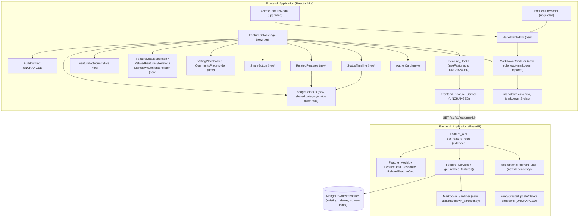

# Design Document

## Overview

Sprint 2B builds the polished Feature Details experience that Sprint 2A deliberately deferred. It extends the Get_Feature_Endpoint with author/ownership/related-feature metadata (`FeatureDetailResponse`), adds a `get_related_features()` `Feature_Service` helper, introduces a shared, sanitized markdown-rendering pipeline (`Markdown_Sanitizer` on the backend, `Markdown_Renderer` on the frontend) used identically by a rewritten `FeatureDetailsPage` and a new, reusable `MarkdownEditor`, and adds five new presentational components (`AuthorCard`, `StatusTimeline`, `RelatedFeatures`, `ShareButton`, plus the loading/error/placeholder states).

**Preserved unchanged from Sprint 2A** (per this sprint's Non-Goals):

- The Feed_Endpoint (`GET /api/v1/features`) — request parameters, response shape (`PaginatedFeatureResponse`/`FeatureFeedResponse`), sorting, filtering, and search behavior are untouched (Req 1.9).
- The Create_Feature_Endpoint, Update_Feature_Endpoint, and Delete_Feature_Endpoint — request/response contracts (`FeatureCreate`/`FeatureUpdate`/`FeatureResponse`) are untouched (Req 1.10).
- `Feature_Hooks` (`useFeatures.js`) — `useFeatureFeed`, `useFeature`, `useCreateFeature`, `useUpdateFeature`, `useDeleteFeature` keep their exact signatures and React Query keys (Req 4.8). `useFeature`'s *resolved data shape* grows because the endpoint it calls now returns `FeatureDetailResponse`, but the hook itself is not modified.
- `Frontend_Feature_Service` (`featureService.js`) — unmodified beyond `getFeature` naturally returning the richer response body.
- `validateFeatureForm` — reused with its existing bounds (title 5-120, description 20-10,000), not redefined.
- `Feature_Service`'s existing functions (`create_feature`, `find_by_id`, `update_feature`, `delete_feature`, `get_feed`, `_build_query`, `_build_sort`) and `ensure_indexes()`'s existing indexes — `get_related_features()` is purely additive and reuses the `category` and `created_at` descending indexes already created in Sprint 2A.
- `FeatureException`/`FeatureNotFoundException`/`PermissionDeniedException`, the `{success, message, data}`/`{success, message, errors}` envelope, and strict layering (routes → services → database) — all reused exactly as established.

The requirements document already resolved every design ambiguity this sprint raises; the decisions below restate them concisely rather than re-litigating them:

1. **`is_owner`/`is_admin` are computed server-side, from an optional-current-user dependency that never raises.** A new `get_optional_current_user` dependency resolves the requester if a valid Bearer token is present, and resolves to `None` — never an exception — for a missing header, malformed/expired token, unrecognized `type` claim, or unresolvable `sub`. This keeps the Get_Feature_Endpoint publicly accessible exactly as Sprint 2A defined it, while still allowing ownership-aware fields to be computed when a caller happens to be authenticated (Req 1.6).
2. **`get_related_features()` selects by `category`, excludes the current feature, orders by `created_at` desc with `_id` desc as a deterministic tiebreaker, and caps at `limit` (default 4, never invoked above 4 this sprint) without padding from other categories.** Zero matches returns `[]`, never `None` (Req 2.1-2.6, 2.9).
3. **`RelatedFeatureCard` is a distinct, narrower schema from `FeatureResponse`** — `id`, `title`, `status`, `category`, `vote_count`, `created_at` only — because the `RelatedFeatures` component never needs `description_markdown`/`author_id`/`author_name`/`comment_count` (Req 2.8).
4. **Markdown safety is split across two layers that each do a different job and neither substitutes for the other**: `Markdown_Sanitizer` (backend, `backend/app/utils/markdown_sanitizer.py`) strips/neutralizes dangerous raw HTML (`script`/`style`/`iframe`/`object`/`embed`/`on*`/`javascript:`) from `description_markdown` identically regardless of call site, as defense-in-depth for any consumer of the raw API response; `Markdown_Renderer` (frontend, the sole `react-markdown` importer) enforces the rendering-time allow-list, suppresses ``, and restricts link schemes via AST-level component overrides — and structurally never passes `rehype-raw`, so raw HTML in the input never becomes live elements regardless of what the sanitizer does or misses (Req 3.1-3.7).
5. **Link-scheme restriction and image suppression are implemented as `react-markdown` component overrides for `a`/`img`, not markdown-source preprocessing.** AST-level overrides are the structural, documented mechanism; a regex preprocessing pass over arbitrary markdown risks both false positives and false negatives (Req 3.3).
6. **Draft preservation is scoped strictly to the current modal mount.** `description_markdown`/`title`/`category` survive toggling the live-preview or switching focus while a modal stays mounted (state lives in the parent modal's `useState`), but closing and reopening a modal does **not** restore unsubmitted content — `CreateFeatureModal` reopens empty, `EditFeatureModal` reopens pre-filled from the feature's persisted data. No `localStorage` or cross-session draft store is introduced this sprint (Req 8.9).
7. **`ShareButton`'s clipboard fallback is a temporary, off-screen, focused-and-selected `<textarea>` plus `document.execCommand("copy")`**, used only when the Clipboard API is unavailable or rejects; exactly one toast (success or error) fires per activation, never zero, never two (Req 12.1-12.5).
8. **Back-navigation relies entirely on native browser history — no `returnTo` query-param passthrough.** Feed navigation to a feature's details page pushes a history entry (`<Link>`/`navigate()`, never `replace`); the browser's native Back button returns to the exact prior URL, and `HomePage`'s feed state is already fully URL-driven (`useFeedQueryParams`, Sprint 2A), so no additional mechanism is needed. The breadcrumb is a distinct, simpler affordance: a plain `<Link to="/">` that does not carry forward filter state. A `navigate(-1)` "back to feed" control with no prior in-app history entry falls back to `navigate("/")` (Req 15.3-15.6).
9. **`MarkdownEditor` is a plain textarea plus string-insertion toolbar — no rich-text-editor library.** Every toolbar action is implemented as one of three distinct textarea-manipulation primitives (span-wrapping, line-prefixing, or placeholder-insertion-with-cursor-selection), matching the shape of the surrounding markdown construct (Req 5.2-5.6).
10. **`Markdown_Renderer` is the sole frontend component that imports `react-markdown`.** `FeatureDetailsPage`'s read-only view and `MarkdownEditor`'s live preview both render through it, so their output can never drift apart (Req 3.7, 6.1, 6.3).
11. **`Markdown_Styles` is one centralized stylesheet, applied via a single root class (`markdown-body`) on `Markdown_Renderer`'s output container.** No other file declares a CSS rule targeting a markdown-allowed element by tag name (Req 7.1-7.4).
12. **Badge colors for `category`/`status` are defined once, in a shared mapping module, and every consumer (FeatureDetailsPage, RelatedFeatures, StatusTimeline) reads from it** rather than each redefining its own color logic (Req 17.3).
13. **AuthorCard's role/verification props are sourced differently depending on viewer identity**: when the viewer is the feature's author (`is_owner === true`), `FeatureDetailsPage` supplies the viewer's own `role`/`is_verified` from `AuthContext`; otherwise it supplies the generic `"user"` role and `is_verified: false`, because `FeatureDetailResponse` does not (and this sprint does not add) expose another user's role/verification status (Req 9.7).
14. **`StatusTimeline` fails safe on an invalid/missing `status`**: it always renders its four fixed stages, and simply highlights none of them rather than raising, so a malformed prop can never break the details page (Req 10.5).

## Architecture



Key decisions:

- **`get_related_features()` lives in the existing `Feature_Service` module**, alongside `get_feed`/`find_by_id`, preserving the "sole owner of the `features` collection" rule — no new service module (Req 2.1).
- **`get_optional_current_user` is a new, separate dependency, not a modification of `get_current_user`.** `get_current_user` continues to raise on a missing/invalid token for every route that already depends on it (create/update/delete); `get_optional_current_user` is the only dependency that swallows those failures into `None`, keeping the "raise on invalid auth" behavior for every other route unchanged (Req 1.6).
- **`Markdown_Sanitizer` is invoked from `Feature_Service`** (at the point `description_markdown` is persisted and/or read back), not from route handlers, so no route ever touches raw HTML directly (Req 3.6).
- **`MarkdownRenderer` and `markdown.css` are new, standalone modules under `components/markdown/`**, imported by both `FeatureDetailsPage` and `MarkdownEditor`, with no other file permitted to import `react-markdown` (Req 3.7).

## Components and Interfaces

### Backend

#### Directory layout additions (`backend/app/`)

```
backend/
├── app/
│   ├── api/v1/
│   │   └── features.py             # extended: get_feature_route
│   ├── middleware/
│   │   └── auth.py                 # extended: get_optional_current_user
│   ├── models/
│   │   └── feature.py              # extended: FeatureDetailResponse, RelatedFeatureCard
│   ├── services/
│   │   └── feature_service.py      # extended: get_related_features()
│   └── utils/
│       └── markdown_sanitizer.py   # NEW - Markdown_Sanitizer
```

#### Feature_Model extension (`models/feature.py`, Req 1, 2)

```python
class RelatedFeatureCard(BaseModel):
    """Lightweight related-feature card schema (Req 2.8). Deliberately
    narrower than FeatureResponse - no description_markdown, author_id,
    author_name, or comment_count, because RelatedFeatures never displays
    those fields."""
    id: str
    title: str
    status: FeatureStatus
    category: FeatureCategory
    vote_count: int
    created_at: datetime

    @classmethod
    def from_mongo(cls, doc: dict[str, Any]) -> "RelatedFeatureCard":
        return cls(
            id=str(doc["_id"]),
            title=doc["title"],
            status=doc["status"],
            category=doc["category"],
            vote_count=doc["vote_count"],
            created_at=doc["created_at"],
        )


class FeatureDetailResponse(FeatureResponse):
    """Get_Feature_Endpoint response schema (Req 1.1): every FeatureResponse
    field, plus is_owner/is_admin/related_features. Superset by
    subclassing FeatureResponse - no field is redefined or duplicated."""
    is_owner: bool
    is_admin: bool
    related_features: list[RelatedFeatureCard]

    @classmethod
    def from_mongo(
        cls,
        doc: dict[str, Any],
        *,
        current_user: dict[str, Any] | None,
        related: list[dict[str, Any]],
    ) -> "FeatureDetailResponse":
        base = FeatureResponse.from_mongo(doc).model_dump()
        is_owner = current_user is not None and str(current_user["_id"]) == doc["author_id"]
        is_admin = current_user is not None and current_user.get("role") == "admin"
        return cls(
            **base,
            is_owner=is_owner,
            is_admin=is_admin,
            related_features=[RelatedFeatureCard.from_mongo(item) for item in related],
        )
```

**Design decision — `FeatureDetailResponse` subclasses `FeatureResponse`** rather than redeclaring its ten fields, so the two schemas cannot silently drift apart as Sprint 2A's shape evolves (Req 1.1).

#### Feature_Service extension (`services/feature_service.py`, Req 2)

```python
async def get_related_features(
    feature_id: str, category: str, limit: int = 4
) -> list[dict[str, Any]]:
    """Returns up to `limit` (<=4 within this sprint's call sites) feature
    documents sharing `category`, excluding `feature_id`, ordered by
    created_at descending with _id descending as a deterministic tiebreaker
    (Req 2.2-2.6). Returns [] on zero matches, never None. Queries only the
    existing `category` and `created_at` indexes from Sprint 2A - no new
    index required (Req 2.9)."""
    cursor = (
        _collection()
        .find({"category": category, "_id": {"$ne": ObjectId(feature_id)}})
        .sort([("created_at", -1), ("_id", -1)])
        .limit(limit)
    )
    return [doc async for doc in cursor]
```

**Design decision — the tiebreaker is expressed as a compound Mongo sort (`created_at` desc, `_id` desc), not a secondary in-memory sort.** MongoDB's `ObjectId` ordering already correlates with insertion order, so a single compound `.sort()` call is sufficient and avoids pulling the whole matching set into memory to re-sort (Req 2.4).

#### get_optional_current_user (`middleware/auth.py`, Req 1.6)

```python
async def get_optional_current_user(
    authorization: str | None = Header(None),
) -> dict[str, Any] | None:
    """Resolves the current user if a valid Bearer access token is present;
    resolves to None - never raises - for a missing header, malformed
    token, expired token, wrong `type` claim, or an unresolvable `sub`.
    Every one of those failure modes is treated identically to "no
    authenticated user" (Req 1.6), so routes depending on this stay
    publicly accessible exactly as they were before this sprint.

    Deliberately does NOT call get_current_user via Depends: doing so would
    let get_current_user's exceptions propagate through FastAPI's
    dependency-resolution path unchanged, which is precisely the behavior
    this dependency exists to avoid.
    """
    scheme, token = get_authorization_scheme_param(authorization or "")
    if not authorization or scheme.lower() != "bearer" or not token:
        return None
    try:
        payload = decode_token(token, token_type="access")
    except (TokenExpiredError, TokenDecodeError):
        return None
    if payload.get("type") != "access":
        return None
    return await user_service.find_by_id(payload["sub"])
```

#### Updated get_feature_route (`api/v1/features.py`, Req 1.7, 1.8)

```python
@router.get("/{feature_id}")
async def get_feature_route(
    feature_id: str,
    current_user: dict | None = Depends(get_optional_current_user),
) -> dict:
    feature = await feature_service.find_by_id(feature_id)
    if feature is None:
        raise FeatureNotFoundException("Feature request not found.")
    related = await feature_service.get_related_features(feature_id, feature["category"])
    body = FeatureDetailResponse.from_mongo(feature, current_user=current_user, related=related)
    return success_response("Feature retrieved.", body.model_dump())
```

The 404 branch is unchanged from Sprint 2A (Req 1.8); the Feed_Endpoint, Create_Feature_Endpoint, Update_Feature_Endpoint, and Delete_Feature_Endpoint route handlers are **not modified** by this sprint (Req 1.9, 1.10).

#### Markdown_Sanitizer (`utils/markdown_sanitizer.py`, Req 3.4, 3.6)

```python
_DANGEROUS_TAGS = re.compile(r"<(script|style|iframe|object|embed)[^>]*>.*?</\1>|<\1[^>]*/?>", re.I | re.S)
_EVENT_HANDLER_ATTR = re.compile(r'\s+on\w+\s*=\s*(["\']).*?\1', re.I)
_JS_URI_ATTR = re.compile(r'\s+(href|src)\s*=\s*(["\'])\s*javascript:.*?\2', re.I)


def sanitize_markdown(raw: str) -> str:
    """Removes/neutralizes script/style/iframe/object/embed tags, on*
    event-handler attributes, and javascript: URI attribute values from
    raw HTML embedded in markdown source (Req 3.4). Applied identically
    regardless of call site - Feature_Service calls this from a single
    location shared by create/update/read paths (Req 3.6). This is
    defense-in-depth: it does not replace Markdown_Renderer's rendering-time
    controls (Req 3.1-3.5), which remain the primary defense on the
    frontend."""
    text = _DANGEROUS_TAGS.sub("", raw)
    text = _EVENT_HANDLER_ATTR.sub("", text)
    text = _JS_URI_ATTR.sub("", text)
    return text
```

**Design decision — `Feature_Service` calls `sanitize_markdown` at a single shared point** (e.g. inside `FeatureResponse.from_mongo`'s caller, or immediately before persistence in `create_feature`/`update_feature`) rather than duplicating the call across `create_feature`, `update_feature`, `find_by_id`, and `get_feed`, so no code path can return a differently-sanitized copy of the same field (Req 3.6).

### Frontend

#### Directory layout additions (`frontend/src/`)

```
frontend/
├── src/
│   ├── components/
│   │   ├── markdown/
│   │   │   ├── MarkdownRenderer.jsx     # NEW - sole react-markdown importer
│   │   │   └── toolbarActions.js        # NEW - pure textarea-manipulation helpers
│   │   ├── MarkdownEditor.jsx           # NEW
│   │   ├── AuthorCard.jsx               # NEW
│   │   ├── StatusTimeline.jsx           # NEW
│   │   ├── RelatedFeatures.jsx          # NEW
│   │   ├── ShareButton.jsx              # NEW
│   │   ├── Placeholders.jsx             # NEW - VotingPlaceholder, CommentsPlaceholder
│   │   ├── skeletons/
│   │   │   ├── FeatureDetailsSkeleton.jsx      # NEW
│   │   │   ├── RelatedFeaturesSkeleton.jsx     # NEW
│   │   │   └── MarkdownContentSkeleton.jsx     # NEW
│   │   ├── FeatureNotFoundState.jsx     # NEW
│   │   ├── CreateFeatureModal.jsx       # upgraded: MarkdownEditor
│   │   └── EditFeatureModal.jsx         # upgraded: MarkdownEditor
│   ├── utils/
│   │   └── badgeColors.js               # NEW - shared category/status color map
│   ├── styles/
│   │   └── markdown.css                 # NEW - Markdown_Styles
│   └── pages/
│       └── FeatureDetailsPage.jsx       # rewritten
```

`react-markdown@10.1.0` is already a dependency (Sprint 2A); `remark-gfm` is added as a new, pinned dependency this sprint.

#### badgeColors (`utils/badgeColors.js`, Req 17.3)

```js
export const CATEGORY_BADGE_CLASSES = {
  ui_ux: "bg-purple-100 text-purple-800",
  integrations: "bg-blue-100 text-blue-800",
  performance: "bg-amber-100 text-amber-800",
  general: "bg-slate-100 text-slate-800",
};

export const STATUS_BADGE_CLASSES = {
  under_review: "bg-slate-100 text-slate-700",
  planned: "bg-indigo-100 text-indigo-800",
  in_progress: "bg-amber-100 text-amber-800",
  completed: "bg-emerald-100 text-emerald-800",
};

export function categoryBadgeClass(category) {
  return CATEGORY_BADGE_CLASSES[category] ?? CATEGORY_BADGE_CLASSES.general;
}

export function statusBadgeClass(status) {
  return STATUS_BADGE_CLASSES[status] ?? STATUS_BADGE_CLASSES.under_review;
}
```

The single source every consumer (`FeatureDetailsPage`, `RelatedFeatures`, `StatusTimeline`) imports from — no component redefines its own category/status color logic (Req 17.3).

#### MarkdownRenderer (`components/markdown/MarkdownRenderer.jsx`, Req 3, 6.1, 6.3, 7.2)

```jsx
import ReactMarkdown from "react-markdown";
import remarkGfm from "remark-gfm";
import "../../styles/markdown.css";

const ALLOWED_LINK_SCHEMES = ["http:", "https:", "mailto:"];

function isAllowedHref(href) {
  try {
    const { protocol } = new URL(href, "http://__relative_probe__");
    // A relative/scheme-less href resolves against the probe base, so
    // its protocol comes back as "http:" from the probe itself - detect
    // that case separately rather than trusting the parsed protocol.
    if (href.startsWith("/") || !/^[a-z][a-z0-9+.-]*:/i.test(href)) return false;
    return ALLOWED_LINK_SCHEMES.includes(protocol);
  } catch {
    return false;
  }
}

function SafeLink({ href, children }) {
  if (!isAllowedHref(href ?? "")) return <>{children}</>; // plain text, href discarded (Req 3.1)
  return <a href={href}>{children}</a>;
}

function SuppressedImage({ alt }) {
  return <>{alt}</>; // alt text only, url discarded (Req 3.2)
}

/**
 * MarkdownRenderer: the sole component in the Frontend_Application that
 * imports react-markdown (Req 3.7). Configures remark-gfm and overrides
 * `a`/`img` at the component level to enforce the link-scheme allow-list
 * and image suppression (Req 3.1-3.3). Never passes rehype-raw, so raw
 * HTML in the source renders as plain text, not live elements (Req 3.5).
 */
function MarkdownRenderer({ children }) {
  return (
    <div className="markdown-body">
      <ReactMarkdown remarkPlugins={[remarkGfm]} components={{ a: SafeLink, img: SuppressedImage }}>
        {children ?? ""}
      </ReactMarkdown>
    </div>
  );
}

export default MarkdownRenderer;
```

An empty/undefined `children` renders an empty `markdown-body` container, never a placeholder (Req 6.1).

#### toolbarActions (`components/markdown/toolbarActions.js`, Req 5.3-5.6)

Pure functions operating on `{ value, selectionStart, selectionEnd }` and returning `{ value, selectionStart, selectionEnd }`, so they're testable without a real DOM `<textarea>`:

```js
export function wrapSelection(state, { before, after = before, placeholder }) {
  const { value, selectionStart, selectionEnd } = state;
  const hasSelection = selectionEnd > selectionStart;
  const inner = hasSelection ? value.slice(selectionStart, selectionEnd) : placeholder;
  const next = value.slice(0, selectionStart) + before + inner + after + value.slice(selectionEnd);
  const innerStart = selectionStart + before.length;
  return { value: next, selectionStart: innerStart, selectionEnd: innerStart + inner.length };
}

export function prefixLines(state, prefix) {
  const { value, selectionStart, selectionEnd } = state;
  const lineStart = value.lastIndexOf("\n", selectionStart - 1) + 1;
  const lineEnd = value.indexOf("\n", selectionEnd);
  const effectiveEnd = lineEnd === -1 ? value.length : lineEnd;
  const block = value.slice(lineStart, effectiveEnd);
  const prefixed = block
    .split("\n")
    .map((line) => prefix + line)
    .join("\n");
  const next = value.slice(0, lineStart) + prefixed + value.slice(effectiveEnd);
  return { value: next, selectionStart: lineStart, selectionEnd: lineStart + prefixed.length };
}

export function insertAtCursor(state, text) {
  const { value, selectionStart } = state;
  const next = value.slice(0, selectionStart) + text + value.slice(selectionStart);
  const cursor = selectionStart + text.length;
  return { value: next, selectionStart: cursor, selectionEnd: cursor };
}

export function insertLinkPlaceholder(state) {
  const withLink = insertAtCursor(state, "[link text](url)");
  const linkTextStart = state.selectionStart + 1; // skip "["
  return { ...withLink, selectionStart: linkTextStart, selectionEnd: linkTextStart + "link text".length };
}

export const TABLE_TEMPLATE = "| Header | Header |\n| --- | --- |\n| Cell | Cell |";
```

`MarkdownEditor`'s toolbar dispatches to these based on selection shape (Req 5.3, 5.4, 5.5) and re-focuses the textarea after every insertion (Req 5.7):

```jsx
const TOOLBAR_ACTIONS = {
  h1: (state) => (isCollapsed(state) ? prefixLines(state, "# ") : prefixLines(state, "# ")),
  h2: (state) => prefixLines(state, "## "),
  bold: (state) => wrapSelection(state, { before: "**", placeholder: "bold text" }),
  italic: (state) => wrapSelection(state, { before: "*", placeholder: "italic text" }),
  bulletList: (state) => prefixLines(state, "- "),
  numberedList: (state) => prefixLines(state, "1. "),
  quote: (state) => prefixLines(state, "> "),
  codeBlock: (state) => wrapSelection(state, { before: "```\n", after: "\n```", placeholder: "code" }),
  link: (state) => (isCollapsed(state) ? insertLinkPlaceholder(state) : wrapLinkAroundSelection(state)),
  horizontalRule: (state) => insertAtCursor(state, "\n---\n"),
  table: (state) => insertAtCursor(state, `${TABLE_TEMPLATE}\n`),
};
```

`wrapSelection` and `prefixLines` are the two distinct primitives named in Requirement 5.3/5.5 — span-level wrapping for Bold/Italic/Quote-with-selection, versus line-level prefixing for Heading/List/Quote/HR — and `insertAtCursor`/`insertLinkPlaceholder` cover the collapsed-selection placeholder case (Req 5.4).

#### Markdown_Styles (`styles/markdown.css`, Req 7)

A single, static stylesheet scoped entirely under `.markdown-body`, imported exactly once by `MarkdownRenderer`:

```css
.markdown-body h1 { font-size: 1.875rem; font-weight: 700; margin-top: 1.5rem; }
.markdown-body h2 { font-size: 1.5rem; font-weight: 700; margin-top: 1.25rem; }
.markdown-body h3 { font-size: 1.25rem; font-weight: 600; margin-top: 1rem; }
.markdown-body h4, .markdown-body h5, .markdown-body h6 { font-weight: 600; margin-top: 0.75rem; }
.markdown-body ul, .markdown-body ol { padding-left: 1.5rem; margin: 0.5rem 0; }
.markdown-body li { margin: 0.25rem 0; }
.markdown-body a { color: #4f46e5; text-decoration: none; }
.markdown-body a:hover { text-decoration: underline; }
.markdown-body table { border-collapse: collapse; width: 100%; margin: 0.75rem 0; }
.markdown-body th, .markdown-body td { border: 1px solid #e2e8f0; padding: 0.5rem; }
.markdown-body th { background: #f8fafc; font-weight: 600; }
.markdown-body blockquote { border-left: 3px solid #cbd5e1; color: #64748b; padding-left: 1rem; margin: 0.75rem 0; }
.markdown-body pre, .markdown-body code { font-family: ui-monospace, monospace; background: #f1f5f9; }
.markdown-body pre { padding: 0.75rem; border-radius: 0.375rem; overflow-x: auto; }
.markdown-body code { padding: 0.125rem 0.25rem; border-radius: 0.25rem; }
.markdown-body p { margin: 0.5rem 0; }
.markdown-body hr { border-color: #e2e8f0; margin: 1rem 0; }
```

No other file declares a rule selecting `h1`-`h6`, `ul`/`ol`/`li`, `a`, `table*`, `pre`/`code`, `blockquote`, `p`, or `hr` within markdown-rendered content (Req 7.3).

#### AuthorCard, StatusTimeline, RelatedFeatures, ShareButton (component signatures)

```jsx
// AuthorCard.jsx (Req 9) — pure presentational, no data fetching (Req 9.1)
function AuthorCard({ authorName, role, isVerified, createdAt }) { /* ... */ }

// StatusTimeline.jsx (Req 10) — read-only, four fixed stages
const STAGES = ["under_review", "planned", "in_progress", "completed"];
function StatusTimeline({ status }) { /* highlights STAGES.indexOf(status); -1 highlights none */ }

// RelatedFeatures.jsx (Req 11)
function RelatedFeatures({ relatedFeatures }) { /* relatedFeatures: RelatedFeatureCard[] */ }

// ShareButton.jsx (Req 12)
function ShareButton({ url }) { /* defaults to window.location.href when url is omitted */ }
```

`ShareButton`'s copy logic, isolated as a pure-ish, mockable helper so its four outcome branches are testable without a real clipboard:

```js
export async function copyToClipboard(text, { clipboard = navigator.clipboard, execCommandCopy } = {}) {
  if (clipboard?.writeText) {
    try {
      await clipboard.writeText(text);
      return true;
    } catch {
      /* fall through to fallback */
    }
  }
  return execCommandCopy ? execCommandCopy(text) : fallbackExecCommandCopy(text);
}

function fallbackExecCommandCopy(text) {
  const el = document.createElement("textarea");
  el.value = text;
  el.style.position = "fixed";
  el.style.opacity = "0";
  document.body.appendChild(el);
  el.focus();
  el.select();
  const ok = document.execCommand("copy");
  document.body.removeChild(el);
  return ok;
}
```

`ShareButton` calls `copyToClipboard`, then shows exactly one toast: `toast.success("Feature link copied.")` on `true`, `toast.error(...)` on `false` (Req 12.2-12.5).

#### Skeletons and FeatureNotFoundState (Req 14)

```jsx
function FeatureDetailsSkeleton() { /* pulsing bars approximating title/badges/author-card/dates */ }
function RelatedFeaturesSkeleton() { /* 4 pulsing card-shaped blocks in a row */ }
function MarkdownContentSkeleton() { /* pulsing paragraph-width lines */ }
function FeatureNotFoundState() { /* message + <Link to="/"> back to feed */ }
```

#### FeatureDetailsPage composition (`pages/FeatureDetailsPage.jsx`, Req 4, 14, 15)

```jsx
function FeatureDetailsPage() {
  const { featureId } = useParams();
  const navigate = useNavigate();
  const { user } = useAuth();
  const { data: feature, isLoading, isError, error, refetch, isFetching } = useFeature(featureId);
  const deleteFeature = useDeleteFeature();
  const [isEditOpen, setIsEditOpen] = useState(false);
  const [isConfirmOpen, setIsConfirmOpen] = useState(false);

  if (isLoading) {
    return (
      <div className="mx-auto max-w-5xl">
        <FeatureDetailsSkeleton />
        <MarkdownContentSkeleton />
        <RelatedFeaturesSkeleton />
      </div>
    );
  }
  if (isError && error?.response?.status === 404) return <FeatureNotFoundState />;
  if (isError) return <DetailsErrorState onRetry={refetch} isRetrying={isFetching} />;

  const authorProps = feature.is_owner
    ? { role: user.role, isVerified: user.is_verified }
    : { role: "user", isVerified: false };

  return (
    <article className="mx-auto grid max-w-5xl gap-6 lg:grid-cols-[1fr_280px]">
      <div className="flex flex-col gap-4 lg:col-span-1">
        <Link to="/" className="text-sm text-slate-500 hover:underline">&larr; Back to feed</Link>
        <h1 className="text-2xl font-bold text-slate-900">{feature.title}</h1>
        <div className="flex gap-2">
          <span className={statusBadgeClass(feature.status)}>{feature.status}</span>
          <span className={categoryBadgeClass(feature.category)}>{feature.category}</span>
        </div>
        <AuthorCard authorName={feature.author_name} createdAt={feature.created_at} {...authorProps} />
        <MarkdownRenderer>{feature.description_markdown}</MarkdownRenderer>
        <div className="flex gap-2">
          <ShareButton />
          {feature.is_owner && <button onClick={() => setIsEditOpen(true)}>Edit</button>}
          {(feature.is_owner || feature.is_admin) && (
            <button onClick={() => setIsConfirmOpen(true)}>Delete</button>
          )}
        </div>
        <VotingPlaceholder />
        <CommentsPlaceholder />
      </div>
      <aside className="lg:sticky lg:top-6">
        <StatusTimeline status={feature.status} />
        <RelatedFeatures relatedFeatures={feature.related_features} />
      </aside>

      {feature.is_owner && (
        <EditFeatureModal isOpen={isEditOpen} feature={feature} onClose={() => setIsEditOpen(false)} />
      )}
      <ConfirmDialog
        open={isConfirmOpen}
        title="Delete feature request?"
        message="This cannot be undone."
        onCancel={() => setIsConfirmOpen(false)}
        onConfirm={() =>
          deleteFeature.mutate(featureId, {
            onSuccess: () => {
              toast.success("Feature request deleted.");
              navigate("/");
            },
            onError: () => {
              toast.error("Failed to delete feature request.");
              setIsConfirmOpen(false);
            },
          })
        }
      />
    </article>
  );
}
```

Fetches exclusively via the unmodified `useFeature(featureId)` (Req 4.8); `RelatedFeatures` cards navigate via `<Link>` (push, not replace), matching Requirement 15.3.

#### CreateFeatureModal / EditFeatureModal upgrade (Req 8)

```jsx
<MarkdownEditor value={descriptionMarkdown} onChange={setDescriptionMarkdown} />
<CharacterCounter length={descriptionMarkdown.length} max={10_000} />
```

`CharacterCounter` is a small pure-render component: `"{length.toLocaleString()} / {max.toLocaleString()}"`, with a `warning` class at `length >= max * 0.9` and an `error` class at `length >= max`, neither of which blocks typing — `validateFeatureForm` remains the sole submit-time gate, unmodified (Req 8.3-8.6).

## Data Models

| Model | Shape | Maps from |
|---|---|---|
| `RelatedFeatureCard` | `id, title, status, category, vote_count, created_at` | A persisted `features` document returned by `get_related_features()`, via `RelatedFeatureCard.from_mongo` |
| `FeatureDetailResponse` | Every `FeatureResponse` field (`id, title, description_markdown, category, status, author_id, author_name, vote_count, comment_count, created_at, updated_at`) plus `is_owner: bool, is_admin: bool, related_features: RelatedFeatureCard[]` | The requested feature's persisted document (base fields, via `FeatureResponse.from_mongo`) + `current_user` (optional, via `get_optional_current_user`) compared against `doc["author_id"]`/`doc.get("role")` for `is_owner`/`is_admin` + `get_related_features(feature_id, doc["category"])`'s result, mapped through `RelatedFeatureCard.from_mongo`, for `related_features` |

`is_owner` is `True` iff `current_user is not None and str(current_user["_id"]) == doc["author_id"]`; `is_admin` is `True` iff `current_user is not None and current_user.get("role") == "admin"`. Both are `False` for an unauthenticated request, matching Requirement 1.3/1.5 exactly.

Frontend-side, `feature` (from `useFeature(featureId)`) is the JS mirror of `FeatureDetailResponse`; no separate frontend schema is introduced. `AuthorCard`'s props are a small, deliberately-narrower projection of that data (Design Decision 13), not a new model.

## Correctness Properties

*A property is a characteristic or behavior that should hold true across all valid executions of a system-essentially, a formal statement about what the system should do. Properties serve as the bridge between human-readable specifications and machine-verifiable correctness guarantees.*

### Property 1: `is_owner`/`is_admin` reflect exact identity/role equality

For any feature's `author_id`, and for either an absent current user or any current user with any `id`/`role` combination, `FeatureDetailResponse.from_mongo` SHALL set `is_owner` to `true` if and only if a current user is present and that user's `id` equals the feature's `author_id`, and SHALL set `is_admin` to `true` if and only if a current user is present and that user's `role` equals `"admin"` — covering all four owner×admin combinations and the unauthenticated case.

**Validates: Requirements 1.2, 1.3, 1.4, 1.5**

### Property 2: The optional-current-user dependency never raises

For any `Authorization` header value (absent, non-Bearer, malformed token, expired token, a token with a `type` claim other than `"access"`, or a well-formed token whose `sub` does not resolve to an existing user), `get_optional_current_user` SHALL return `None` and SHALL NOT raise an exception.

**Validates: Requirements 1.6**

### Property 3: `get_related_features` selects, excludes, and orders deterministically

For any set of persisted feature documents (including documents with identical `created_at` timestamps), any target `category`, and any target `feature_id` drawn from that set, `get_related_features(feature_id, category)` SHALL return only documents whose `category` equals the target category and whose `id` does not equal `feature_id`, ordered by `created_at` descending with ties broken by `id` descending.

**Validates: Requirements 2.2, 2.3, 2.4**

### Property 4: `get_related_features` never exceeds `limit` and never pads across categories

For any number of matching documents (zero, fewer than `limit`, exactly `limit`, or more than `limit`) and any `limit` from 1 to 4, `get_related_features` SHALL return exactly `min(matching_count, limit)` documents, all from the requested category, and SHALL return `[]` (never `None`) when zero documents match.

**Validates: Requirements 2.1, 2.5, 2.6**

### Property 5: Link-scheme allow-list is enforced for every href scheme

For any generated `href` string (covering `http:`, `https:`, `mailto:`, `javascript:`, `data:`, `ftp:`, relative paths, and scheme-less strings) and any link text, `MarkdownRenderer` SHALL render an `<a href="...">` element if and only if the href's scheme is `http`, `https`, or `mailto`; for every other case it SHALL render the link text as plain, non-linked text with no `href` present in the output.

**Validates: Requirements 3.1**

### Property 6: Image syntax never produces an `` element

For any generated `alt` text and `url`, rendering markdown image syntax `` through `MarkdownRenderer` SHALL NOT produce an `` element in the output, SHALL render the alt text as plain, non-linked text, and the output SHALL NOT contain the `url` string anywhere.

**Validates: Requirements 3.2**

### Property 7: `Markdown_Sanitizer` neutralizes dangerous constructs and is call-site-independent

For any markdown string containing a mix of safe text and dangerous raw HTML constructs (`<script>`, `<style>`, `<iframe>`, `<object>`, `<embed>`, `on*` event-handler attributes, `javascript:`-scheme `href`/`src` values), `sanitize_markdown` SHALL remove or neutralize every dangerous construct from its output, SHALL leave the safe text unaffected, and calling it from any Feature_Service call site (create, update, or read-back) on the same raw input SHALL produce the identical sanitized string.

**Validates: Requirements 3.4, 3.6**

### Property 8: Toolbar span-wrapping applies to the whole selection as one unit, including multi-line selections

For any textarea value and any non-empty selection range within it (including ranges spanning multiple lines), activating Bold or Italic SHALL wrap the entire selected range in the corresponding markdown syntax as a single unit, and the resulting selection SHALL cover exactly the wrapped text; activating Quote SHALL prefix every line within the selected range with `"> "`.

**Validates: Requirements 5.3**

### Property 9: Collapsed-selection placeholder insertion selects the placeholder's inner span

For any textarea value and any collapsed cursor position within it, activating Bold, Italic, or Code Block SHALL insert that syntax's placeholder pair at the cursor and SHALL select exactly the placeholder's inner text; activating Link SHALL insert `[link text](url)` at the cursor and SHALL select exactly the `link text` span.

**Validates: Requirements 5.4**

### Property 10: Line-level toolbar actions prefix lines rather than wrapping a span

For any textarea value, and for either a collapsed cursor position or a selection spanning one or more lines, activating Heading 1, Heading 2, Bullet List, or Numbered List SHALL prefix every line touched by the cursor/selection with that action's literal markdown prefix (`"# "`, `"## "`, `"- "`, or `"1. "`), and SHALL NOT wrap the selection as an inline span.

**Validates: Requirements 5.5**

### Property 11: Toggling live preview never alters the textarea's value

For any textarea value and any sequence of live-preview toggle activations, the textarea's `value` after the sequence SHALL be identical to its `value` before the sequence.

**Validates: Requirements 6.5**

### Property 12: Character counter reflects exact length and classifies against documented thresholds

For any `description_markdown` string length from 0 up to and beyond 10,000 characters, the character counter SHALL display that exact length, SHALL indicate the warning state if and only if the length is in `[9000, 10000)`, and SHALL indicate the limit-reached state if and only if the length is `>= 10000`.

**Validates: Requirements 8.3, 8.4, 8.5**

### Property 13: AuthorCard's avatar and badges are a pure function of name/role/isVerified

For any author name (empty, single word, multiple words, containing extra whitespace, or Unicode), AuthorCard SHALL render the uppercased initials of the first one or two words when the name is non-empty, or a generic person icon when it is empty; for any `role` value, AuthorCard SHALL render exactly one of the two documented badge states (`"user"` or `"admin"`, defaulting to the `"user"` state for any unrecognized value) with no third or blank state; and for any boolean `isVerified`, the verified badge SHALL be present if and only if `isVerified` is `true`.

**Validates: Requirements 9.2, 9.3, 9.4**

### Property 14: StatusTimeline always renders four stages and highlights at most the one matching a valid status

For any `status` value — each of the four valid `Feature_Status` values, or `null`/`undefined`/an invalid string — StatusTimeline SHALL render exactly the four documented stages in order, SHALL mark exactly the stage matching `status` as current when `status` is one of the four valid values, and SHALL mark none of them as current otherwise, without raising an error.

**Validates: Requirements 10.1, 10.2, 10.5**

### Property 15: RelatedFeatures renders exactly the given entries, or nothing when empty

For any array of `RelatedFeatureCard` entries of length 0 to 4, RelatedFeatures SHALL render exactly one card per entry showing that entry's `title`, `category`, `status`, and `vote_count`, using the shared badge-color mapping; when the array is empty, RelatedFeatures SHALL render no heading, container, or message.

**Validates: Requirements 11.2, 11.3, 11.6**

### Property 16: ShareButton fires exactly one toast, determined by whether any copy mechanism succeeded

For any combination of {Clipboard API available-and-succeeds, available-and-rejects, unavailable} crossed with {execCommand fallback succeeds, fails}, activating ShareButton SHALL display exactly one toast, and that toast SHALL be the success toast if and only if the Clipboard API attempt succeeded or the fallback attempt succeeded; otherwise it SHALL be the error toast.

**Validates: Requirements 12.2, 12.3, 12.4, 12.5**

### Property 17: Badge color mapping is total, deterministic, and single-sourced

For any of the four `Feature_Category` values and any of the four `Feature_Status` values, `categoryBadgeClass`/`statusBadgeClass` SHALL return the same class string on every call for that value, and every consuming component (FeatureDetailsPage, RelatedFeatures, StatusTimeline) SHALL render that same class string for that same value.

**Validates: Requirements 17.3**

## Error Handling

| Failure | Raised/handled by | Result |
|---|---|---|
| Feature not found (`GET /api/v1/features/{id}`) | `Feature_API`'s `get_feature_route` | `FeatureNotFoundException` -> 404, unchanged handler from Sprint 2A; frontend renders `FeatureNotFoundState` |
| Any other `useFeature` query error (network failure, 500) | React Query | `FeatureDetailsPage` renders an inline error state with a retry control wired to `refetch()`; retry control disables itself and no second concurrent request is issued while `isFetching` is `true` |
| Missing/invalid/expired `Authorization` header on `GET /api/v1/features/{id}` | `get_optional_current_user` | Resolves to `None`, no exception, no change to the endpoint's public accessibility — `is_owner`/`is_admin` simply come back `false` |
| Delete mutation failure (author/admin deleting) | `useDeleteFeature` | `FeatureDetailsPage` shows an error Toast, closes `ConfirmDialog`, and stays on the details page without navigating away |
| Delete mutation success | `useDeleteFeature` | `FeatureDetailsPage` shows a success Toast and navigates to `/` |
| Clipboard API and `execCommand` fallback both fail | `ShareButton` | Error Toast instructing manual copy; never the success toast |
| Dangerous raw HTML embedded in `description_markdown` | `Markdown_Sanitizer` (backend, defense-in-depth) + `MarkdownRenderer`'s missing `rehype-raw` (frontend, primary) | Neutralized/stripped server-side; never re-parsed into live elements client-side regardless |
| Disallowed link scheme / image syntax in rendered markdown | `MarkdownRenderer`'s `a`/`img` overrides | Rendered as plain text with the URL discarded; no thrown error |

No route handler in `Feature_API` catches an exception to build a response inline; `FeatureNotFoundException` continues to propagate to `main.py`'s existing `FeatureException` handler unchanged (Req 1.8). `get_optional_current_user` is the one dependency in this sprint whose entire purpose is to convert every authentication failure mode into a non-error `None` value rather than a propagated exception (Req 1.6).

## Testing Strategy

**Backend**: pytest + Hypothesis + FastAPI `TestClient`, matching Sprint 2A's established pattern — a fake in-memory Motor-like collection patched over `feature_service.db`. Each Correctness Property above with backend scope (Properties 1, 2, 3, 4, 7) becomes exactly one Hypothesis-driven test (`max_examples=100`), tagged `# Feature: sprint-2b-feature-details-markdown-polish, Property N: ...`. `get_feature_route`'s wiring (mapping `get_related_features`'s result into `related_features`, the 404 branch, the unchanged Feed/Create/Update/Delete contracts) is covered by `TestClient` integration examples using `app.dependency_overrides`, not properties, since that wiring doesn't vary meaningfully with input beyond what the properties already cover. `ensure_indexes()` is unchanged and re-asserted with the existing Sprint 2A unit test only.

**Frontend**: Vitest + React Testing Library + fast-check, matching Sprint 2A's established pattern. Pure functions (`toolbarActions.js`'s `wrapSelection`/`prefixLines`/`insertAtCursor`, `badgeColors.js`, the character-counter threshold classifier, `copyToClipboard`, `AuthorCard`'s initials derivation, `MarkdownRenderer`'s `isAllowedHref`) are exercised directly with `fc.assert(fc.property(...), { numRuns: 100 })` for Properties 5, 6, 8, 9, 10, 11, 12, 13, 14, 15, 16, 17, each tagged with its property number in a comment. A handful of rendering-level tests (via `render`/`screen`/`userEvent`) confirm each pure function's result is actually wired into the DOM: `MarkdownEditor`'s toolbar buttons dispatch to the right `toolbarActions` function and refocus the textarea; `FeatureDetailsPage` renders the Edit/Delete buttons per `is_owner`/`is_admin`; the loading/404/error/retry states render per `useFeature`'s query status (Requirement 14, example-based per the four discrete states); navigation behavior (push-not-replace, breadcrumb target, back-button fallback) is tested with `MemoryRouter` and history-entry assertions (Requirement 15, example-based per scenario); accessibility assertions (`aria-label`, `aria-pressed`, `aria-current`, focus-trap-on-dialog-open) are checked via RTL queries per component (Requirement 16, example-based). `remark-gfm` table rendering and the `markdown-body` root class are each confirmed with one concrete rendering example (Requirement 6.3, 7.2). CreateFeatureModal/EditFeatureModal's continued use of the unmodified `validateFeatureForm`, and the modal-remount draft-scoping behavior (Requirement 8.6, 8.9), are regression examples reusing Sprint 2A's existing test patterns.

## Design Decisions Summary

| # | Decision | Requirement |
|---|---|---|
| 1 | `is_owner`/`is_admin` computed via a new, separate `get_optional_current_user` dependency that never raises | 1.6 |
| 2 | `get_related_features()` added to the existing `Feature_Service`; reuses existing indexes, no new index | 2.1, 2.9 |
| 3 | `RelatedFeatureCard` is a distinct, narrower schema than `FeatureResponse` | 2.8 |
| 4 | Markdown safety split: `Markdown_Sanitizer` (backend, defense-in-depth) vs. `Markdown_Renderer` (frontend, primary, structural) | 3.1-3.7 |
| 5 | Link/image restrictions via `react-markdown` component overrides, not source preprocessing | 3.3 |
| 6 | Draft preservation scoped to current modal mount only; no cross-session persistence | 8.9 |
| 7 | `ShareButton` fallback: temporary off-screen textarea + `execCommand("copy")`; exactly one toast always | 12.1-12.5 |
| 8 | Back-navigation relies on native browser history; no `returnTo` param; breadcrumb is a distinct, simpler `<Link to="/">` | 15.3-15.6 |
| 9 | `MarkdownEditor` is plain textarea + string-insertion toolbar; no rich-text-editor library | 5.2-5.6 |
| 10 | `MarkdownRenderer` is the sole `react-markdown` importer, shared by read-only view and live preview | 3.7, 6.1, 6.3 |
| 11 | `Markdown_Styles` centralized in one stylesheet under one root class (`markdown-body`) | 7.1-7.4 |
| 12 | Category/status badge colors defined once in `badgeColors.js`, reused everywhere | 17.3 |
| 13 | AuthorCard's role/verification props sourced from `AuthContext` when viewer is owner, else generic placeholders | 9.7 |
| 14 | `StatusTimeline` fails safe on invalid/missing status: renders all four stages, highlights none | 10.5 |
| 15 | `FeatureDetailResponse` subclasses `FeatureResponse` rather than redeclaring fields | 1.1 |
| 16 | `get_optional_current_user` does not `Depends` on `get_current_user`, to avoid its exceptions propagating | 1.6 |
| 17 | Feed/Create/Update/Delete endpoint contracts and `Feature_Hooks` signatures/query keys are explicitly unmodified | 1.9, 1.10, 4.8 |
