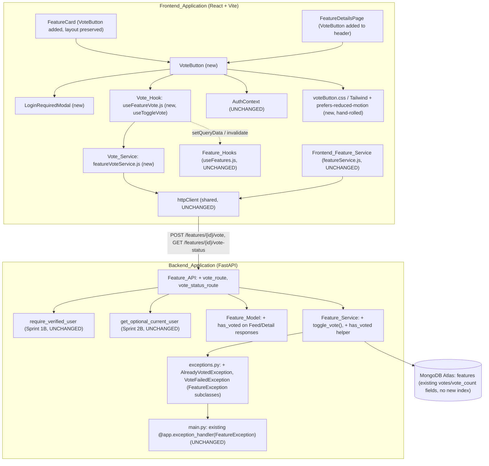

# Design Document

## Overview

Sprint 3 adds the Atomic Voting Engine on top of Sprint 2A's `features` collection / `Feature_Service` / `Feature_API` and Sprint 2B's `FeatureDetailResponse` and optional-auth dependency. It reuses the `votes` array and `vote_count` integer already persisted on every feature document (Sprint 2A defaulted them to `[]`/`0`), adds an atomic `toggle_vote()` to `Feature_Service`, adds a `has_voted` field to the two read schemas (`FeatureFeedResponse`, `FeatureDetailResponse`), adds two thin `Feature_API` routes (Vote_Endpoint, Vote_Status_Endpoint), defines two new `FeatureException` subclasses, and on the frontend introduces a separate `Vote_Service` (`featureVoteService.js`), a separate `Vote_Hook` (`useFeatureVote.js`) with optimistic updates and rollback, a reusable `VoteButton` integrated into `FeatureCard` and `FeatureDetailsPage`, a `LoginRequiredModal`, a hand-rolled CSS vote animation, and a loading/double-click guard.

**Preserved unchanged from earlier sprints** (per this sprint's Non-Goals):

- The Feed_Endpoint's pagination structure — `PaginatedFeatureResponse`/`PaginationMeta`, page size, sort/filter/search behavior, and item ordering — is untouched; only a `has_voted` field is added to each `FeatureFeedResponse` item (Req 5.1, 5.5).
- The Create_Feature_Endpoint, Update_Feature_Endpoint, and Delete_Feature_Endpoint route handlers and their `FeatureCreate`/`FeatureUpdate`/`FeatureResponse` contracts (Req 4.5).
- `Feature_Hooks` (`useFeatures.js`) — `useFeatureFeed` (keyed `["features", params]`), `useFeature` (keyed `["feature", featureId]`), `useCreateFeature`, `useUpdateFeature`, `useDeleteFeature` keep their exact signatures and query keys; the new vote hook lives in a separate file (Req 9.1).
- `Frontend_Feature_Service` (`featureService.js`) — unmodified; the new vote calls live in a separate `featureVoteService.js` (Req 8.1).
- `FeatureCard`'s existing layout — title, description preview, category/status badges, metadata line, "View Details" link, and Edit/Delete controls stay in place; the VoteButton is added, not substituted (Req 12.3).
- `get_optional_current_user` (Sprint 2B) and `require_verified_user` (Sprint 1B) — reused exactly; no auth dependency is modified (Req 3.1, 5.4).
- The `FeatureException` family and its single `@app.exception_handler(FeatureException)` registration in `main.py`; `Feature_Service` as the sole owner of the `features` collection; the `{success, message, data}`/`{success, message, errors}` envelope; strict routes → services → database layering — all reused (Req 4.4, 7.4).

The requirements document already resolved every design ambiguity this sprint raises; the decisions below restate them concisely:

1. **Each vote branch is a single conditional atomic MongoDB update, not a read-modify-write.** `toggle_vote` reads the feature once only to (a) confirm it exists (so a genuine miss is a `FeatureNotFoundException`, not a lost-race `AlreadyVotedException`) and (b) decide which branch to attempt. The actual state change is a single `find_one_and_update` whose filter *includes the membership condition*: the add branch filters `{_id, votes: {$ne: user_id}}` and applies `{$addToSet: {votes: user_id}, $inc: {vote_count: 1}}`; the remove branch filters `{_id, votes: user_id}` and applies `{$pull: {votes: user_id}, $inc: {vote_count: -1}}`. Both request the post-update document. Because the array-membership guard and the count adjustment are the same document write, the two can never diverge, and `$addToSet` makes a duplicate structurally impossible even if two identical add requests interleave — the second finds `votes: {$ne: user_id}` false and matches nothing (Req 2.1-2.5).
2. **`AlreadyVotedException` is the defined outcome of the lost race.** If the pre-read said "not voted" (so the add branch is attempted) but a concurrent request added the vote first, the add branch's `{votes: {$ne: user_id}}` filter now matches nothing and `find_one_and_update` returns `None`; symmetrically for the remove branch. Rather than retry blindly or silently corrupt the count, `toggle_vote` raises `AlreadyVotedException` (HTTP 409) for that matched-nothing-on-existing-feature case (Req 2.7, 7.2).
3. **`has_voted` is computed server-side as `current_user is not None and str(current_user["_id"]) in doc["votes"]`** for the resolved optional user. The feed and detail reads both use `get_optional_current_user`, so a guest resolves to `None` and every `has_voted` is `false` without raising. This mirrors exactly how Sprint 2B computes `is_owner`/`is_admin`, and the computation is identical on both schemas so it lives in one place (Req 5.2, 5.3, 6.2, 6.3).
4. **The Vote_Status_Endpoint requires auth (`require_verified_user`), unlike the feed/detail reads.** Reading "have *I* voted?" is only meaningful for an authenticated user, so it is not made publicly accessible; the guest-visible `has_voted` still rides along on the public feed/detail reads (Req 3.4, 4.2).
5. **The raw `votes` array is never exposed.** `has_voted` is derived from it and `vote_count` summarizes it, but no response schema declares a `votes` field — preserving Sprint 2A's deliberate omission on `FeatureResponse` and its subclasses (Req 1.4).
6. **Optimistic cache strategy is `setQueryData`-only, decoupled from feed URL state.** `onMutate` cancels in-flight queries for `["feature", featureId]` and `["features", ...]`, snapshots them, and writes the optimistic `has_voted`/`vote_count` into the detail entry and into every feed page entry whose `items` contain the feature; `onError` restores the snapshots and toasts; `onSettled` invalidates the keys so caches eventually reconcile, but does not force an immediate synchronous full feed refetch. Because the hook never reads or writes `useSearchParams`, a vote never disturbs the feed's search/filters/page/scroll (Req 10, 17, 18).
7. **The new vote service and vote hook are separate files, not edits to the existing ones**, so the existing `featureService`/`useFeatures` signatures and query keys are provably unchanged (Req 8.1, 9.1).

## Architecture



Key decisions:

- **`toggle_vote()` lives in the existing `Feature_Service` module**, preserving the "sole owner of the `features` collection" rule — no new service module and no separate votes collection (Req 1.1).
- **`has_voted` is computed inside the two response schemas' `from_mongo`/serialization path**, taking the optional current user as an argument exactly as Sprint 2B's `FeatureDetailResponse.from_mongo` already does for `is_owner`/`is_admin`, so the feed and detail computations are identical and single-sourced (Req 5.2, 6.2).
- **The two new routes are additive on the existing `/features` router**; the create/feed/get/update/delete handlers are not touched (Req 4.5).
- **`AlreadyVotedException`/`VoteFailedException` are new `FeatureException` subclasses** appended to `exceptions.py`; `main.py`'s single family handler already translates any `FeatureException`, so no handler is added (Req 7.1, 7.4).
- **`Vote_Service` and `Vote_Hook` are new standalone files**; `featureService.js`/`useFeatures.js` are read but never modified (Req 8.1, 9.1).

## Components and Interfaces

### Backend

#### Directory layout additions (`backend/app/`)

```
backend/
├── app/
│   ├── api/v1/
│   │   └── features.py             # extended: vote_route, vote_status_route
│   ├── core/
│   │   └── exceptions.py           # extended: AlreadyVotedException, VoteFailedException
│   ├── models/
│   │   └── feature.py              # extended: has_voted on FeatureFeedResponse + FeatureDetailResponse
│   └── services/
│       └── feature_service.py      # extended: toggle_vote(), has_voted computed in serialization
```

No new file and no new index: the `votes`/`vote_count` fields and the `vote_count` descending index already exist from Sprint 2A.

#### Vote exception family (`core/exceptions.py`, Req 7)

```python
class AlreadyVotedException(FeatureException):
    """Defensive: raised when a conditional vote update matches no document
    because the feature's vote state changed between the pre-read and the
    atomic write (the lost-race case, Req 2.7). Maps to HTTP 409 (Req 7.2)."""
    status_code = 409


class VoteFailedException(FeatureException):
    """Raised when a voting operation cannot be completed for a reason other
    than a not-found feature or an already-resolved concurrent toggle
    (Req 2.x). Maps to HTTP 500 (Req 7.3)."""
    status_code = 500
```

**Design decision — these subclass `FeatureException`, not `AuthException`** (Req 7.1), mirroring Sprint 2A's `FeatureNotFoundException`/`PermissionDeniedException` and reusing `main.py`'s single `FeatureException` handler with no new registration (Req 7.4).

#### Atomic `toggle_vote` (`services/feature_service.py`, Req 2)

```python
async def toggle_vote(feature_id: str, user_id: str) -> dict[str, Any]:
    """Atomically toggle `user_id`'s vote on a feature.

    Reads the feature once to confirm existence (Req 2.6) and choose the
    branch. The state change itself is a single conditional
    find_one_and_update whose filter carries the membership guard, so the
    array update and count adjustment are one write and can never diverge
    (Req 2.2, 2.3). Returns {voted, vote_count} derived from the post-update
    document (Req 2.4, 2.5).
    """
    feature = await find_by_id(feature_id)
    if feature is None:
        raise FeatureNotFoundException("Feature request not found.")

    object_id = feature["_id"]
    already_voted = user_id in feature.get("votes", [])

    if already_voted:
        # Remove branch: filter requires the user IS present.
        updated = await _collection().find_one_and_update(
            {"_id": object_id, "votes": user_id},
            {"$pull": {"votes": user_id}, "$inc": {"vote_count": -1}},
            return_document=ReturnDocument.AFTER,
        )
        resulting_voted = False
    else:
        # Add branch: filter requires the user is NOT present.
        updated = await _collection().find_one_and_update(
            {"_id": object_id, "votes": {"$ne": user_id}},
            {"$addToSet": {"votes": user_id}, "$inc": {"vote_count": 1}},
            return_document=ReturnDocument.AFTER,
        )
        resulting_voted = True

    if updated is None:
        # The feature exists (checked above) but the conditional write
        # matched nothing: the vote state changed under us (Req 2.7).
        raise AlreadyVotedException("Your vote could not be applied because the vote state changed. Please retry.")

    return {"voted": resulting_voted, "vote_count": updated["vote_count"]}
```

**Design decision — the membership guard lives in the update filter, not in a separate check.** A read-modify-write (read `votes`, decide, then unconditionally `$set`) would allow two concurrent add requests to both pass the read and both write, producing a duplicate and a doubled count. Putting `{votes: {$ne: user_id}}` / `{votes: user_id}` in the filter makes the second racing write match nothing, so `$addToSet`+`$inc` (or `$pull`+`$inc`) apply exactly once. This is what preserves both `vote_count == len(votes)` and no-duplicates under concurrency (Req 1.2, 1.3, 2.2, 2.3). `$addToSet` is belt-and-suspenders on the no-duplicate guarantee even independent of the filter.

#### `has_voted` computation (`models/feature.py` + serialization, Req 5, 6)

`has_voted` is a per-viewer field, so — like Sprint 2B's `is_owner`/`is_admin` — it is passed into serialization rather than stored. The membership test is single-sourced:

```python
def viewer_has_voted(doc: dict[str, Any], current_user: dict[str, Any] | None) -> bool:
    """True iff a resolved current user's id is present in the feature's
    votes array; False for a guest (Req 5.2, 5.3, 6.2, 6.3)."""
    return current_user is not None and str(current_user["_id"]) in doc.get("votes", [])
```

```python
class FeatureFeedResponse(FeatureResponse):
    """Feed item schema, now carrying a per-viewer has_voted (Req 5.1)."""
    has_voted: bool = False

    @classmethod
    def from_mongo(cls, doc, *, current_user=None):
        base = FeatureResponse.from_mongo(doc).model_dump()
        return cls(**base, has_voted=viewer_has_voted(doc, current_user))


class FeatureDetailResponse(FeatureResponse):
    is_owner: bool
    is_admin: bool
    related_features: list[RelatedFeatureCard]
    has_voted: bool = False   # added (Req 6.1)

    @classmethod
    def from_mongo(cls, doc, *, current_user, related):
        base = FeatureResponse.from_mongo(doc).model_dump()
        # ... existing is_owner/is_admin computation (Sprint 2B) ...
        return cls(
            **base,
            is_owner=is_owner,
            is_admin=is_admin,
            related_features=[RelatedFeatureCard.from_mongo(x) for x in related],
            has_voted=viewer_has_voted(doc, current_user),
        )
```

**Design decision — `has_voted` defaults to `False`** so any serialization path that omits `current_user` (there are none this sprint, but defensively) produces the guest value, and no existing `FeatureFeedResponse`/`FeatureDetailResponse` field is removed, renamed, or retyped (Req 5.1, 6.1).

#### Routes (`api/v1/features.py`, Req 4)

```python
@router.post("/{feature_id}/vote")
async def vote_route(
    feature_id: str,
    current_user: dict = Depends(require_verified_user),
) -> dict:
    result = await feature_service.toggle_vote(feature_id, str(current_user["_id"]))
    return success_response("Vote updated.", result)  # {voted, vote_count}


@router.get("/{feature_id}/vote-status")
async def vote_status_route(
    feature_id: str,
    current_user: dict = Depends(require_verified_user),
) -> dict:
    feature = await feature_service.find_by_id(feature_id)
    if feature is None:
        raise FeatureNotFoundException("Feature request not found.")
    has_voted = str(current_user["_id"]) in feature.get("votes", [])
    return success_response("Vote status retrieved.", {"has_voted": has_voted, "vote_count": feature["vote_count"]})
```

The feed and get-feature handlers additionally thread `current_user` (from their existing `get_optional_current_user` dependency for the detail route; the feed route gains a `get_optional_current_user` dependency) into `from_mongo` so `has_voted` is populated — the only change to those two handlers (Req 5.4, 6.4). Create/update/delete are untouched (Req 4.5).

### Frontend

#### Directory layout additions (`frontend/src/`)

```
frontend/
├── src/
│   ├── services/
│   │   └── featureVoteService.js   # NEW - Vote_Service
│   ├── hooks/
│   │   └── useFeatureVote.js       # NEW - Vote_Hook (useToggleVote)
│   ├── components/
│   │   ├── VoteButton.jsx          # NEW
│   │   ├── LoginRequiredModal.jsx  # NEW
│   │   ├── FeatureCard.jsx         # modified: renders VoteButton (layout preserved)
│   │   └── voteAnimation.js        # NEW - pure reduced-motion + optimistic-transform helpers
│   └── pages/
│       └── FeatureDetailsPage.jsx  # modified: VoteButton in header
```

#### Vote_Service (`services/featureVoteService.js`, Req 8)

```js
import { httpClient } from "./httpClient";

export const featureVoteService = {
  async toggleVote(featureId) {
    const { data } = await httpClient.post(`/api/v1/features/${featureId}/vote`);
    return data.data; // { voted, vote_count }
  },
  async getVoteStatus(featureId) {
    const { data } = await httpClient.get(`/api/v1/features/${featureId}/vote-status`);
    return data.data; // { has_voted, vote_count }
  },
};
```

The same shared `httpClient` `featureService.js` uses, so vote requests carry the access token and refresh-interceptor behavior identically (Req 8.4).

#### Optimistic transform helpers (`components/voteAnimation.js`, Req 10, 15, 17)

Pure functions extracted so they are testable without React or a DOM:

```js
/** Flip has_voted and adjust vote_count by exactly +/-1 for the target
 *  feature, leaving every other field/entry untouched. Never drives a
 *  consistent cache's vote_count below zero (Req 10.1, 10.5). */
export function applyOptimisticVote(feature) {
  const nextVoted = !feature.has_voted;
  const delta = nextVoted ? 1 : -1;
  return { ...feature, has_voted: nextVoted, vote_count: Math.max(0, feature.vote_count + delta) };
}

/** Rewrite a single ["features", ...] feed page's items, applying the
 *  optimistic transform to the one entry matching featureId (Req 10.2). */
export function applyOptimisticVoteToPage(page, featureId) {
  if (!page?.items) return page;
  return { ...page, items: page.items.map((f) => (f.id === featureId ? applyOptimisticVote(f) : f)) };
}

export function prefersReducedMotion() {
  return typeof window !== "undefined" && window.matchMedia?.("(prefers-reduced-motion: reduce)").matches === true;
}
```

#### Vote_Hook (`hooks/useFeatureVote.js`, Req 9, 10, 17, 19)

```js
import { useMutation, useQueryClient } from "@tanstack/react-query";
import { toast } from "sonner";
import { featureVoteService } from "../services/featureVoteService";
import { applyOptimisticVote, applyOptimisticVoteToPage } from "../components/voteAnimation";

export function useToggleVote(featureId) {
  const queryClient = useQueryClient();
  return useMutation({
    mutationFn: () => featureVoteService.toggleVote(featureId),

    async onMutate() {
      // Stop in-flight fetches so they can't clobber the optimistic write.
      await queryClient.cancelQueries({ queryKey: ["feature", featureId] });
      await queryClient.cancelQueries({ queryKey: ["features"] });

      // Snapshot every affected cache entry for rollback.
      const prevDetail = queryClient.getQueryData(["feature", featureId]);
      const prevFeeds = queryClient.getQueriesData({ queryKey: ["features"] });

      // Optimistically update the detail entry...
      if (prevDetail) {
        queryClient.setQueryData(["feature", featureId], applyOptimisticVote(prevDetail));
      }
      // ...and every feed page containing the feature.
      prevFeeds.forEach(([key, page]) => {
        queryClient.setQueryData(key, applyOptimisticVoteToPage(page, featureId));
      });

      return { prevDetail, prevFeeds };
    },

    onError(_err, _vars, context) {
      // Restore exact pre-mutation snapshots (Req 10.3, 19.1).
      if (context?.prevDetail !== undefined) {
        queryClient.setQueryData(["feature", featureId], context.prevDetail);
      }
      context?.prevFeeds?.forEach(([key, page]) => queryClient.setQueryData(key, page));
      toast.error("Your vote could not be recorded. Please try again."); // Req 10.4, 19.2
    },

    onSettled() {
      // Reconcile eventually; NOT an immediate synchronous full refetch
      // that would replace the optimistic feed page mid-interaction (Req 17.2).
      queryClient.invalidateQueries({ queryKey: ["feature", featureId] });
      queryClient.invalidateQueries({ queryKey: ["features"] });
    },
  });
}
```

The hook never imports or touches `useSearchParams`/`useFeedQueryParams`, so a vote is fully decoupled from feed URL state (Req 18.3). `useFeatures.js` is not modified (Req 9.1).

#### VoteButton (`components/VoteButton.jsx`, Req 11, 15, 16)

```jsx
// Pure state selection (Req 11.2-11.5), extracted for direct testing:
export function selectVoteButtonState({ isAuthenticated, isVerified, hasVoted, isPending }) {
  if (isPending) return "loading";        // pending always wins (Req 16.1)
  if (!isAuthenticated) return "guest";   // Req 11.2
  if (!isVerified) return "guest";        // unverified is treated like guest for the click affordance
  return hasVoted ? "active" : "inactive"; // Req 11.3, 11.4
}

function VoteButton({ featureId, voteCount, hasVoted }) {
  const { user, isAuthenticated } = useAuth();
  const toggleVote = useToggleVote(featureId);
  const [modalOpen, setModalOpen] = useState(false);

  const state = selectVoteButtonState({
    isAuthenticated,
    isVerified: Boolean(user?.is_verified),
    hasVoted,
    isPending: toggleVote.isPending,
  });

  function handleClick() {
    if (state === "loading") return;           // double-click guard (Req 16.2)
    if (state === "guest") { setModalOpen(true); return; } // Req 11.2, 14.2
    toggleVote.mutate();                        // Req 11.3, 11.4
  }

  const reduce = prefersReducedMotion();        // Req 15.3
  // className toggles the hand-rolled scale/color/count-transition classes
  // only when !reduce; disabled === (state === "loading") (Req 15, 16.1).
  return (/* arrow icon or spinner + voteCount, aria-pressed={hasVoted} */);
}
```

Guest/unverified activation opens `LoginRequiredModal` rather than voting; verified activation calls `useToggleVote().mutate()`; a pending mutation disables the button, shows a spinner, and ignores clicks (Req 11, 16). The animation is hand-rolled CSS transitions/keyframes suppressed under `prefers-reduced-motion` — no animation library (Req 15.2, 15.3).

#### LoginRequiredModal (`components/LoginRequiredModal.jsx`, Req 14)

```jsx
function LoginRequiredModal({ isOpen, onClose }) {
  const navigate = useNavigate();
  if (!isOpen) return null;
  return (
    <div role="dialog" aria-modal="true">
      <p>Log in to vote for feature requests.</p>
      <button onClick={() => navigate("/login")}>Login</button>
      <button onClick={() => navigate("/signup")}>Signup</button>
      <button onClick={onClose}>Cancel</button>
    </div>
  );
}
```

No navigation on open; navigation only in response to an explicit Login/Signup activation; Cancel closes and stays put (Req 14.3, 14.4, 14.5).

#### FeatureCard and FeatureDetailsPage integration (Req 12, 13)

`FeatureCard` gains a single `<VoteButton featureId={feature.id} voteCount={feature.vote_count} hasVoted={feature.has_voted} />` in its metadata region; every existing element (title, preview, badges, metadata line, "View Details" link, Edit/Delete controls) stays exactly where it is (Req 12.1, 12.3). `FeatureDetailsPage` gains a `VoteButton` in its header, wired to `FeatureDetailResponse.vote_count`/`has_voted`, leaving the Sprint 2B section order and Edit/Delete controls intact (Req 13.1, 13.3). Neither integration issues a manual refetch — the optimistic cache edit propagates the change (Req 12.2, 13.2, 17.3).

## Data Models

No persisted schema change. The feature document keeps its Sprint 2A shape; this sprint is the first to read/write the existing `votes`/`vote_count` fields for voting:

```
features (existing document; fields relevant to this sprint)
  _id:         ObjectId
  votes:       list[str]   # user-id strings; $addToSet / $pull target; no duplicates (Req 1.2)
  vote_count:  int         # maintained == len(votes) after every toggle (Req 1.3)
  ...          (title, description_markdown, category, status, author_id, author_name,
                comment_count, created_at, updated_at — unchanged)
```

API payloads added/changed this sprint:

```
Vote_Endpoint       POST /api/v1/features/{id}/vote        -> data: { voted: bool, vote_count: int }
Vote_Status_Endpoint GET /api/v1/features/{id}/vote-status -> data: { has_voted: bool, vote_count: int }
FeatureFeedResponse  (feed item)                           += has_voted: bool
FeatureDetailResponse (get feature)                        += has_voted: bool
```

No new index (the `vote_count` descending index already exists from Sprint 2A; `$addToSet`/`$pull`/`$inc` on a `_id`-filtered document need no additional index).

## Correctness Properties

*A property is a characteristic or behavior that should hold true across all valid executions of a system — essentially, a formal statement about what the system should do. Properties serve as the bridge between human-readable specifications and machine-verifiable correctness guarantees.*

### Property 1: Vote count equals votes-array length after every toggle

*For any* feature and *any* sequence of `toggle_vote` calls by *any* set of user ids, after each completed call the feature's `vote_count` equals the length of its `votes` array (`vote_count == len(votes)`).

**Validates: Requirements 1.3, 2.4, 2.5**

### Property 2: The votes array never contains a duplicate user id

*For any* feature and *any* sequence of `toggle_vote` calls (including repeated calls by the same user, in any order), the `votes` array contains each user id at most once at every step.

**Validates: Requirements 1.2, 2.2, 2.3**

### Property 3: Toggling a user's vote twice is an involution

*For any* feature and *any* user, calling `toggle_vote` twice in succession for that user returns the feature's `vote_count` and that user's membership in `votes` to their exact pre-toggle values, and each individual call returns `voted` equal to whether the user is a member of `votes` after that call.

**Validates: Requirements 2.1, 2.5**

### Property 4: `has_voted` equals votes membership for the resolved viewer

*For any* feature document and *any* resolved optional viewer, the serialized `has_voted` (on both `FeatureFeedResponse` and `FeatureDetailResponse`) is `true` exactly when the viewer is present (not a guest) and the viewer's id is in the feature's `votes` array, and `false` otherwise (including every guest case).

**Validates: Requirements 5.2, 5.3, 6.2, 6.3**

### Property 5: Optimistic update flips `has_voted` and adjusts count by exactly one

*For any* cached feature and *any* set of feed pages, applying the optimistic vote transform flips the target feature's `has_voted`, changes its `vote_count` by exactly `+1` (when it was not voted) or `-1` (when it was voted, never below zero), and applies that same change to the feature everywhere it appears (the detail entry and every feed page containing it) while leaving all other features and fields unchanged.

**Validates: Requirements 10.1, 10.2, 10.5, 17.1**

### Property 6: Optimistic update followed by rollback restores the original cache

*For any* cached detail entry and *any* set of feed pages, snapshotting the cache, applying the optimistic vote transform, and then restoring the snapshot yields a cache deeply equal to the original — for any failure cause.

**Validates: Requirements 10.3, 19.1**

### Property 7: VoteButton state selection is a total function of its inputs

*For any* combination of `isAuthenticated`, `isVerified`, `hasVoted`, and `isPending` booleans, `selectVoteButtonState` returns exactly one of `loading`/`guest`/`inactive`/`active`, with `isPending` always yielding `loading`, an unauthenticated or unverified viewer yielding `guest`, and an authenticated verified viewer yielding `active` iff `hasVoted` else `inactive`.

**Validates: Requirements 11.2, 11.3, 11.4, 11.5, 16.1**

## Error Handling

- **Not-found feature (vote / vote-status / detail):** `toggle_vote` and `vote_status_route` confirm existence via `find_by_id` and raise `FeatureNotFoundException` (HTTP 404) on a miss, translated by `main.py`'s existing `FeatureException` handler (Req 2.6, 4.3, 7.4).
- **Lost-race conditional write (vote):** when the atomic update matches nothing on an existing feature, `toggle_vote` raises `AlreadyVotedException` (HTTP 409) rather than retrying or corrupting the count (Req 2.7, 7.2).
- **Unexpected voting failure:** `VoteFailedException` (HTTP 500) is available for a voting operation that fails for a reason other than not-found/lost-race (Req 7.3); it flows through the same family handler.
- **Auth failures (vote / vote-status):** a missing/invalid token yields HTTP 401 via `get_current_user`'s `UnauthorizedException`; an unverified user yields HTTP 403 via `require_verified_user` — both unchanged from Sprint 1A/1B and translated by the existing `AuthException` handler (Req 3.2, 3.3, 3.4).
- **Guest read (feed / detail):** `get_optional_current_user` resolves a guest to `None` without raising; `has_voted` is `false` (Req 5.4, 6.4).
- **Frontend vote failure:** any rejected vote request triggers `onError` → snapshot rollback of every affected cache entry + a single Sonner error Toast, leaving the displayed count/state consistent with the server and the button re-activatable on settle (Req 10.3, 10.4, 16.3, 19.1-19.3).
- **Guest vote attempt (frontend):** the VoteButton opens `LoginRequiredModal` and issues no request (Req 11.2, 14.2).

## Testing Strategy

**Dual approach.** Property-based tests validate the universal invariants above; example/integration/unit tests cover concrete endpoint contracts, error branches, wiring, and UI behavior. Property-based testing is appropriate here because the vote toggle logic, the count/uniqueness invariants, the `has_voted` membership computation, and the pure optimistic-cache transforms are all input-varying pure/deterministic logic over a large input space. It is *not* used for endpoint auth wiring, schema-shape guarantees, side-effect toasts, or animation styling — those use example/integration tests.

**Backend** — pytest + Hypothesis (`max_examples=100`) + FastAPI `TestClient` against a fake in-memory Motor-like `features` collection patched over `feature_service.db` (mirroring the existing `test_token_consumption_properties.py` fake-collection pattern):
- Property tests: Property 1 (count integrity), Property 2 (no duplicates), Property 3 (toggle involution), Property 4 (`has_voted` membership) — each a Hypothesis `@given` over generated features / user-id sequences / viewers.
- Example/integration tests: vote (200 `{voted, vote_count}`), unvote, duplicate/lost-race (`find_one_and_update` returns `None` on an existing feature → 409 `AlreadyVotedException`), unknown feature → 404, guest → 401, unverified → 403, verified → 200 (via `app.dependency_overrides`), and the vote-exception envelope shape through the existing family handler.

**Frontend** — Vitest + React Testing Library + fast-check (`numRuns: 100`):
- Property tests: Property 5 (optimistic forward transform over random feed pages + target), Property 6 (apply-then-rollback round-trip), Property 7 (`selectVoteButtonState` over the boolean tuple).
- Example/unit tests: `Vote_Service` `toggleVote`/`getVoteStatus` URL+payload (mocked `httpClient`); `useToggleVote` optimistic increment/decrement and rollback + error Toast (with a `QueryClient`); VoteButton guest/inactive/active/loading rendering and the double-click guard; `LoginRequiredModal` exact message + Login/Signup/Cancel behavior (no auto-redirect, via `MemoryRouter`); FeatureCard/FeatureDetailsPage VoteButton integration with layout/section preservation; cache-sync without an immediate full refetch and URL/scroll stability; animation-class toggling and its suppression under a mocked `matchMedia(prefers-reduced-motion: reduce)`.

**Property test configuration** — minimum 100 iterations per property test; each property test is tagged with a comment referencing its design property: **Feature: sprint-3-voting-engine, Property {number}: {property_text}**. Each correctness property is implemented by a single property-based test using the ecosystem's standard library (Hypothesis / fast-check); property-based testing is not implemented from scratch.
