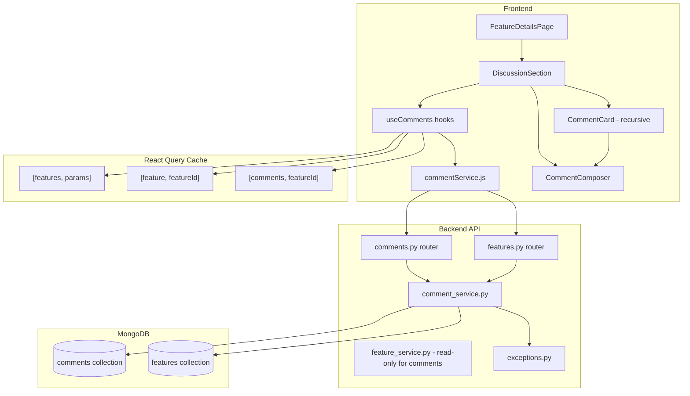

# Design Document: Sprint 4 — Threaded Discussions

## Overview

This sprint adds a complete threaded discussion system to the Feature Roadmap
Portal. Users can post top-level comments and nested replies (up to depth 3) on
any feature request. Comments support markdown content, soft-deletion with
tombstoning, and author-only editing. The feature's `comment_count` on the feature
document is maintained atomically via `$inc`. On the frontend, the
`CommentsPlaceholder` is replaced by a live `DiscussionSection` component with
optimistic updates, loading skeletons, and a guest-friendly banner.

### Preserved Unchanged

The following files and modules must **not** be modified by Sprint 4 implementation:

| File | Reason |
|---|---|
| `backend/app/main.py` | New exceptions subclass `FeatureException`; existing handler covers them |
| `backend/app/services/feature_service.py` | Comment counts are updated from `comment_service.py` directly |
| `backend/app/middleware/auth.py` | Reused as-is: `require_verified_user`, `get_current_user`, `get_optional_current_user` |
| `frontend/src/hooks/useFeatures.js` | Query keys `["features", params]` and `["feature", featureId]` are stable |
| `frontend/src/services/featureService.js` | All existing endpoints are unchanged |
| `frontend/src/components/MarkdownEditor.jsx` | Reused as a controlled component |
| `frontend/src/components/AuthorCard.jsx` | Reused with existing props |
| `frontend/src/components/markdown/MarkdownRenderer.jsx` | Reused accepting children |
| `frontend/src/components/CharacterCounter.jsx` | Reused with `{ length, max }` props |
| `frontend/src/components/ConfirmDialog.jsx` | Reused for delete confirmation |
| `frontend/src/components/LoginRequiredModal.jsx` | Reused for guest prompts |
| `frontend/src/components/Placeholders.jsx` | Kept; `CommentsPlaceholder` remains exported |

---

## Architecture



---

## Components and Interfaces

### Backend New Files

#### `backend/app/models/comment.py`

Pydantic schemas for the Comment API boundary and the tree-building helper.

```python
class CommentCreate(BaseModel):
    content_markdown: str = Field(min_length=3, max_length=2000)
    parent_comment_id: str | None = None

class CommentUpdate(BaseModel):
    content_markdown: str = Field(min_length=3, max_length=2000)

class CommentResponse(BaseModel):
    id: str
    feature_id: str
    author_id: str
    author_name: str
    author_role: str
    is_verified: bool
    parent_comment_id: str | None
    content_markdown: str
    reply_count: int
    created_at: datetime
    updated_at: datetime
    is_deleted: bool

    @classmethod
    def from_mongo(cls, doc: dict) -> "CommentResponse": ...

class CommentTreeResponse(CommentResponse):
    replies: list["CommentTreeResponse"] = []

def build_comment_tree(docs: list[dict]) -> list[CommentTreeResponse]: ...
```

#### `backend/app/services/comment_service.py`

All comment business logic. Uses `_collection()` pattern for the `comments`
collection. Updates the `features` collection directly via `$inc` for
`comment_count`.

```python
def _collection():           # returns db["comments"]
def _features_collection():  # returns db["features"]

async def ensure_indexes() -> None
async def create_comment(data: CommentCreate, feature_id: str, author: dict) -> dict
async def reply_to_comment(data: CommentCreate, parent_comment_id: str, author: dict) -> dict
async def get_comments_for_feature(feature_id: str) -> list[dict]
async def find_comment_by_id(comment_id: str) -> dict | None
async def update_comment(comment_id: str, data: CommentUpdate, current_user: dict) -> dict
async def delete_comment(comment_id: str, current_user: dict) -> dict
```

#### `backend/app/api/v1/comments.py`

```python
router = APIRouter(prefix="/comments")

@router.post("/{comment_id}/reply", status_code=201)
async def reply_to_comment_route(...)

@router.patch("/{comment_id}")
async def update_comment_route(...)

@router.delete("/{comment_id}")
async def delete_comment_route(...)
```

### Backend Modified Files

#### `backend/app/api/v1/features.py` — added routes

```python
@router.post("/{feature_id}/comments", status_code=201)
async def create_comment_route(
    feature_id: str,
    body: CommentCreate,
    current_user: dict = Depends(require_verified_user),
) -> dict

@router.get("/{feature_id}/comments")
async def get_comments_route(
    feature_id: str,
) -> dict
```

#### `backend/app/core/exceptions.py` — appended subclasses

```python
class CommentNotFoundException(FeatureException):
    status_code = 404

class CommentPermissionDeniedException(FeatureException):
    status_code = 403

class CommentDeletedException(FeatureException):
    status_code = 410

class ReplyDepthExceededException(FeatureException):
    status_code = 422
```

#### `backend/app/api/v1/__init__.py` — added import

```python
from app.api.v1 import auth, comments, dashboard, features, health
api_router.include_router(comments.router, tags=["comments"])
```

### Frontend New Files

#### `frontend/src/services/commentService.js`

```js
export const commentService = {
  getComments(featureId),       // GET /api/v1/features/{featureId}/comments
  createComment(featureId, payload), // POST /api/v1/features/{featureId}/comments
  replyToComment(commentId, payload), // POST /api/v1/comments/{commentId}/reply
  updateComment(commentId, payload),  // PATCH /api/v1/comments/{commentId}
  deleteComment(commentId),           // DELETE /api/v1/comments/{commentId}
}
```

#### `frontend/src/hooks/useComments.js`

```js
export function useComments(featureId)      // useQuery, key ["comments", featureId]
export function useCreateComment()          // useMutation with optimistic insert
export function useReplyToComment()         // useMutation with optimistic insert
export function useUpdateComment()          // useMutation with optimistic edit
export function useDeleteComment()          // useMutation with optimistic soft-delete
```

#### `frontend/src/components/CommentComposer.jsx`

Props: `{ onSubmit, onCancel, initialValue, mode, isLoading }`
- `mode`: `"compose"` | `"edit"` | `"reply"`
- Renders `MarkdownEditor` + `CharacterCounter` + Submit/Cancel buttons
- Submit disabled when `content.length < 3 || content.length > 2000 || isLoading`

#### `frontend/src/components/CommentCard.jsx`

Props: `{ comment, depth, featureId, currentUser }`
- Recursively renders `comment.replies`
- Renders `AuthorCard`, `MarkdownRenderer`, action buttons
- Inline `CommentComposer` for reply/edit modes
- `ConfirmDialog` for delete confirmation
- Collapse/Expand toggle for replies

#### `frontend/src/components/DiscussionSection.jsx`

Props: `{ featureId, commentCount }`
- Orchestrates the full discussion UI
- Renders guest banner or top-level `CommentComposer`
- Renders comment tree via `CommentCard`
- Uses `useComments(featureId)`

### Frontend Modified Files

#### `frontend/src/pages/FeatureDetailsPage.jsx`

Replace `CommentsPlaceholder` import with `DiscussionSection`:
```jsx
// Before:
import { VotingPlaceholder, CommentsPlaceholder } from "../components/Placeholders";
// ...
<CommentsPlaceholder />

// After:
import DiscussionSection from "../components/DiscussionSection";
// ...
<DiscussionSection featureId={feature.id} commentCount={feature.comment_count} />
```

---

## Data Models

### Comment Document (MongoDB `comments` collection)

```json
{
  "_id": ObjectId,
  "feature_id": "str(ObjectId)",
  "author_id": "str(ObjectId)",
  "author_name": "string",
  "author_role": "user | admin",
  "is_verified": true,
  "parent_comment_id": "str(ObjectId) | null",
  "content_markdown": "sanitized markdown string (3–2000 chars)",
  "reply_count": 0,
  "created_at": "ISODate (UTC)",
  "updated_at": "ISODate (UTC)",
  "is_deleted": false
}
```

### MongoDB Indexes (`comment_service.ensure_indexes`)

```python
await collection.create_index("feature_id")
await collection.create_index("parent_comment_id")
await collection.create_index([("feature_id", 1), ("created_at", 1)])
```

### Exact MongoDB Operations

#### Create Top-Level Comment (`create_comment`)

```python
now = datetime.now(timezone.utc)
doc = {
    "feature_id": feature_id,
    "author_id": str(author["_id"]),
    "author_name": author["name"],
    "author_role": author.get("role", "user"),
    "is_verified": bool(author.get("is_verified", False)),
    "parent_comment_id": None,
    "content_markdown": sanitize_markdown(data.content_markdown),
    "reply_count": 0,
    "created_at": now,
    "updated_at": now,
    "is_deleted": False,
}
result = await _collection().insert_one(doc)
doc["_id"] = result.inserted_id
# Atomically increment comment_count on the feature
await _features_collection().update_one(
    {"_id": ObjectId(feature_id)},
    {"$inc": {"comment_count": 1}},
)
return doc
```

#### Create Reply (`reply_to_comment`)

```python
# 1. Verify parent exists
parent = await find_comment_by_id(parent_comment_id)
if parent is None:
    raise CommentNotFoundException("Parent comment not found.")

# 2. Insert reply doc (same as create_comment but with parent_comment_id set)
doc["parent_comment_id"] = str(parent["_id"])
# ... insert_one ...

# 3. Increment parent's reply_count
await _collection().update_one(
    {"_id": parent["_id"]},
    {"$inc": {"reply_count": 1}},
)

# 4. Increment feature comment_count
await _features_collection().update_one(
    {"_id": ObjectId(feature_id)},
    {"$inc": {"comment_count": 1}},
)
```

#### Get Comment Tree (`get_comments_for_feature`)

```python
cursor = _collection().find(
    {"feature_id": feature_id}
).sort("created_at", 1)
docs = [doc async for doc in cursor]
return docs  # returned flat; build_comment_tree() called in route handler
```

#### Update Comment (`update_comment`)

```python
comment = await find_comment_by_id(comment_id)
if comment is None:
    raise CommentNotFoundException("Comment not found.")
if comment["author_id"] != str(current_user["_id"]):
    raise CommentPermissionDeniedException("Only the author may edit this comment.")
if comment["is_deleted"]:
    raise CommentDeletedException("Cannot edit a deleted comment.")

await _collection().update_one(
    {"_id": comment["_id"]},
    {"$set": {
        "content_markdown": sanitize_markdown(data.content_markdown),
        "updated_at": datetime.now(timezone.utc),
    }},
)
return await find_comment_by_id(comment_id)
```

#### Delete Comment (`delete_comment`)

```python
comment = await find_comment_by_id(comment_id)
if comment is None:
    raise CommentNotFoundException("Comment not found.")
is_author = comment["author_id"] == str(current_user["_id"])
is_admin = current_user.get("role") == "admin"
if not (is_author or is_admin):
    raise CommentPermissionDeniedException("Only the author or an admin may delete.")

already_deleted = comment["is_deleted"]

await _collection().update_one(
    {"_id": comment["_id"]},
    {"$set": {
        "is_deleted": True,
        "content_markdown": "[deleted]",
        "author_name": "[deleted]",
        "updated_at": datetime.now(timezone.utc),
    }},
)

# Only decrement if the comment was not already deleted
if not already_deleted:
    await _features_collection().update_one(
        {"_id": ObjectId(comment["feature_id"])},
        {"$inc": {"comment_count": -1}},
    )

return await find_comment_by_id(comment_id)
```

---

## Tree-Building Algorithm

`build_comment_tree(docs: list[dict]) -> list[CommentTreeResponse]`

The algorithm converts a flat list (already sorted oldest-first by the DB query)
into a nested `CommentTreeResponse` tree with max depth 3.

```
Precondition: docs is sorted by created_at ASC (oldest-first)

1. Convert all docs to CommentTreeResponse objects (replies=[])
2. Build a lookup dict: id_map = { str(doc._id): node }
3. Build a depth_map: depth_map = { id: int } tracking each node's depth
4. Initialize roots = []
5. For each node in docs (in arrival order — already oldest-first):
     pid = node.parent_comment_id
     if pid is None or pid not in id_map:
         # top-level comment
         depth_map[node.id] = 0
         roots.append(node)
     else:
         parent_depth = depth_map[id_map[pid].id]
         if parent_depth < 3:
             # attach as direct child of parent
             depth_map[node.id] = parent_depth + 1
             id_map[pid].replies.append(node)
         else:
             # excess depth: walk up until depth == 3, attach there
             ancestor = id_map[pid]
             while depth_map[ancestor.id] > 3:
                 ancestor = id_map[ancestor.parent_comment_id]
             depth_map[node.id] = 3
             ancestor.replies.append(node)
6. Return roots
```

Key invariants guaranteed by this algorithm:
- Every comment appears in the output exactly once (no duplication, no omission).
- No node in the output tree has depth > 3.
- Siblings at every depth level are ordered oldest-first (input order is preserved
  since docs arrive sorted and are appended in arrival order).
- Soft-deleted comments (`is_deleted=True`) are included unchanged; their
  `content_markdown` and `author_name` are already tombstoned by the delete
  operation before storage — the tree builder does not modify them.

---

## React Query Cache Update Strategy

### Query Keys

| Key | Content |
|---|---|
| `["comments", featureId]` | Full `CommentTreeResponse[]` list for a feature |
| `["feature", featureId]` | `FeatureDetailResponse` (contains `comment_count`) |
| `["features", params]` | Feed pages (contains `comment_count` on feed items) |

### `useCreateComment` / `useReplyToComment` — Optimistic Insert

```
onMutate(variables):
  1. Cancel outgoing ["comments", featureId] queries
  2. Snapshot = queryClient.getQueryData(["comments", featureId])
  3. Build optimistic comment:
       {
         id: `optimistic-${Date.now()}`,
         feature_id: featureId,
         author_id: user.id,
         author_name: user.name,
         author_role: user.role,
         is_verified: user.is_verified,
         parent_comment_id: null,  // or parentCommentId for reply
         content_markdown: content,
         reply_count: 0,
         replies: [],
         created_at: new Date().toISOString(),
         updated_at: new Date().toISOString(),
         is_deleted: false,
       }
  4. setQueryData(["comments", featureId], insert optimistic node at end of tree
     or appended to parent.replies for replies)
  5. Return { snapshot }

onError(err, vars, context):
  1. queryClient.setQueryData(["comments", featureId], context.snapshot)
  2. toast.error(...)

onSettled:
  1. queryClient.invalidateQueries(["comments", featureId])
  2. Update comment_count: setQueryData(["feature", featureId], prev =>
       ({ ...prev, comment_count: prev.comment_count + 1 }))
  3. queryClient.invalidateQueries(["features"])
```

### `useUpdateComment` — Optimistic Edit

```
onMutate({ commentId, payload }):
  1. Cancel outgoing ["comments", featureId] queries
  2. Snapshot = queryClient.getQueryData(["comments", featureId])
  3. Walk tree, find node with id == commentId, update
     content_markdown and updated_at in-place
  4. setQueryData(["comments", featureId], updatedTree)
  5. Return { snapshot }

onError: rollback + toast.error(...)
onSettled: invalidateQueries(["comments", featureId])
```

### `useDeleteComment` — Optimistic Soft-Delete

```
onMutate({ commentId }):
  1. Cancel outgoing ["comments", featureId] queries
  2. Snapshot = queryClient.getQueryData(["comments", featureId])
  3. Walk tree, find node with id == commentId, set
     is_deleted=true, content_markdown="[deleted]", author_name="[deleted]"
  4. setQueryData(["comments", featureId], updatedTree)
  5. Return { snapshot }

onError: rollback + toast.error(...)
onSettled:
  1. invalidateQueries(["comments", featureId])
  2. Decrement comment_count: setQueryData(["feature", featureId], prev =>
       ({ ...prev, comment_count: Math.max(0, prev.comment_count - 1) }))
  3. invalidateQueries(["features"])
```

---

## Correctness Properties

*A property is a characteristic or behavior that should hold true across all
valid executions of a system — essentially, a formal statement about what the
system should do. Properties serve as the bridge between human-readable
specifications and machine-verifiable correctness guarantees.*

### Property 1: Tree Building — Total Inclusion

*For any* flat list of comment documents with valid parent references,
`build_comment_tree()` SHALL produce a tree whose set of node ids equals the
set of ids in the input list (every comment appears exactly once, none are
lost and none are duplicated).

**Validates: Requirements 1.5, 4.1, 4.2**

---

### Property 2: Tree Building — Max Depth Invariant

*For any* flat list of comment documents including chains of arbitrary depth,
`build_comment_tree()` SHALL produce a tree where no node has a depth greater
than 3 (measured from the root at depth 0).

**Validates: Requirements 1.6, 4.3, 4.4**

---

### Property 3: Tree Building — Oldest-First Ordering

*For any* flat list of comment documents where siblings share a parent,
`build_comment_tree()` SHALL produce a tree where for every node, its `replies`
list is ordered with earlier `created_at` values before later ones.

**Validates: Requirements 4.1, 4.2, 24.2**

---

### Property 4: Sanitizer Idempotence

*For any* markdown string `s`, `sanitize_markdown(sanitize_markdown(s))` SHALL
equal `sanitize_markdown(s)` (the sanitizer is idempotent: applying it twice
produces the same result as applying it once).

**Validates: Requirements 2.2**

---

### Property 5: Soft-Delete Tombstone Invariant

*For any* comment document, after a soft-delete operation is applied,
the resulting document SHALL have `is_deleted=True`, `content_markdown="[deleted]"`,
and `author_name="[deleted]"`, regardless of the original content or author.

**Validates: Requirements 8.4, 10.1**

---

### Property 6: Optimistic Comment Shape Completeness

*For any* combination of `(user, featureId, content, parentCommentId)`,
the Optimistic_Comment constructed by the mutation's `onMutate` SHALL contain
all required fields: `id` (prefixed `"optimistic-"`), `feature_id`, `author_id`,
`author_name`, `author_role`, `is_verified`, `parent_comment_id`,
`content_markdown`, `reply_count` (0), `replies` ([]), `created_at`,
`updated_at`, `is_deleted` (false).

**Validates: Requirements 15.1, 15.2**

---

### Property 7: CommentComposer Submit Disabled on Invalid Length

*For any* content string with `length < 3` or `length > 2000`, the
`CommentComposer` submit button SHALL be disabled; *for any* content string
with `3 <= length <= 2000`, the submit button SHALL be enabled (when not
in a loading state).

**Validates: Requirements 19.4, 19.5**

---

## Error Handling

### Backend Error Map

| Condition | Exception | HTTP |
|---|---|---|
| Feature not found on comment create/read | `FeatureNotFoundException` | 404 |
| Parent comment not found on reply | `CommentNotFoundException` | 404 |
| Comment not found on edit/delete | `CommentNotFoundException` | 404 |
| Edit by non-author | `CommentPermissionDeniedException` | 403 |
| Delete by non-author non-admin | `CommentPermissionDeniedException` | 403 |
| Edit on deleted comment | `CommentDeletedException` | 410 |
| Content validation failure | `RequestValidationError` (Pydantic) | 422 |
| Unauthenticated create/reply | `UnauthorizedException` (existing) | 401 |
| Unverified user create/reply | `UnauthorizedException` (existing) | 403 |

All FeatureException subclasses are handled by the existing
`@app.exception_handler(FeatureException)` in `main.py` — no new handler is
registered.

### Frontend Error Handling

- All mutation `onError` callbacks roll back the optimistic cache to the
  pre-mutation snapshot and display a Sonner error toast.
- `useComments` query errors render an inline error state in `DiscussionSection`
  with a retry button wired to `refetch()`.
- Mutation success callbacks display a Sonner success toast via the calling
  component (e.g., `CommentComposer`, `CommentCard`).

---

## Testing Strategy

This feature has pure business logic functions (`build_comment_tree`,
`sanitize_markdown`, soft-delete field mapping, optimistic comment shape
construction, `CommentComposer` submit gate) that are well-suited to
property-based testing. The backend service functions involve MongoDB I/O and
are best covered by integration tests.

### Property-Based Tests (Hypothesis — Python backend)

Each of the 7 Correctness Properties maps to one Hypothesis property test.
The test file is `backend/tests/test_comment_properties.py`.

- **Property 1** — `@given(lists of comment dicts with valid parent chains)`:
  verify `{n.id for n in flatten(tree)} == {str(d["_id"]) for d in docs}`
- **Property 2** — `@given(lists including chains longer than 3)`:
  verify `max_depth(tree) <= 3`
- **Property 3** — `@given(comment dicts with varying created_at)`:
  verify `all siblings sorted by created_at ascending`
- **Property 4** — `@given(st.text())`:
  verify `sanitize_markdown(sanitize_markdown(s)) == sanitize_markdown(s)`
- **Properties 5, 6, 7** — pure Python / JS logic, no DB required

### Property-Based Tests (fast-check — JavaScript frontend)

- **Property 6** — fast-check: `fc.record({user, featureId, content, parentCommentId})`,
  verify all required fields present with correct values
- **Property 7** — fast-check: `fc.string()` of varying lengths, mount
  `CommentComposer`, verify button disabled state matches `length < 3 || length > 2000`

### Unit Tests

- `CommentResponse.from_mongo` field mapping (Python)
- `build_comment_tree` with specific fixtures: empty list, single top-level,
  3-deep chain, exact-depth-4 excess (edge case)
- Authorization checks: edit author-only, delete author-or-admin
- Soft-delete idempotency: deleting an already-deleted comment returns 200, count unchanged
- `DiscussionSection` renders guest banner when unauthenticated
- `CommentCard` tombstone rendering when `is_deleted=True`
- `CommentCard` "(edited)" badge when `updated_at !== created_at`

### Integration Tests

- Create comment → feature `comment_count` incremented
- Delete non-deleted comment → feature `comment_count` decremented
- Delete already-deleted comment → `comment_count` unchanged
- Full round-trip: create feature → post comment → reply → edit reply → delete reply → verify tree shape and counts
