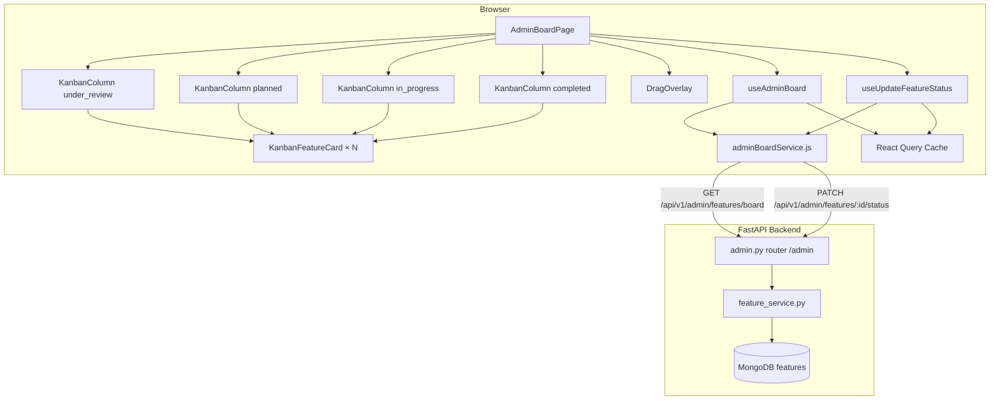

# Design Document: Sprint 5A — Admin Kanban Board

## Overview

Sprint 5A adds a Kanban-style board for verified administrators. The board groups all feature requests by their `status` field into four columns and allows admins to move cards between columns via drag-and-drop, triggering atomic status updates on the backend.

The sprint adds two backend endpoints (`GET /admin/features/board`, `PATCH /admin/features/{feature_id}/status`) in a new `admin.py` router, three new exception types that slot into the existing `FeatureException` handler chain, two new service functions in `feature_service.py`, and a full React frontend consisting of a page, two new components, a service module, and a React Query hook pair.

### Preserved Unchanged

| Artifact | Reason |
|---|---|
| `main.py` | No new `@app.exception_handler` needed; all three new exceptions subclass `FeatureException` |
| `feature_service.py` existing functions | `create_feature`, `update_feature`, `delete_feature`, `find_by_id`, `get_feed`, `toggle_vote`, `get_related_features` untouched |
| `middleware/auth.py` | `require_admin` already checks `is_verified + role == "admin"` |
| `dashboard.py` | Existing `/user/dashboard` and `/admin/dashboard` routes unmodified |
| `AdminDashboardPage.jsx` | Existing `/admin` route target; not touched |
| `AdminRoute.jsx` | Guards on `isAuthenticated + is_verified + role === "admin"`; reused without change |
| `badgeColors.js` | `categoryBadgeClass` / `statusBadgeClass` reused in `KanbanFeatureCard`, not modified |
| `StatusTimeline.jsx` | Auto-reflects status from server data; no change needed |
| `useFeatures.js` | Query keys `["features", params]` and `["feature", featureId]` unchanged |
| `featureService.js` | No modifications |

---

## Architecture



---

## Components and Interfaces

### Backend

#### `backend/app/core/exceptions.py` additions

Three new classes, appended after the existing comment-domain exceptions:

```python
class InvalidStatusTransitionException(FeatureException):
    """Raised by validate_status_transition when current == requested. HTTP 400."""
    status_code = 400

class AdminPermissionException(FeatureException):
    """Raised when a non-admin reaches admin service logic. HTTP 403."""
    status_code = 403

class StatusUpdateFailedException(FeatureException):
    """Raised when find_one_and_update returns None unexpectedly. HTTP 500."""
    status_code = 500
```

All three subclass `FeatureException`; the existing `@app.exception_handler(FeatureException)` in `main.py` handles them with zero changes to that file.

#### `backend/app/services/feature_service.py` additions

**Transition map and validator (module-level):**

```python
VALID_STATUSES = {"under_review", "planned", "in_progress", "completed"}

ALLOWED_TRANSITIONS: dict[str, set[str]] = {
    s: VALID_STATUSES - {s} for s in VALID_STATUSES
}

def validate_status_transition(current_status: str, requested_status: str) -> None:
    """Pure helper. Raises InvalidStatusTransitionException for same-to-same."""
    if requested_status == current_status:
        raise InvalidStatusTransitionException(
            f"Feature is already '{current_status}'. "
            "Specify a different target status."
        )
```

**`get_board()`:**

```python
async def get_board() -> dict[str, list[dict]]:
    cursor = _collection().find({}).sort([("vote_count", -1), ("created_at", -1)])
    docs = [doc async for doc in cursor]
    board: dict[str, list] = {
        "under_review": [], "planned": [],
        "in_progress": [], "completed": [],
    }
    for doc in docs:
        col = doc.get("status")
        if col in board:
            board[col].append(doc)
    return board
```

- Single `find({})` — no filter, no pagination.
- Sorting at the MongoDB layer means each column list is already `vote_count desc, created_at desc`.
- Unknown status values are silently dropped (future-proofing).

**`update_feature_status()`:**

```python
async def update_feature_status(
    feature_id: str, new_status: str, current_user: dict
) -> dict:
    feature = await find_by_id(feature_id)
    if feature is None:
        raise FeatureNotFoundException("Feature request not found.")
    if current_user.get("role") != "admin":
        raise AdminPermissionException("Administrator access required.")
    validate_status_transition(feature["status"], new_status)
    now = datetime.now(timezone.utc)
    updated = await _collection().find_one_and_update(
        {"_id": feature["_id"]},
        {"$set": {"status": new_status, "updated_at": now}},
        return_document=ReturnDocument.AFTER,
    )
    if updated is None:
        raise StatusUpdateFailedException(
            "Status update could not be applied. Please retry."
        )
    return updated
```

Guard order: not-found → not-admin → invalid-transition → DB write. This mirrors `delete_feature`'s pattern.

#### `backend/app/models/feature.py` additions (or `backend/app/models/admin.py`)

```python
class BoardFeatureCard(BaseModel):
    id: str
    title: str
    category: str
    status: str
    vote_count: int
    comment_count: int
    author_name: str
    created_at: datetime

    @classmethod
    def from_mongo(cls, doc: dict) -> "BoardFeatureCard":
        return cls(
            id=str(doc["_id"]),
            title=doc["title"],
            category=doc["category"],
            status=doc["status"],
            vote_count=doc["vote_count"],
            comment_count=doc["comment_count"],
            author_name=doc["author_name"],
            created_at=doc["created_at"],
        )

class BoardResponse(BaseModel):
    under_review: list[BoardFeatureCard]
    planned: list[BoardFeatureCard]
    in_progress: list[BoardFeatureCard]
    completed: list[BoardFeatureCard]

class AdminStatusUpdate(BaseModel):
    status: FeatureStatus   # reuses existing enum; Pydantic rejects invalid values at 422
```

#### `backend/app/api/v1/admin.py`

```python
router = APIRouter(prefix="/admin")

@router.get("/features/board")
async def board_route(current_user: dict = Depends(require_admin)) -> dict:
    board_dict = await feature_service.get_board()
    serialized = {
        col: [BoardFeatureCard.from_mongo(doc).model_dump() for doc in docs]
        for col, docs in board_dict.items()
    }
    return success_response("Board retrieved.", serialized)

@router.patch("/features/{feature_id}/status")
async def update_status_route(
    feature_id: str,
    body: AdminStatusUpdate,
    current_user: dict = Depends(require_admin),
) -> dict:
    doc = await feature_service.update_feature_status(
        feature_id, body.status, current_user
    )
    return success_response("Status updated.", FeatureResponse.from_mongo(doc).model_dump())
```

The `/admin` prefix from `APIRouter` plus the `/api/v1` prefix from `api_router` gives final paths `/api/v1/admin/features/board` and `/api/v1/admin/features/{feature_id}/status`.

#### `backend/app/api/v1/__init__.py` diff

```python
from app.api.v1 import admin, auth, comments, dashboard, features, health

api_router.include_router(admin.router, tags=["admin"])   # new line
```

The ordering of `include_router` calls does not affect routing; the new line can be inserted after the existing includes.

---

### Frontend

#### `frontend/package.json` additions

```json
"@dnd-kit/core": "6.3.1",
"@dnd-kit/sortable": "10.0.0"
```

Both pinned exactly. Added to the `dependencies` object.

#### `frontend/src/services/adminBoardService.js`

```js
import httpClient from "./httpClient";   // same instance used by featureService.js

export async function getBoard() {
  const res = await httpClient.get("/api/v1/admin/features/board");
  return res.data.data;     // BoardResponse shape
}

export async function updateStatus(featureId, status) {
  const res = await httpClient.patch(
    `/api/v1/admin/features/${featureId}/status`,
    { status }
  );
  return res.data.data;     // FeatureResponse shape
}
```

#### `frontend/src/hooks/useAdminBoard.js`

```js
import { useQuery, useMutation, useQueryClient } from "@tanstack/react-query";
import { toast } from "sonner";
import * as adminBoardService from "../services/adminBoardService";

export function useAdminBoard() {
  return useQuery({
    queryKey: ["adminBoard"],
    queryFn: adminBoardService.getBoard,
  });
}

export function useUpdateFeatureStatus() {
  const queryClient = useQueryClient();
  return useMutation({
    mutationFn: ({ featureId, status }) =>
      adminBoardService.updateStatus(featureId, status),

    onMutate: async ({ featureId, status: newStatus }) => {
      await queryClient.cancelQueries({ queryKey: ["adminBoard"] });
      const snapshot = queryClient.getQueryData(["adminBoard"]);

      queryClient.setQueryData(["adminBoard"], (old) => {
        if (!old) return old;
        const next = { ...old };
        // Remove from current column
        for (const col of Object.keys(next)) {
          next[col] = next[col].filter((f) => f.id !== featureId);
        }
        // Find the card in the snapshot
        const card = Object.values(snapshot).flat().find((f) => f.id === featureId);
        if (card) next[newStatus] = [{ ...card, status: newStatus }, ...next[newStatus]];
        return next;
      });

      return { snapshot };
    },

    onError: (_err, _vars, context) => {
      if (context?.snapshot) {
        queryClient.setQueryData(["adminBoard"], context.snapshot);
      }
      toast.error("Status update failed. The change has been reverted.");
    },

    onSettled: (_data, _err, { featureId, status: newStatus }) => {
      queryClient.invalidateQueries({ queryKey: ["adminBoard"] });
      // Sync detail cache if present
      queryClient.setQueryData(["feature", featureId], (old) =>
        old ? { ...old, status: newStatus } : old
      );
      queryClient.invalidateQueries({ queryKey: ["features"] });
    },
  });
}
```

#### `frontend/src/components/KanbanFeatureCard.jsx`

```jsx
import { useSortable } from "@dnd-kit/sortable";
import { CSS } from "@dnd-kit/utilities";
import { Link } from "react-router-dom";
import { categoryBadgeClass, statusBadgeClass } from "../utils/badgeColors";

function KanbanFeatureCard({ feature }) {
  const {
    attributes, listeners, setNodeRef,
    transform, transition, isDragging,
  } = useSortable({
    id: feature.id,
    data: { status: feature.status },  // used by handleDragEnd
  });

  const style = {
    transform: CSS.Transform.toString(transform),
    transition,
    opacity: isDragging ? 0.4 : 1,
  };

  return (
    <div
      ref={setNodeRef}
      style={style}
      className="bg-white rounded-lg border border-slate-200 p-3 shadow-sm"
    >
      {/* Drag handle */}
      <button
        {...attributes}
        {...listeners}
        aria-label={`Drag ${feature.title} to reorder`}
        className="cursor-grab text-slate-400 hover:text-slate-600 mb-1 block"
      >
        ⠿
      </button>

      <p className="text-sm font-medium text-slate-900 line-clamp-2 mb-2">
        {feature.title}
      </p>

      <div className="flex flex-wrap gap-1 mb-2">
        <span className={`text-xs px-2 py-0.5 rounded-full font-medium ${categoryBadgeClass(feature.category)}`}>
          {feature.category.replace("_", " ")}
        </span>
        <span className={`text-xs px-2 py-0.5 rounded-full font-medium ${statusBadgeClass(feature.status)}`}>
          {feature.status.replace(/_/g, " ")}
        </span>
      </div>

      <div className="flex items-center gap-3 text-xs text-slate-500 mb-2">
        <span>▲ {feature.vote_count}</span>
        <span>💬 {feature.comment_count}</span>
      </div>

      <p className="text-xs text-slate-400 mb-2">
        by {feature.author_name} · {new Date(feature.created_at).toLocaleDateString()}
      </p>

      <Link
        to={`/features/${feature.id}`}
        className="text-xs text-indigo-600 hover:underline"
      >
        View feature →
      </Link>
    </div>
  );
}

export default KanbanFeatureCard;
```

#### `frontend/src/components/KanbanColumn.jsx`

```jsx
import { useDroppable } from "@dnd-kit/core";
import { SortableContext, verticalListSortingStrategy } from "@dnd-kit/sortable";
import KanbanFeatureCard from "./KanbanFeatureCard";

function KanbanColumn({ status, label, features }) {
  const { setNodeRef, isOver } = useDroppable({ id: status });

  return (
    <div
      className="flex flex-col bg-slate-50 rounded-xl border border-slate-200"
      aria-label={`${label} column`}
    >
      {/* Column header */}
      <div className="flex items-center justify-between px-3 py-2 border-b border-slate-200">
        <h2 className="text-sm font-semibold text-slate-700">{label}</h2>
        <span className="text-xs font-medium bg-slate-200 text-slate-600 rounded-full px-2 py-0.5">
          {features.length}
        </span>
      </div>

      {/* Drop zone */}
      <div
        ref={setNodeRef}
        className={`flex-1 overflow-y-auto max-h-[calc(100vh-16rem)] p-2 flex flex-col gap-2 transition-colors ${
          isOver ? "bg-indigo-50 border-indigo-300" : ""
        }`}
      >
        <SortableContext
          items={features.map((f) => f.id)}
          strategy={verticalListSortingStrategy}
        >
          {features.length === 0 ? (
            <div className="flex-1 flex items-center justify-center border-2 border-dashed border-slate-300 rounded-lg min-h-[80px] text-xs text-slate-400">
              No features here
            </div>
          ) : (
            features.map((feature) => (
              <KanbanFeatureCard key={feature.id} feature={feature} />
            ))
          )}
        </SortableContext>
      </div>
    </div>
  );
}

export default KanbanColumn;
```

#### `frontend/src/pages/AdminBoardPage.jsx`

```jsx
import { useState } from "react";
import { DndContext, DragOverlay, PointerSensor, KeyboardSensor, useSensor, useSensors } from "@dnd-kit/core";
import { sortableKeyboardCoordinates } from "@dnd-kit/sortable";
import { useQueryClient } from "@tanstack/react-query";
import { useAdminBoard, useUpdateFeatureStatus } from "../hooks/useAdminBoard";
import KanbanColumn from "../components/KanbanColumn";
import KanbanFeatureCard from "../components/KanbanFeatureCard";

const COLUMNS = [
  { status: "under_review", label: "Under Review" },
  { status: "planned",      label: "Planned" },
  { status: "in_progress",  label: "In Progress" },
  { status: "completed",    label: "Completed" },
];

function computeStats(board) {
  if (!board) return null;
  const all = Object.values(board).flat();
  return {
    total:        all.length,
    under_review: board.under_review.length,
    planned:      board.planned.length,
    in_progress:  board.in_progress.length,
    completed:    board.completed.length,
    totalVotes:   all.reduce((s, f) => s + f.vote_count, 0),
    totalComments: all.reduce((s, f) => s + f.comment_count, 0),
  };
}

export default function AdminBoardPage() {
  const queryClient = useQueryClient();
  const { data: board, isLoading, isError } = useAdminBoard();
  const updateStatus = useUpdateFeatureStatus();
  const [activeId, setActiveId] = useState(null);

  const sensors = useSensors(
    useSensor(PointerSensor),
    useSensor(KeyboardSensor, { coordinateGetter: sortableKeyboardCoordinates })
  );

  const activeFeature = activeId
    ? Object.values(board ?? {}).flat().find((f) => f.id === activeId)
    : null;

  function handleDragStart({ active }) {
    setActiveId(active.id);
  }

  function handleDragEnd({ active, over }) {
    setActiveId(null);
    if (!over || over.id === active.data.current?.status) return;
    updateStatus.mutate({ featureId: active.id, status: over.id });
  }

  const stats = computeStats(board);

  if (isLoading) return (
    <div className="p-6">
      <div className="grid grid-cols-1 sm:grid-cols-2 lg:grid-cols-4 gap-4" role="status" aria-label="Loading board">
        {COLUMNS.map((c) => (
          <div key={c.status} className="bg-slate-100 rounded-xl h-64 animate-pulse" />
        ))}
      </div>
    </div>
  );

  if (isError) return (
    <div className="p-6 text-center">
      <p className="text-slate-600 mb-4">Failed to load the board.</p>
      <button
        onClick={() => queryClient.invalidateQueries({ queryKey: ["adminBoard"] })}
        className="px-4 py-2 bg-indigo-600 text-white rounded-lg hover:bg-indigo-700"
      >
        Retry
      </button>
    </div>
  );

  return (
    <div className="p-6 space-y-6">
      {/* Header */}
      <div className="flex items-center justify-between">
        <h1 className="text-2xl font-bold text-slate-900">Feature Board</h1>
        <button
          onClick={() => queryClient.invalidateQueries({ queryKey: ["adminBoard"] })}
          className="px-3 py-1.5 text-sm bg-white border border-slate-200 rounded-lg hover:bg-slate-50"
        >
          ↻ Refresh
        </button>
      </div>

      {/* Board statistics */}
      {stats && (
        <dl className="grid grid-cols-2 sm:grid-cols-4 lg:grid-cols-7 gap-3">
          {[
            ["Total", stats.total],
            ["Under Review", stats.under_review],
            ["Planned", stats.planned],
            ["In Progress", stats.in_progress],
            ["Completed", stats.completed],
            ["Votes", stats.totalVotes],
            ["Comments", stats.totalComments],
          ].map(([label, value]) => (
            <div key={label} className="bg-white border border-slate-200 rounded-lg p-3 text-center">
              <dt className="text-xs text-slate-500">{label}</dt>
              <dd className="text-xl font-bold text-slate-900">{value}</dd>
            </div>
          ))}
        </dl>
      )}

      {/* Board */}
      <DndContext
        sensors={sensors}
        onDragStart={handleDragStart}
        onDragEnd={handleDragEnd}
      >
        <div className="overflow-x-auto">
          <div className="grid grid-cols-1 sm:grid-cols-2 lg:grid-cols-4 gap-4 min-w-[640px]">
            {COLUMNS.map(({ status, label }) => (
              <KanbanColumn
                key={status}
                status={status}
                label={label}
                features={board?.[status] ?? []}
              />
            ))}
          </div>
        </div>

        <DragOverlay>
          {activeFeature ? <KanbanFeatureCard feature={activeFeature} /> : null}
        </DragOverlay>
      </DndContext>
    </div>
  );
}
```

#### `frontend/src/App.jsx` changes

Add import:
```jsx
import AdminBoardPage from "./pages/AdminBoardPage";
```

Add route after the existing `admin` route:
```jsx
<Route
  path="admin/board"
  element={
    <AdminRoute>
      <AdminBoardPage />
    </AdminRoute>
  }
/>
```

---

## Data Models

### MongoDB feature document (existing, unchanged)

| Field | Type | Notes |
|---|---|---|
| `_id` | ObjectId | Serialized as `id: str` |
| `title` | string | |
| `description_markdown` | string | Sanitized at write-time |
| `category` | string | `ui_ux`, `integrations`, `performance`, `general` |
| `status` | string | `under_review`, `planned`, `in_progress`, `completed` |
| `author_id` | string | |
| `author_name` | string | |
| `vote_count` | int | |
| `comment_count` | int | |
| `votes` | array[string] | User IDs |
| `created_at` | datetime | |
| `updated_at` | datetime | |

### BoardFeatureCard (new — subset, no description or votes)

| Field | Type |
|---|---|
| `id` | str |
| `title` | str |
| `category` | str |
| `status` | str |
| `vote_count` | int |
| `comment_count` | int |
| `author_name` | str |
| `created_at` | datetime |

---

## Correctness Properties

*A property is a characteristic or behavior that should hold true across all valid executions of a system — essentially, a formal statement about what the system should do. Properties serve as the bridge between human-readable specifications and machine-verifiable correctness guarantees.*

### Property 1: Same-Status Transition Is Always Rejected

*For any* status value `s` drawn from the four valid status strings (`under_review`, `planned`, `in_progress`, `completed`), calling `validate_status_transition(s, s)` MUST raise `InvalidStatusTransitionException`.

**Validates: Requirements 4.2**

---

### Property 2: Cross-Status Transition Is Always Accepted

*For any* pair `(current, requested)` where both are valid status strings and `current != requested`, calling `validate_status_transition(current, requested)` MUST return without raising any exception.

**Validates: Requirements 4.3**

---

### Property 3: Board Totality — Every Feature Appears in Exactly One Column

*For any* list of feature documents (each with a valid `status` field), the result of `get_board()` MUST satisfy:
- The union of all four column lists contains every input document exactly once (no duplicates, no omissions for known-status documents).
- No document appears in more than one column.
- The total count across all columns equals the count of input documents with a known status.

**Validates: Requirements 6.1, 6.2, 2.3, 2.4**

---

### Property 4: Optimistic Move Consistency

*For any* board state (a `BoardResponse` object) and any `(featureId, targetStatus)` pair where `featureId` is present in the board, after the optimistic `setQueryData` update in `onMutate`, the feature MUST appear in exactly one column (the `targetStatus` column) and MUST NOT appear in any other column.

**Validates: Requirements 10.2, 10.3**

---

### Property 5: Board Statistics Are Consistent With Board Data

*For any* `BoardResponse` object, the client-side `computeStats` function MUST satisfy:
- `stats.total` equals the sum of the lengths of all four column lists.
- `stats.totalVotes` equals the sum of `vote_count` across every feature in all four columns.
- `stats.totalComments` equals the sum of `comment_count` across every feature in all four columns.
- `stats.under_review`, `stats.planned`, `stats.in_progress`, `stats.completed` equal the lengths of their respective column lists.

**Validates: Requirements 15.1, 15.2**

---

### Property 6: BoardFeatureCard Serialization Includes Required Fields and Excludes Forbidden Fields

*For any* valid MongoDB feature document, `BoardFeatureCard.from_mongo(doc)` MUST produce an object that:
- Contains all eight required fields: `id`, `title`, `category`, `status`, `vote_count`, `comment_count`, `author_name`, `created_at`.
- Contains no `description_markdown` field.
- Contains no `votes` field.
- Has `id` equal to `str(doc["_id"])`.

**Validates: Requirements 1.1, 1.2, 1.5**

---

## Error Handling

### Backend

| Scenario | Exception raised | HTTP code |
|---|---|---|
| Feature not found | `FeatureNotFoundException` | 404 |
| Caller is not admin | `AdminPermissionException` | 403 |
| Same-to-same status transition | `InvalidStatusTransitionException` | 400 |
| Atomic update returns None | `StatusUpdateFailedException` | 500 |
| Invalid status string in body | Pydantic `RequestValidationError` | 422 |
| Missing / bad auth token | `UnauthorizedException` / `ExpiredTokenException` | 401 |
| Authenticated but not admin | `UnauthorizedException(403)` via `require_admin` | 403 |

All custom exceptions flow through the existing `@app.exception_handler(FeatureException)` registered in `main.py`. No new handler needed.

### Frontend

| Scenario | Handling |
|---|---|
| Board fetch fails | `isError` branch: inline error message + Retry button |
| Status mutation fails | `onError`: rollback snapshot + `toast.error` notification |
| Drag to same column | `handleDragEnd` no-op guard: `over.id === active.data.current.status` |

---

## Testing Strategy

### Backend (Python / Pytest + Hypothesis)

**Property-based tests** (using [Hypothesis](https://hypothesis.readthedocs.io/)):
- **Property 1 & 2**: Generate from `st.sampled_from(["under_review", "planned", "in_progress", "completed"])`. Use `@given` to test same-to-same raises and cross-status returns cleanly. Minimum 100 iterations per property.
- **Property 3**: Use `@given(st.lists(feature_document_strategy()))` to build arbitrary lists of feature dicts, call the grouping logic directly (extracted from `get_board` for pure testing), assert totality.
- **Property 6**: Use `@given(feature_document_strategy())` and assert `BoardFeatureCard.from_mongo(doc)` fields.

**Unit tests (example-based)**:
- `ALLOWED_TRANSITIONS` structure assertions.
- `update_feature_status` guard order: not-found before not-admin, not-admin before invalid-transition.
- `admin.py` route handler 200/404/400/403/500 with a mocked `feature_service`.

**Integration tests** (1–2 runs, live MongoDB):
- `GET /admin/features/board` with seeded data returns all features grouped correctly.
- `PATCH /admin/features/{id}/status` with a valid cross-status transition returns 200 and persists.

### Frontend (Vitest + @testing-library/react + fast-check)

**Property-based tests** (using [fast-check](https://fast-check.dev/)):
- **Property 4**: Generate arbitrary `BoardResponse`-shaped objects and `(featureId, targetStatus)` pairs; run the `onMutate` update logic; assert exactly-one-column invariant. Tag: `Feature: sprint-5a-admin-kanban-board, Property 4: Optimistic Move Consistency`.
- **Property 5**: Generate arbitrary `BoardResponse`-shaped objects; run `computeStats`; assert all seven computed values match expectations. Tag: `Feature: sprint-5a-admin-kanban-board, Property 5: Board Statistics Consistency`.
- **Property 6 (JS)**: Generate arbitrary feature objects; render `KanbanFeatureCard`; assert `aria-label` on drag handle equals `` `Drag ${feature.title} to reorder` ``. Tag: `Feature: sprint-5a-admin-kanban-board, Property 6: Drag Handle aria-label Totality`.

**Example-based unit tests**:
- `KanbanFeatureCard`: renders title, badges, vote/comment counts, "View feature" link; applies opacity when `isDragging`.
- `KanbanColumn`: renders count badge, empty state when no features, highlighted border when `isOver`.
- `handleDragEnd`: same-column drop → no mutation; cross-column drop → mutation called with correct args.
- `AdminRoute` (existing, unchanged): reused from Sprint 1B tests.

**Minimum 100 iterations** configured via `fc.assert(fc.property(...), { numRuns: 100 })` for all property tests.
