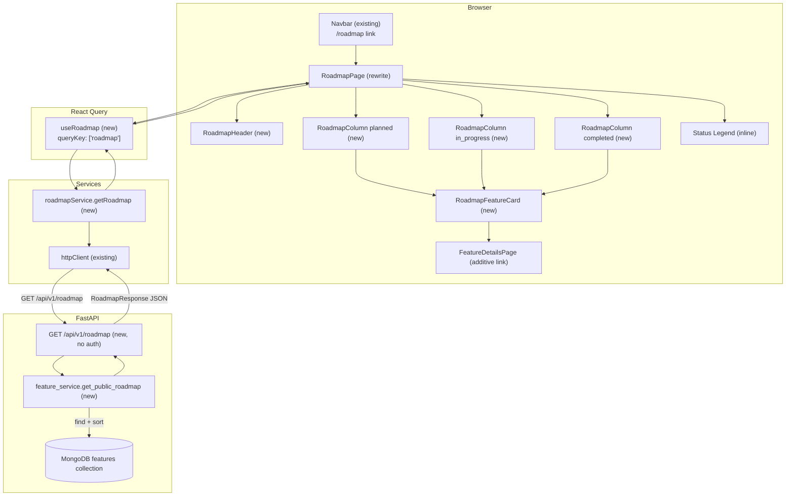

# Design Document — Sprint 5B: Public Roadmap

## Overview

Sprint 5B adds a publicly accessible roadmap view. The backend gains one new service function (`get_public_roadmap` in `feature_service.py`), one new Pydantic schema pair (`RoadmapCard` / `RoadmapResponse`), and one new router module (`roadmap.py`). The frontend replaces the stub `RoadmapPage.jsx` with a full implementation backed by a new service (`roadmapService.js`), hook (`useRoadmap.js`), and three presentational components (`RoadmapHeader`, `RoadmapColumn`, `RoadmapFeatureCard`). `FeatureDetailsPage` receives a small additive "View on Roadmap →" link.

No authentication is involved anywhere in this sprint. No new exception types are introduced. No existing routes, hooks, or components are modified — every change is strictly additive, except for the stub page rewrite and the additive FeatureDetailsPage link.

---

## Architecture



---

## Preserved Unchanged

The following files are **not modified** by Sprint 5B:

| File | Reason preserved |
|------|-----------------|
| `App.jsx` | Route `path="roadmap"` already exists |
| `Navbar.jsx` | `{ label: "Roadmap", to: "/roadmap" }` already in `NAV_LINKS` |
| `KanbanFeatureCard.jsx` | Admin-only drag card; roadmap uses its own `RoadmapFeatureCard` |
| `StatusTimeline.jsx` | Auto-reflects status; no change needed |
| `badgeColors.js` | Reused via import; not modified |
| `featureService.js` | Feed/detail endpoints unchanged |
| `useFeatures.js` | Feed/detail hooks unchanged |
| `main.py` | Existing `FeatureException` + `AuthException` handlers already sufficient |
| All Sprint 0–5A routes, service functions, models | No changes |

---

## Components and Interfaces

### Backend

#### `get_public_roadmap()` in `feature_service.py`

```python
async def get_public_roadmap() -> dict[str, list[dict]]:
    board: dict[str, list[dict]] = {
        "planned": [],
        "in_progress": [],
        "completed": [],
    }
    cursor = _collection().find({}).sort([("vote_count", -1), ("created_at", -1)])
    async for doc in cursor:
        status = doc.get("status")
        if status in board:           # skips "under_review" and any unknown status
            board[status].append(doc)
    return board
```

This mirrors the existing `get_board()` pattern exactly, with three keys instead of four. No new indexes are needed — the existing `vote_count` and `created_at` indexes from Sprint 2A serve the sort.

#### `RoadmapCard` and `RoadmapResponse` in `backend/app/models/feature.py`

```python
class RoadmapCard(BaseModel):
    id: str
    title: str
    category: FeatureCategory
    status: FeatureStatus
    vote_count: int
    comment_count: int
    author_name: str
    created_at: datetime

    @classmethod
    def from_mongo(cls, doc: dict[str, Any]) -> "RoadmapCard":
        return cls(
            id=str(doc["_id"]),
            title=doc["title"],
            category=doc["category"],
            status=doc["status"],
            vote_count=doc["vote_count"],
            comment_count=doc["comment_count"],
            author_name=doc["author_name"],
            created_at=doc["created_at"],
        )

class RoadmapResponse(BaseModel):
    planned: list[RoadmapCard] = []
    in_progress: list[RoadmapCard] = []
    completed: list[RoadmapCard] = []
```

`RoadmapCard` is kept separate from `BoardFeatureCard` so the two can diverge in future sprints (e.g. the admin card might gain a `note` field; the public card should not).

#### `backend/app/api/v1/roadmap.py`

```python
from fastapi import APIRouter
from app.models.feature import RoadmapCard, RoadmapResponse
from app.services import feature_service
from app.utils.responses import success_response

router = APIRouter(prefix="/roadmap")

@router.get("")
async def roadmap_route() -> dict:
    """Returns all non-under_review features grouped by status (public, no auth)."""
    board_dict = await feature_service.get_public_roadmap()
    serialized = RoadmapResponse(
        planned=[RoadmapCard.from_mongo(doc) for doc in board_dict["planned"]],
        in_progress=[RoadmapCard.from_mongo(doc) for doc in board_dict["in_progress"]],
        completed=[RoadmapCard.from_mongo(doc) for doc in board_dict["completed"]],
    )
    return success_response("Roadmap retrieved.", serialized.model_dump())
```

#### `backend/app/api/v1/__init__.py` update

```python
from app.api.v1 import admin, auth, comments, dashboard, features, health, roadmap

api_router.include_router(roadmap.router, tags=["roadmap"])
```

---

### Frontend

#### `frontend/src/services/roadmapService.js`

```js
import { httpClient } from "./httpClient";

export const roadmapService = {
  async getRoadmap() {
    const { data } = await httpClient.get("/api/v1/roadmap");
    return data.data;   // RoadmapResponse shape: { planned, in_progress, completed }
  },
};
```

#### `frontend/src/hooks/useRoadmap.js`

```js
import { useQuery } from "@tanstack/react-query";
import { roadmapService } from "../services/roadmapService";

export function useRoadmap() {
  return useQuery({
    queryKey: ["roadmap"],
    queryFn: roadmapService.getRoadmap,
  });
}
```

#### `frontend/src/components/RoadmapFeatureCard.jsx`

```jsx
// Props: { feature }  (RoadmapCard shape)
// Root: <article aria-label={feature.title}>
// Displays: title, category badge, status badge, ▲ vote_count,
//           💬 comment_count, author_name, formatted created_at
// Link: <Link to={`/features/${feature.id}`}>View Details →</Link>
// No drag handle, no useSortable
```

#### `frontend/src/components/RoadmapColumn.jsx`

```jsx
// Props: { status, label, features }
// Root: <section aria-label={`${label} roadmap column`}>
// Header: label + <span>{features.length}</span>
// Feature list: overflow-y-auto max-h-[calc(100vh-16rem)]
// Empty state: dashed border, "No features yet"
// Maps features → <RoadmapFeatureCard key={f.id} feature={f} />
```

#### `frontend/src/components/RoadmapHeader.jsx`

```jsx
// Props: { totalPlanned, totalInProgress, totalCompleted }
// Displays heading "Public Roadmap", description, three stat values
// Purely presentational — no hooks, no data fetching
```

#### `frontend/src/pages/RoadmapPage.jsx` (rewrite)

```jsx
// Uses useRoadmap() for data and useQueryClient() for retry
// Loading: 3 skeleton divs, role="status", animate-pulse
// Error: error message + Retry button → invalidateQueries(["roadmap"])
// Success:
//   <main aria-label="Public roadmap">
//     <RoadmapHeader totalPlanned=... totalInProgress=... totalCompleted=... />
//     <div className="grid grid-cols-1 sm:grid-cols-2 lg:grid-cols-3 gap-4">
//       <RoadmapColumn status="planned"     label="Planned"     features={...} />
//       <RoadmapColumn status="in_progress" label="In Progress" features={...} />
//       <RoadmapColumn status="completed"   label="Completed"   features={...} />
//     </div>
//     <StatusLegend />    {/* inline, uses statusBadgeClass */}
//   </main>
```

#### `frontend/src/pages/FeatureDetailsPage.jsx` (additive link)

Below the existing breadcrumb or action bar, when `feature.status !== "under_review"`:

```jsx
{feature.status !== "under_review" && (
  <Link to="/roadmap" className="text-sm text-indigo-600 hover:underline">
    View on Roadmap →
  </Link>
)}
```

---

## Data Models

### MongoDB document (unchanged)

The `features` collection document shape is unchanged from Sprint 5A. `get_public_roadmap()` reads the same documents as `get_board()`.

### Response payload shape

```json
{
  "success": true,
  "message": "Roadmap retrieved.",
  "data": {
    "planned": [
      {
        "id": "...",
        "title": "...",
        "category": "ui_ux",
        "status": "planned",
        "vote_count": 12,
        "comment_count": 3,
        "author_name": "Alice",
        "created_at": "2024-01-15T10:00:00Z"
      }
    ],
    "in_progress": [...],
    "completed": [...]
  }
}
```

---

## Correctness Properties

*A property is a characteristic or behavior that should hold true across all valid executions of a system — essentially, a formal statement about what the system should do. Properties serve as the bridge between human-readable specifications and machine-verifiable correctness guarantees.*

### Property 1: Public Roadmap Excludes Under_Review

*For any* collection of feature documents that includes documents with `status == "under_review"`, calling `get_public_roadmap()` should produce a result in which no document with `status == "under_review"` appears in any column.

**Validates: Requirements 3.3**

### Property 2: Roadmap Card Omits Admin-Only Fields

*For any* valid MongoDB feature document (including those that carry `description_markdown`, `votes`, `author_id`, `is_owner`, or `is_admin`), serializing it through `RoadmapCard.from_mongo(doc).model_dump()` should produce a dict that contains none of the forbidden keys.

**Validates: Requirements 1.1, 1.2**

### Property 3: Roadmap Column Totality

*For any* collection of feature documents whose `status` values are drawn from `{"planned", "in_progress", "completed"}`, every document appears in exactly one column of the dict returned by `get_public_roadmap()`, and no document is duplicated across columns.

**Validates: Requirements 3.2, 3.3**

### Property 4: Roadmap Card Link Correctness

*For any* valid `RoadmapCard` instance, rendering `RoadmapFeatureCard` with that card should produce an anchor whose `href` attribute equals `/features/${feature.id}`.

**Validates: Requirements 8.2**

### Property 5: Roadmap Card Renders All Required Fields

*For any* valid `RoadmapCard` instance, the rendered `RoadmapFeatureCard` output should contain the card's `title`, string representation of `vote_count`, string representation of `comment_count`, and `author_name`.

**Validates: Requirements 8.1**

---

## Error Handling

No new exception types are introduced. The `Roadmap_Endpoint` is a read-only endpoint that cannot trigger `FeatureNotFoundException`, `PermissionDeniedException`, or any write-path exception. In the unlikely event of a MongoDB connection failure, the standard Motor exception propagates to FastAPI's default 500 handler, which is already present. On the frontend, `useRoadmap` surfaces the error via React Query's `isError`/`error` state, and `RoadmapPage` renders an error message with a Retry button.

| Scenario | Backend response | Frontend behaviour |
|---|---|---|
| MongoDB unavailable | 500 from Motor | `isError=true` → error message + Retry |
| Empty database | 200, all three arrays `[]` | Each column shows "No features yet" |
| All features `under_review` | 200, all three arrays `[]` | Each column shows "No features yet" |
| Network timeout | — | `isError=true` → error message + Retry |

---

## Testing Strategy

### Backend

**Property-based tests** (Hypothesis):

- **Property 1** — Generate collections of feature documents with random status values (including `under_review`); call `get_public_roadmap()` with a mocked Motor collection; assert no `under_review` doc appears in any column.
- **Property 2** — Generate arbitrary MongoDB feature documents (including those with `description_markdown`, `votes`, `author_id`); call `RoadmapCard.from_mongo(doc)`; assert `model_dump()` has exactly the eight permitted keys.
- **Property 3** — Generate collections where every doc has a status in `{"planned", "in_progress", "completed"}`; call `get_public_roadmap()`; assert the union of all three column lists equals the full input set with no duplicates.

Each property test is tagged:
- `Feature: sprint-5b-public-roadmap, Property 1: Public Roadmap Excludes Under_Review`
- `Feature: sprint-5b-public-roadmap, Property 2: Roadmap Card Omits Admin-Only Fields`
- `Feature: sprint-5b-public-roadmap, Property 3: Roadmap Column Totality`

Minimum 100 iterations per property. Use `unittest.mock` or `pytest-asyncio` with mocked Motor cursors for Properties 1 and 3.

**Unit / integration tests** (pytest):

- `GET /api/v1/roadmap` returns HTTP 200 with no auth header (Req 2.2).
- `GET /api/v1/roadmap` response envelope has `success=true` and `data` with three keys (Req 2.1).
- `RoadmapResponse()` defaults to three empty lists (Req 1.4).
- `get_public_roadmap()` returns a `dict`, not a `RoadmapResponse` instance (Req 3.5).

### Frontend

**Property-based tests** (fast-check, minimum 100 iterations):

- **Property 4** — For any valid `RoadmapCard`-shaped object, render `RoadmapFeatureCard` and assert the link href equals `/features/${feature.id}`.
- **Property 5** — For any valid `RoadmapCard`-shaped object, render `RoadmapFeatureCard` and assert the rendered text contains `title`, `vote_count`, `comment_count`, and `author_name`.

Each tagged:
- `Feature: sprint-5b-public-roadmap, Property 4: Roadmap Card Link Correctness`
- `Feature: sprint-5b-public-roadmap, Property 5: Roadmap Card Renders All Required Fields`

**Unit / example tests** (Vitest + React Testing Library):

- `RoadmapColumn` with `features=[]` renders "No features yet".
- `RoadmapPage` loading state renders three `role="status"` skeletons.
- `RoadmapPage` error state renders error message and Retry button.
- `FeatureDetailsPage` with `status="planned"` renders "View on Roadmap →" link.
- `FeatureDetailsPage` with `status="under_review"` does not render the roadmap link.
- `getRoadmap()` calls `GET /api/v1/roadmap` and returns `response.data.data`.
